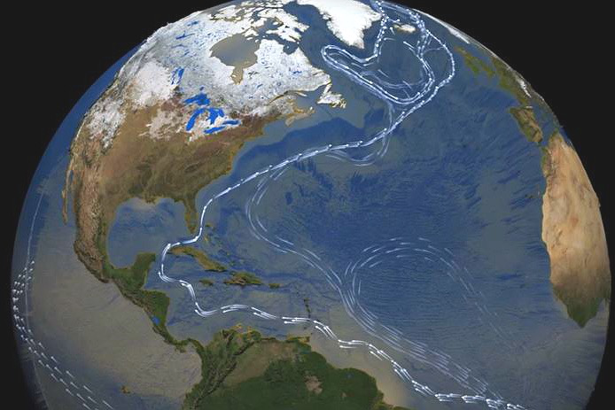
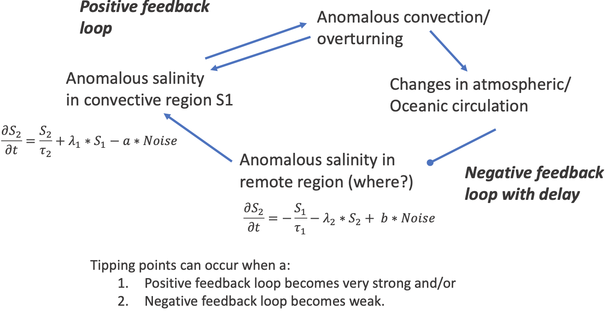
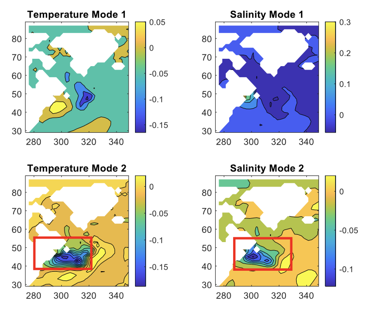

==========================
Milestone 10 Progress Report
==========================

**Approved for public release; distribution is unlimited. This material is based upon work supported by the Defense Advanced Research Projects Agency (DARPA) under Agreement No. HR00112290032.**

**PACMANS TEAM:**
• Jennifer Sleeman (JHU APL) PI
• Anand Gnanadesikan (JHU) Co-PI
• Yannis Kevrekidis (JHU) Co-PI
• Jay Brett (JHU APL)
• David Chung (JHU APL)
• Chace Ashcraft (JHU APL)
• Thomas Haine (JHU)
• Marie-Aude Pradal (JHU)
• Renske Gelderloos (JHU)
• Caroline Tang (DUKE)
• Anshu Saksena (JHU APL)
• Larry White (JHU APL)
• Marisa Hughes (JHU APL)

1   Overview
-------------
• This technical report covers the period of January 10, 2023, through March 10, 2023.
• The deliverable for this milestone is this report.

2   Team Resources
------------------
• Code
    • https://github.com/JHUAPL/PACMANs - Public to all (Up to date with all code from start to MS 3 deliverables)
    • https://github.com/JHUAPL/PACMANs_internal - Public to DARPA, JHU, and APL (Hold until internal approvals)
• Documentation
    • https://pacmans.readthedocs.io/en/latest/
• Datasets
    • https://data.idies.jhu.edu/PACMANS/

3   Goals and Impact
--------------------
The goal for this milestone includes:

• Delivering preliminary results from analysis on chosen data.

4   Task 2.6: Data Analysis of the Ocean Models Dataset
-------------------------------------------------------
Subtask Description: We will report on preliminary results of the ocean models dataset, which is based on the simplified GCM model and observable data that will be added to further evaluate its value based on what the hybrid AI approach indicates.

• In this report we describe preliminary analysis of the experiments described in the Milestone 9 Report, which includes:

    • Analysis related to observable data experimentation.

**Task 2.6: Data Analysis of the Ocean Models Dataset – Introduction**

• Assessing the value of new data assumes one has observational data and needs to measure how that observational data will impact performance.

• However, one must first ask, “What are we looking for in the observations?” • In this case we are looking for changes in modal structure (dynamics) that results in variability.

• A first step is identifying interesting behavior that we do not understand due to variability.

• A second step is identifying how observations could be used to measure this variability.

• In this report we identify interesting behavior and give insight into what would be needed to better understand the modal structure that results in the variability and how it leads to the observed behavior.

**Task 2.6: Thinking About Variability and Tipping Points**

• One possibility is that variability can be described as:

1. A development of a surface anomaly that changes the overturning (positive or negative salinity anomaly).

2. The resultant change in circulation produces opposite-sign salinity anomaly...

3. That then propagates into convective region and causes a switch.

With regards to delayed oscillator mechanism:

• Two questions:

    1. Is overturning variability described by this mechanism in models with tipping points?

    2. Does the oscillator mechanism change under climate change?

**Task 2.6: Illustration of the Mechanism**

**Task 2.6: How Do We Determine What Data Is Needed?**

• What terms contribute to the salinity budget of key centers of action?
    • 3-D advection of salinity,
    • Rate of mixing from below, and
    • Lateral diffusion.
• Measuring the relationship between these tendencies and the spatial pattern of salinity/temperature anomalies allows us to calibrate these oscillator models.
• What we show here is what regions matter and when they matter.

**Task 2.6: Q1. Is Overturning Variability Described By This Mechanism in Models with Tipping Points?**

• Top figures show convective mode, tends to drive negative values of mode 2 with ~4 year lag, very weak growth

• Bottom figures show gyre boundary shift mode, correlated with positive tendency of convective mode. Peaks four years early. (Precursor!)

• Isolates gyre boundary region as critical.

**Task 2.6: What Does This Mean for the GAN?**
• Currently, variability and shutoff are purely associated with freshwater flux variability. They are uncorrelated with time.
• Suggests that producing changes in cross-boundary transport associated with convection could introduce new timescale of variability.
• Phase of variability is a new variable in predicting collapse with the GAN.

**Task 2.6: Q2. Do Modes/Coupling Change Under Historical Conditions?**
• Preliminary analysis:
    • First mode shows much more salinity variability in Arctic.
    • Period of oscillation decreases- stronger coupling between modes?
• More analysis needed to look at tipping points.

5  Citations
-------------
1. Boers, Niklas. "Observation-based early-warning signals for a collapse of the Atlantic Meridional Overturning Circulation." Nature Climate Change 11, no. 8 (2021): 680-688.

2. Gnanadesikan, A., A simple model for the structure of the oceanic pycnocline, Science., 283:2077-2079, (1999).

3. Forget, G., J.-M. Campin, P. Heimbach, C. N. Hill, R. M. Ponte, C. Wunsch, ECCO version 4: An integrated framework for non-linear inverse modeling and global ocean state estimation. Geosci. Model Dev. 8, 3071–3104 (2015).

4. Gnanadesikan, A., R. Kelson and M. Sten, Flux correction and overturning stability: Insights from a dynamical box model, J. Climate, 31, 9335-9350,
https://doi.org/10.1175/JCLI-D-18-0388.1, (2018).

5. Kaufhold, John Patrick, and Jennifer Alexander Sleeman. "Systems and methods for deep model translation generation." U.S. Patent No. 10,504,004. 10
Dec. 2019.

6. Garcez, Artur d'Avila, and Luis C. Lamb. "Neurosymbolic AI: the 3rd Wave." arXiv preprint arXiv:2012.05876 (2020).

7. Stommel, H. Thermohaline convection with two stable regimes of flow. Tellus 13, 224–230 (1961).

8. Karniadakis, George Em, Ioannis G. Kevrekidis, Lu Lu, Paris Perdikaris, Sifan Wang, and Liu Yang. "Physics-informed machine learning." Nature Reviews
Physics 3, no. 6 (2021): 422-440.

9. Sleeman, Jennifer, Milton Halem, Zhifeng Yang, Vanessa Caicedo, Belay Demoz, and Ruben Delgado. "A Deep Machine Learning Approach for LIDAR Based
Boundary Layer Height Detection." In IGARSS 2020-2020 IEEE International Geoscience and Remote Sensing Symposium, pp. 3676-3679. IEEE, 2020.

10. Patel, Kinjal, Jennifer Sleeman, and Milton Halem. "Physics-aware deep edge detection network." In Remote Sensing of Clouds and the Atmosphere XXVI,
vol. 11859, pp. 32-38. SPIE, 2021.

11. Brulé, Joshua. "A causation coefficient and taxonomy of correlation/causation relationships." arXiv preprint arXiv:1708.05069 (2017).

12. Rasp, Stephan, Michael S. Pritchard, and Pierre Gentine. "Deep learning to represent subgrid processes in climate models." Proceedings of the National Academy of Sciences 115, no. 39 (2018): 9684-9689.

13. Bolton, Thomas, and Laure Zanna. "Applications of deep learning to ocean data inference and subgrid parameterization." Journal of Advances in Modeling Earth Systems 11, no. 1 (2019): 376-399.

14. Kurth, Thorsten, Sean Treichler, Joshua Romero, Mayur Mudigonda, Nathan Luehr, Everett Phillips, Ankur Mahesh et al. "Exascale deep learning for climate analytics." In SC18: International Conference for High Performance Computing, Networking, Storage and Analysis, pp. 649-660. IEEE, 2018.

15. Weber, Theodore, Austin Corotan, Brian Hutchinson, Ben Kravitz, and Robert Link. "Deep learning for creating surrogate models of precipitation in Earth system models." Atmospheric Chemistry and Physics 20, no. 4 (2020): 2303-2317.

16. Matsubara, Takashi, Ai Ishikawa, and Takaharu Yaguchi. "Deep energy-based modeling of discrete-time physics." arXiv preprint arXiv:1905.08604 (2019).

17. Kleinen, T., Held, H. & Petschel-Held, G. The potential role of spectral properties in detecting thresholds in the Earth system: application to the thermohaline circulation. Ocean Dyn. 53, 53–63 (2003).

18. Kocaoglu, Murat, Christopher Snyder, Alexandros G. Dimakis, and Sriram Vishwanath. "Causalgan: Learning causal implicit generative models with adversarial training." arXiv preprint arXiv:1709.02023 (2017).

19. Feinman, Reuben, and Brenden M. Lake. "Learning Task-General Representations with Generative Neuro-Symbolic Modeling." arXiv preprint arXiv:2006.14448 (2020).

20. Yi, Kexin, Chuang Gan, Yunzhu Li, Pushmeet Kohli, Jiajun Wu, Antonio Torralba, and Joshua B. Tenenbaum. "Clevrer: Collision events for video representation and reasoning." arXiv preprint arXiv:1910.01442 (2019).

21. Nowack, Peer, Jakob Runge, Veronika Eyring, and Joanna D. Haigh. "Causal networks for climate model evaluation and constrained projections." Nature communications 11, no. 1 (2020): 1-11.

22. Andersson, Tom R., J. Scott Hosking, María Pérez-Ortiz, Brooks Paige, Andrew Elliott, Chris Russell, Stephen Law et al. "Seasonal Arctic sea ice forecasting with probabilistic deep learning." Nature communications 12, no. 1 (2021): 1-12.

23. Storchan, Victor, Svitlana Vyetrenko, and Tucker Balch. "MAS-GAN: Adversarial Calibration of Multi-Agent Market Simulators." (2020).

24. De Raedt, Luc, Robin Manhaeve, Sebastijan Dumancic, Thomas Demeester, and Angelika Kimmig. "Neuro-symbolic=neural+ logical+ probabilistic." In NeSy'19@ IJCAI, the 14th International Workshop on Neural-Symbolic Learning and Reasoning. 2019.

25. Eyring, V., Bony, S., Meehl, G. A., Senior, C. A., Stevens, B., Stouffer, R. J., and Taylor, K. E.: Overview of the Coupled Model Intercomparison Project Phase 6 (CMIP6) experimental design and organization, Geosci. Model Dev., 9, 1937-1958, doi:10.5194/gmd-9-1937-2016, 2016.

26. Swingedouw, Didier, Chinwe Ifejika Speranza, Annett Bartsch, Gael Durand, Cedric Jamet, Gregory Beaugrand, and Alessandra Conversi. "Early warning from space for a few key tipping points in physical, biological, and social-ecological systems." Surveys in geophysics 41, no. 6 (2020): 1237-1284.

27. Reichstein, Markus, Gustau Camps-Valls, Bjorn Stevens, Martin Jung, Joachim Denzler, and Nuno Carvalhais. "Deep learning and process understanding for data-driven Earth system science." Nature 566, no. 7743 (2019): 195-204.

28. Sleeman, Jennifer, Ivanka Stajner, Christoph Keller, Milton Halem, Christopher Hamer, Raffaele Montuoro, and Barry Baker. "The Integration of Artificial Intelligence for Improved Operational Air Quality Forecasting." In AGU Fall Meeting 2021. 2021.

29. Bellomo, K., Angeloni, M., Corti, S. et al. Future climate change shaped by inter-model differences in Atlantic meridional overturning circulation response. Nat Commun 12, 3659 (2021). https://doi.org/10.1038/s41467-021-24015-w

30. Sgubin, G., Swingedouw, D., Drijfhout, S. et al. Abrupt cooling over the North Atlantic in modern climate models. Nat Commun 8, 14375 (2017). https://doi.org/10.1038/ncomms14375

31. Swingedouw, D., Bily, A., Esquerdo, C., Borchert, L. F., Sgubin, G., Mignot, J., & Menary, M. (2021). On the risk of abrupt changes in the North Atlantic subpolar gyre in CMIP6 models. Annals of the New York Academy of Sciences, 1504(1), 187-201. https://doi.org/10.1111/nyas.14659

32. Mao, Jiayuan, Chuang Gan, Pushmeet Kohli, Joshua B. Tenenbaum, and Jiajun Wu. "The neuro-symbolic concept learner: Interpreting scenes, words, and sentences from natural supervision." arXiv preprint arXiv:1904.12584 (2019).
