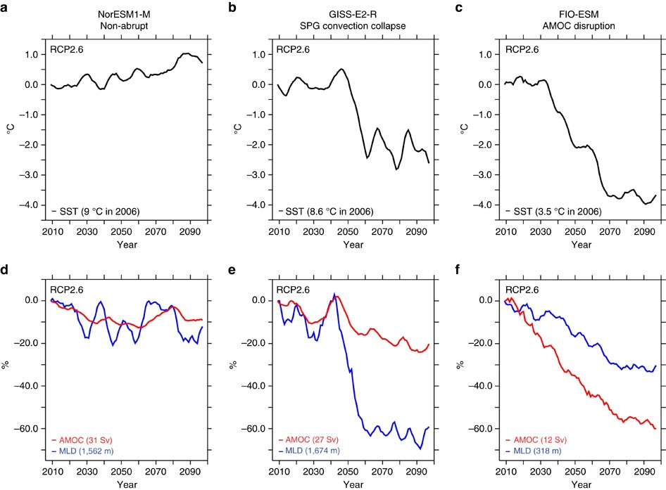
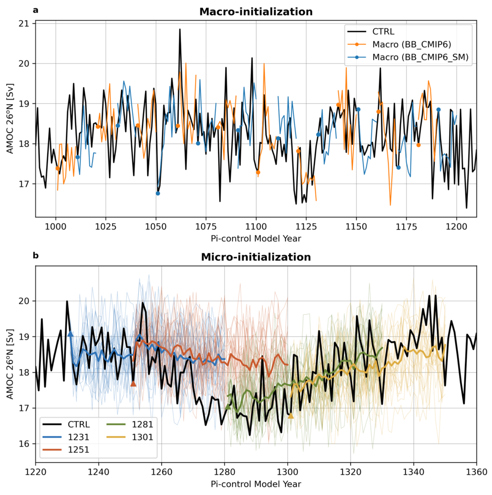
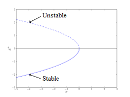
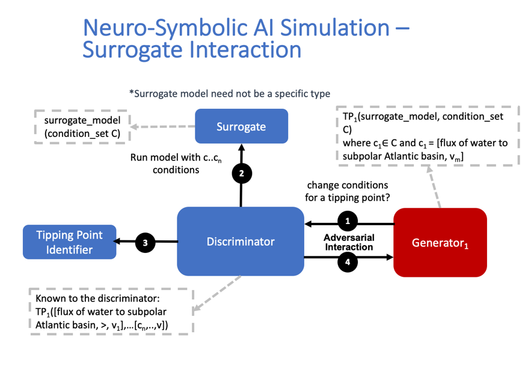
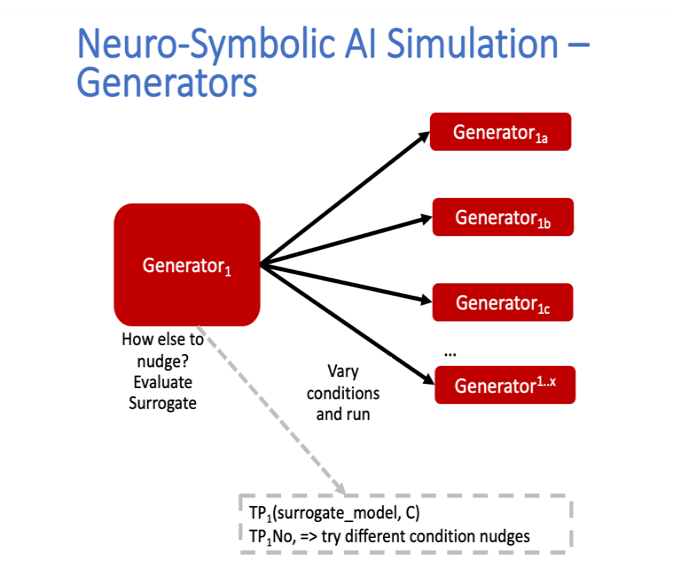
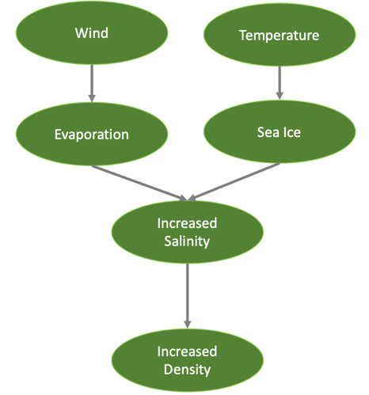

===========================
Milestone 1 Progress Report
===========================
Report on Identifying Hybrid Model Constituents with Datasets, Problems and Targeted Effects to be Investigated

**Approved for public release; distribution is unlimited. This material is based upon work supported by the Defense Advanced Research Projects Agency (DARPA) under Agreement No. HR00112290032.**

**PACMANS TEAM:**
• Jennifer Sleeman (JHU APL) PI
• Anand Gnanadesikan (JHU) Co-PI
• Yannis Kevrekidis (JHU) Co-PI
• Jay Brett (JHU APL)
• David Chung (JHU APL)
• Chace Ashcraft (JHU APL)
• Thomas Haine (JHU)
• Marie-Aude Pradal (JHU)
• Renske Gelderloos (JHU)
• Caroline Tang (DUKE)
• Anshu Saksena (JHU APL)
• Larry White (JHU APL)
• Marisa Hughes (JHU APL)

1      Overview
===============

This technical report covers the period of December 2021 through January
13, 2022. The report documents the achievement of the milestone
associated with Month 1 of the JHU/APL-led PACMAN team’s statement of
work. 

2      Goals and Impact
========================

The goals for this milestone include identifying hybrid model
constituents with datasets, identifying problems/risks and targeted
effects regarding: a.) the problem setup related to conditions that lead
to Atlantic meridional overturning circulation (AMOC) collapse, b.)
acquiring CMIPs data and performing cross-disciplinary analysis of data
extractions for AI architectures, c.) identifying architectures and
equations that will be modeled for surrogates, and d.) evaluating
potential architectures for the Artificial Intelligence (AI) simulation,
exploring the theoretical setup of tipping point identification and
basic requirements for the neuro-symbolic language and causal model.

3      Task 1.1. Designation of an Ocean Model Use Case
=======================================================

**Description: Explore a set of use cases related to the AMOC and define
questions to answer related to conditions that lead to AMOC collapse.**

One of the big challenges of understanding the impacts of global warming
is that the general circulation models (GCMs) used to project global
warming often show very different qualitative behavior in simulations
with similar, relatively realistic forcings. 

Figure 1. Example of General Circulation Model (GCM) outcomes that expose
disagreement among models.

This is demonstrated in Figure 1, which shows change in subpolar gyre
sea surface temperature (SST) in degrees Celsius (top row), relative
change in AMOC transport (in bottom row, red) and subpolar gyre mixed
layer depth (bottom row, blue) in three classes of models used in CMIP5
model intercomparison project. The left column model has a steady rise
in temperatures and relatively small decline in overturning. The middle
column shows a convective shutoff within the subpolar gyre, though with
a relatively weak impact on the overturning. The right column shows a
model with a more gradual state transition in temperature, mixed layer
depth and overturning.  (Sgubin et al., 2017)

Additionally, as illustrated above in Figure 1 (Sgubin et al., 2017),
some models show a shutoff in convection in the Labrador Sea
(illustrated by a relatively large relative decline in mixed layer depth
and cooling of the subpolar gyre in the models in the center and
right-hand columns). These are sometimes accompanied by large relative
declines in the overturning circulation while other (illustrated by the
model in the left-hand column) models do not. The source of these
differences is not well understood across GCMs. One reason for this is
that these models differ in many ways, ranging from the numerical
techniques used to discretize the Navier-Stokes equations to the
representation of ocean mixing to the temperature dependence of sea ice
albedo to the response of clouds to changes in stratification. The other
reason is that internal model variability may play a role in setting the
exact timing of such rapid changes. 

AMOC Collapse
-------------

Theories for AMOC collapse dating from Stommel (1961) have focused on
the role of the enhanced hydrological cycle in driving a hypothesized
fold bifurcation. The dynamics of this bifurcation involve greater
freshwater flux to the subpolar gyre, increasing the salinity difference
and lowering the density difference between high and low latitudes. The
result is a slowing of the overturning, which in turn allows more
freshwater to build up in high latitudes. Within the Stommel theory, one
can define a solution for the mean state overturnings that depends on
the overturning driven by temperature alone (:math:`M_{T}`), the density
difference associated with temperature (:math:`\Delta\rho_{T}`), and the
maximum density difference associated with salinity
(:math:`\Delta\rho_{S}^{\max}`) such that the relationship between the
overturning and the freshwater flux is:

.. math:: F_{w}\  = \left( \frac{\Delta\rho_{T}}{\Delta\rho_{S}^{\max}}\  \right)*M*\left( M_{T} - M \right)

There is then a separatrix that separates the solution state space into
regions of stable and unstable solutions defined by:

.. math:: F_{w}\  = \left( \frac{\Delta\rho_{T}}{\Delta\rho_{S}^{\max}}\  \right)*\frac{M_{T}^{2}}{2}

This model would then suggest that models that have a larger overturning
should be more resistant to collapse. However, this appears to fail in
Fig. 1, as the steepest drop in temperature is found in the model with
intermediate overturning. Nor does the initial depth of convection in
the Labrador Sea appear to explain the difference (both the left-hand
and middle column appear to have realistically deep convection).

More recent theories note that there are multiple controls on the
overturning, which can be combined in different ways to produce
“realistic”-looking results. However, as described in Gnanadesikan et
al. (2018), these combinations may have quite different stability
thresholds.  A potentially important question is how are salinity
anomalies in the upper subpolar gyre removed- is the overturning the
dominant mode of removal or is lateral exchange? A second possibility is
that the differences reflect different levels of remote forcing from
winds in the Southern Ocean, which are expected to increase under global
warming and thus to provide a stronger source of light water-stabilizing
the overturning. A third possibility is that some models have
unrealistic convection in the Northwest Pacific. Under global warming,
this convection switches off and the pycnocline as a whole deepens,
driving more light water into the North Atlantic and counteracting the
“braking” effect from the enhanced hydrological cycle.  

Questions to Answer Using Machine Learning
------------------------------------------

Distinguishing between these multiple controls on the overturning has
not been straightforward, suggesting that the application of machine
learning methods might be fruitful. In particular, we would like answers
to the questions noted below:

1. Do models that exhibit rapid change in AMOC/convection under
   relatively weak greenhouse gas forcing share some common
   characteristics in their mean state? Alternatively, do these models
   have mean states that lies close to the separatrix between “on” and
   “off” states and what model parameters control the geometry of this
   separatrix?

2. Do models that exhibit rapid change in AMOC/convection under
   relatively weak greenhouse gas forcing share some common
   characteristics in the dynamics of their variability? Another way of
   stating this would be- do such models have a mean state that is
   comparably far from the separatrix between “on” and “off” states, but
   larger internal variability compared with models that don't show
   rapid change?

3. Can we predict the magnitude and timing of rapid transitions in
   AMOC/convection using the behavior of the model in preindustrial
   control simulations? 

4. Do models that show collapse under relatively weak forcing exhibit
   fingerprints of change that provide early warning?

5. Can we express all of these in terms of a parsimonious representation
   of the overturning (i.e., neuro-symbolic/box model)?

In some cases, the answers to these questions might reflect systemic
model biases. For example, it might be the case that models that have an
Icelandic low that is too far to the east will be inefficient at
laterally exporting freshwater from the Atlantic and thus more likely to
see a collapse. This would lead us to be less concerned about rapid
transitions occurring in the next 20-40 years.  Or in another instance,
it might be that models that do not show too much sensitivity to global
warming have unrealistic convection in the Northwest Pacific-leading us
to be *more* concerned about the possibility of AMOC collapse.
Additionally, it is possible that a rapid transition in the AMOC is
driven by a particular combination of atmospheric and oceanic conditions
that may randomly occur in some models but not others. 

Risks/Concerns
--------------

A few instances of concern are: a) the real world might lie close to a
separatrix, but we haven't yet experienced the particular combination of
conditions that would result in a tipping point and b) inaccuracies in
the current generation of models make it impossible to capture this
state of affairs. Our goals are to develop an AI system that can explore
a set of models, identify models with realistic solutions that lie close
to a tipping point, and apply this system to some subset of the CMIP6
models to either generate initial conditions that would produce an early
transition of the overturning or identify biases that make such a
transition less likely than would be the case in the real world.   

4      Task 2.1. CMIPS and PMIP Data Acquisition and Analysis
==============================================================

**Description: Acquire CMIPs data and perform a cross-disciplinary
analysis of data extractions to formulate the AI datasets to enable the
use case.**

In order to address the questions laid out above, we will use data from
existing global general circulation models (GCM) in concert with the
Gnanadesikan et al. (2018) box model as a framework for reducing the
data for initial understanding. This model connects the overturning rate
to the pycnocline depth at lower latitudes, freshwater fluxes between
high and low latitudes, the low-latitude upwelling from depth, and the
Southern ocean’s balance of wind-driven and eddy-driven fluxes. These
state variables can be integrated from the available standard outputs
archived for the coupled model intercomparison projects (CMIP) and
analyzed for their dynamics in the same way as the box model.

Our initial analysis of the available runs of CMIPs models, with respect
to having sufficient representation of AMOC tipping point conditions,
has led us to consider a secondary set of model runs – the PMIP4,
Paleoclimate Model Intercomparison Project 4
(https://pmip4.lsce.ipsl.fr/doku.php/index), which includes many of the
same models as CMIP. The scenarios run in PMIP4 are good candidates for
complementing the pre-industrial control runs and forward scenarios from
CMIP.

Using the Community Earth System Model
--------------------------------------

We will begin with the Community Earth System Model (CESM), as we know
that there are significant changes in the North Atlantic convection for
the lower-warming projections of the 21st century
(https://doi.org/10.1111/nyas.14659). A large ensemble of pre-industrial
control simulations with initializations spanning a range of AMOC
strengths (LENS2, `CESM2 Large Ensemble Community Project
(ucar.edu) <https://www.cesm.ucar.edu/projects/community-projects/LENS2/>`__)
will be used to map out the stable areas in dynamical state space. These
simulations include a large number of oscillations in the strength of
the AMOC, without reaching a collapse or permanent change in state (see
Figure 2 below).  Analyzing the dynamics of this ensemble will allow us
to improve the box model, if needed, to have similar stable-AMOC
dynamics. The 21st-century projections, on the other hand, may contain a
tipping point, which we can determine after the pre-industrial analysis.
If these are insufficient to represent the alternate AMOC state, we will
also use available paleoclimate runs for this model (Holocene, Pliocene,
and Last Interglacial). The paleoclimate simulations have large
variations in CO\ :sub:`2` and AMOC, but other forcing changes that are
less similar to those expected in the near future. While we will
describe it in more detail in the next section, the aim is to understand
the dynamics through identifying the separatrix between ‘normal’
subpolar convection and AMOC and a shut-off of subpolar convection and
weakened or collapsed AMOC.

Figure 2. CESM2-LE initialization consequences for the Atlantic
Meridional Overturning Circulation (AMOC) at 26.5°N with 20
macro-initializations (top) and the micro-initializations (bottom).

As shown in Figure 2 above, the AMOC transport in the pre-industrial
control simulation (black line) for CESM2 is shown over two time slices
corresponding to (top) 20 macro-initializations and (bottom) the
micro-initializations. In the top figure the AMOC transports for the
individual ensemble members are shown as solid colors, with the
initiation points marked as colored closed circles. In bottom figure the
AMOC transports are shown in thin solid lines for individual ensemble
members, and the ensemble-mean is represented as a thicker solid line.
Transports are in Sverdrups (Sv) (106 m3 s-1). (Rodgers et. al 2021,
https://doi.org/10.5194/esd-12-1393-2021).

The CESM2 Large Ensemble is available through the NCAR Climate Data
Gateway (`Dataset: CESM2 LENS Ocean Post Processed Data Monthly Averages
(earthsystemgrid.org) <https://www.earthsystemgrid.org/dataset/ucar.cgd.cesm2le.ocn.proc.monthly_ave.html>`__). 
The CMIP6 model outputs are available through the CMIP6 portal,
https://esgf-node.llnl.gov/search/cmip6. The initial use model has a
small ensemble of historical and pre-industrial control (piControl) runs
labeled CMIP.NCAR.CESM2; the forward projection with a known strong
decrease in subpolar convection is ScenarioMIP.NCAR.CESM2.ssp126 (3
instances). The variables needed to perform this analysis include the
wind stress, temperature, salinity, surface heat and water fluxes, and
internal mass and freshwater fluxes. We are using the monthly-mean ocean
and atmospheric data for this stage. While we are currently reducing the
data by integrating across large sections of the Atlantic and Southern
Ocean, we expect to use the full data later for the Generative
Adversarial Network (GAN). The integrated data may be of interest to the
Exeter group, as they examine abrupt changes and possible early warning
signals. We plan to share the data and the method for building it so
that others can use it across more models. 

While we are beginning with a single GCM, as noted in the previous
section, our interests, include the differences between models. Thus,
once this model whose behavior includes convection collapses is
analyzed, we will be able to apply the same techniques to a broader set
of CMIP6 GCMs.

Data Storage, Preprocessing and Data Analysis First Steps
---------------------------------------------------------

We currently have a team performing system requirement analysis for data
storage to host this data. The options we are evaluating include:
SciServer, Amazon cloud, and an internal high-performance environment.
As part of this effort, we are evaluating resource needs based on an
initial analysis of the models we will use both with respect to the box
model and with respect to the GCMs. Currently, we are serially
downloading individual ensemble members and processing them to reach
box-model-style integrated timeseries for our initial analyses. We also
building a suite of data processing tools to ready the data for machine
learning processing. Our cross-disciplinary team is working together in
weekly meetings to develop this data repository. Analysis of this data
from the machine learning perspective will begin once the data
repository is populated with the model data.

Initial discussions have included mapping variables that will be used
from the Box models to variables that will be used from the GCMs. Part
of this discussion has been to define a set of variables that will be
important to include in the model data for deep learning models. As part
of this step, we have begun to download example, simplified CESM2 models
to perform data analysis.

5      Task 3.1 AI Physics-Informed Surrogate Model Design
==========================================================

**Description: Identify the architectures and equations that will be
modeled in terms the neural network.**

Due to the complexity of GCMs, we are taking the approach of building AI
architectures that use simplified box models initially then once the
architectures are stabilized progress to the more complex GCMs. The AI
simulation is agnostic in that it can work with any type of surrogate
model. We list surrogate models and their levels of complexity below (we
will start with the zero-dimensional box models and progress to the
three-dimensional GCMs):

Types of Surrogate models (increasing in level of complexity):

-  Zero-dimensional Ocean models (box models), uses 10 ODEs

-  One-dimensional ocean models using PDEs for vertical structure

-  Two-dimensional PDE Ocean models

-  Three-dimensional General circulation models

As a first pass at developing the surrogate models, we will use the box
models as described in Tasks 1.1 and 2.1. 

Tipping Point Identification
----------------------------

As a basis for tipping point identification, saddle-node (fold)
bifurcation identification as shown in Figure 3, will be used to
identify sudden changes in the model. Initially, the saddle-node
bifurcation method will be applied using both zero-dimension and
one-dimension models.  

|image1|
\ Further extensions to this method will be developed as we
begin to work with GCMs. Thus far, our progress in terms of tipping
point identification has been to identify tipping points (i.e.,
saddle-node bifurcations) using the box model as a tool for identifying
forcing conditions that result in bifurcation. 

We are developing the methodology to perform parametric bifurcation
analysis for the Gnanadesikan et al. (2018) box models using established
numerical bifurcation/continuation algorithms, to discover the locus of
"hard" bifurcations (folds, subcritical Hopf) that are known to underpin
model tipping points.

We will then attempt the computation of the slow stable manifolds of the
saddle solutions that defines the separatrix (a difficult problem) since
in a system with *n* degrees of freedom the separatrix is an *n-1*
dimensional manifold. We are only interested in the slowest stable
directions. These are the data that will be used to train our GAN
surrogate separatrix construction. We are also exploring how to
inform/match the box models with "box-level" observations of the finer,
PDE Ocean models in the neighborhood of the tipping points. 

6      Task 4.1 AI Simulation Design
====================================

**Description: Evaluate potential architectures, explore the theoretical
setup of tipping point identification and identify the requirements of
the neuro-symbolic and causal models. We will map how these subsystems
will work together as one cohesive framework.**

Generative Learning - Overview
------------------------------

The GAN will take the form based on the typical setup of the adversarial
game (based on minimax game theory and Nash equilibrium) and Goodfellow
2014, as shown below, where *G* represents the generator neural network
and *D* represents the discriminator neural network,
:math:`\mathbb{E}_{x}` represents the expected value over data samples
and :math:`\mathbb{E}_{z}` represents the expected value over generated
samples, with adjusted *D* parameters to minimize *log D(x)* and
adjusted *G* parameters to minimize *log(1-D(G(x)))* define the minimax
game. In this adversarial setup, the discriminator tries to maximize its
loss and the generator tries to minimize its loss as depicted in the
following value function, where *V* is the value function.

.. math:: \frac{\min}{G}\frac{\max}{D}V(D,\ G) = \ \mathbb{E}_{x\sim pdata(x)}\lbrack\log{D(x)\rbrack + \ }\mathbb{E}_{z\sim p_{z}(Z)}\left\lbrack \log\left( 1 - D\left( G(z) \right) \right) \right\rbrack

Labeled data is processed by the discriminator and “fake” data is
generated by the generator. The generator distribution is learned by a
mapping function that maps from a prior noise distribution *p\ z\ (z)*
to the data space.

In the proposed GAN architecture, there will be prior information that
constrains the *p\ z\ (z)* distribution, as this will be prescribed
symbolically in terms of the problem setup. Therefore, the loss function
will need to be modified to account for multiple generators and a single
discriminator in addition to having priors. There will be *M* generators
so as *G\ 1:M* will map to a single distribution representing the
perturbations of the model (akin to an ensemble). As each *G* has access
to the model that it perturbed, this goes beyond a mixture over the *M*
distributions because their perturbations are based on a previous step
in the adversarial game.

**Generative Learning – Surrogate Interaction**

In GAN architectures typically a discriminator learns a classification,
for example classifying images, and is given labeled information which
it uses to determine how well it is learning that classification. In our
proposed architecture, the job of the discriminator involves the
extension of a surrogate model and bifurcation method that the
discriminator uses to run the conditioned scenario. The discriminator
uses the surrogate and bifurcation method to classify the conditions
presented, as a tipping point or not, and at the same time calculates a
loss on its own model based on assessing how imbalanced or balanced the
state is, given the presented conditions.

The architecture for the discriminator based on this interaction is
still being explored by our team, as we are developing a probabilistic
model to support this interaction. Our team is currently working on a
simple GAN prototype to understand requirements of the architecture and
loss function given this setup. We will first begin with a pure
simulated-data prototype, then introduce a simple problem which includes
a set of conditions, a simplistic surrogate model, and the
|image2|\ bifurcation algorithm. As shown in Figure 4, this part of the
exploration is focused on the interactions between the discriminator, a
surrogate and a method that tells the discriminator if the
identification of a tipping point was reached or not.

The adversarial game is based on this idea climate forcings: where the
discriminator’s goal is to keep the forcings balanced, the generators
will perturb conditions to unbalance the forcings, defined in terms of
positive and negative forcings:

Positive forcings:

-  Warming of low latitudes

-  Cooling of high latitudes

-  Upwelling in subpolar gyre (+North Atlantic Oscillation (NAO)/Arctic
      Oscillation (AO))

-  Lateral mixing of salinity by eddies into the mixed layer

-  Stronger winds driving more evaporation

Negative forcings:

-  Hydrological cycle, salinities tropics and freshens high latitudes

-  Loss of glacial land ice (e.g., Greenland Ice Sheet) freshens
      subpolar North Atlantic.

-  Warming of high latitudes

-  Weak downwelling in subpolar gyre (-NAO/AO?)

-  Lateral advection by eddies

-  Weaker winds driving less evaporation

The AI simulation is agnostic in that it can work with any type of
surrogate model.  As mentioned in Tasks 1.1 and 2.1, given the box model
is able to succeed in matching expected behavior at it relates to the
separatrix between ‘normal’ convection and a shut-off of convection, a
map of the separatrix of the box model will be used by the discriminator
for the GAN.  The box model will be introduced in these early
experiments as the prototype the AI simulation progresses.  As part of
this step forcing imbalances will be identified a priori using the
pre-industrial control simulations and historical (years) data (see
section 4 for more of a discussion of this data) and a map of the
separatrix.

|image3|\ In this early stage, we will not introduce the full
neuro-symbolic language for training, but will use a
pseudo-representation of this language.

Generative Learning – Generators
--------------------------------

The introduction of multiple generators also diverges from a typical GAN
architecture, pictured in Figure 5. In work by Hoang et al. 2018 and Li
et al. 2021, a multi-generator GAN was introduced to overcome mode
collapse issues and to improve performance, however in both of these
publications they treated the generators as a mixture over the
distributions and used a classifier to perform a multi-class
classification associating labels with generators.

We will explore if the classifier is required for the proposed GAN, as
we introduced an underlying causal model to capture the state of the
model as the generators perturb conditions. To better understand this
interaction, the team is working on a prototype that captures state
changes across a surrogate model by means of a causal graph structure.

We will be exploring the behavior of this interaction and using that
exploration to inform how to constrain the interactions across
generators, and how the interaction between the generators and the
causal model will take place. In addition, we are considering causality
in terms of template causal graph of known knowledge. We will explore
how that can be used to constrain the generators’ perturbations so as to
ensure the generators are not going down paths in the model space that
are unrealistic.

Neuro-symbolic Language Requirements
------------------------------------

The team has begun to identify requirements for the neuro-symbolic
language.  This language will be critical for symbolically representing
questions formulated that will be asked of the model and will define the
parameters for adversarial game.

A requirement for the neuro-symbolic language is that we bound the
language to a small enough subset that the representation is
maintainable, but large enough to capture the scenarios that lead to
forcing imbalances.

The language will include the following representations:

Ocean regions (and potential sub-regions): 

-  Arctic

-  Atlantic (North Atlantic)

-  Indian

-  Pacific (North Pacific)

-  Southern oceans

-  Tropics

-  Equatorial band

-  High and Low Latitudes

-  Surface

-  Deep

-  Subsurface

In addition, equatorial, subtropical, and subpolar separations of the
Arctic, Atlantic, Pacific, Indian ocean may be useful sub-regions.

The following categories of parameters (with specific parameters defined
for each category):

-  Air (Temperature)

-  Wind (Speed, Direction)

-  Water (Temperature, Salinity, Density)

-  Current (Direction, Flow, Velocity, Integrated overturning flux in
   depth and density space)

-  Sea Surface (Height, Temperature)

Our team is also working on defining the symbolic representation of the
problem setup-ups that will be used for the adversarial interactions.
This includes symbolically representing:

-  Questions to enable the GAN exploration

-  Model initial conditions

-  Conditions

-  Bounds in terms of conditions

-  Tipping Point Probability thresholds

For GAN simulation, there will be a set of parameters which constrain
and direct the adversarial game and a set of parameters that act as
hyperparameters for the GAN itself. We will further define these
parameters as we move forward with prototyping the architectures.

Causality
---------

|image4|
\ There are two ways in which causality will be used to support
the AI Simulation.  The first we are evaluating is using causal
structure “templates” as part of the symbolic representation of the
problem domain.  For example, as shown in Figure 6, we know generally
that evaporation leads to high salinity in ocean waters, and that sea
ice can also lead to higher levels of salinity. An increase in salinity
can lead to an increase in density which could then have other effects.
However, what we wish to learn are the co-occurring factors and the
probabilistic model that governs these co-occurring factors. Our team is
currently defining these potential causal structure “templates” and
evaluating how these templates will be used. As we build the
neuro-symbolic language, this kind of causal structure can help
structure how the generators build out graph structures which support
their search in parameter space. 

The second area where causality will be implemented is as a
post-processing inference applied to the causal graph constructed as a
result of the adversarial game played between the generators and the
discriminator.  We are currently developing a causal inference method
that will use the adversarial generated graph structure to infer the
following: a) subspaces that the climate model should explore to invoke
a tipping point (directed search), b) an explainability map to better
characterize the adversarial game, and c) to support question answering
of the graph. We are exploring a graphical model and a machine learning
method for this work.  

Conclusion and Next Steps
=========================

The first milestone marks a concentrated effort to clearly define how we
will model and invoke abrupt state changes in the AMOC, which models
will be used to formulate datasets, initial prototype definitions for
the AI models, and a plan for setting up the computing environment to
enable joint research between the APL and JHU teams. Part of this effort
has been to think through risks both in terms of computational needs and
in terms of collecting the right data to sufficiently support deep
learning research, in particular producing sufficient examples of AMOC
tipping point conditions for training.

The next steps include continuing to perform data analysis on both the
box models and the GCM models which will be used to build a AI data
repository, to run simulations using the box model to generate tipping
model conditions, to begin building prototype deep learning
architectures and to further define the function of these architectures,
to develop the first version of neuro-symbolic language and its role
with the underlying causality model, and to build the first version of
surrogate models and accompanying bifurcation method.

Bibliography
============

**Gnanadesikan**, A., R. Kelson and M. Sten, Flux correction and
overturning stability: Insights from a dynamical box model, J. Climate,
31, 9335-9350, https://doi.org/10.1175/JCLI-D-18-0388.1, (2018).

Stommel, H. Thermohaline convection with two stable regimes of flow.
Tellus 13, 224–230 (1961).

Sgubin, Giovanni, Didier Swingedouw, Sybren Drijfhout, Yannick Mary, and
Amine Bennabi. “Abrupt cooling over the North Atlantic in modern climate
models.” Nature Communications 8, no. 1 (2017): 1-12.

Rodgers, Keith B., Sun-Seon Lee, Nan Rosenbloom, Axel Timmermann, Gokhan
Danabasoglu, Clara Deser, Jim Edwards et al. "Ubiquity of human-induced
changes in climate variability." Earth System Dynamics 12, no. 4 (2021):
1393-1411.

Goodfellow, Ian, Jean Pouget-Abadie, Mehdi Mirza, Bing Xu, David
Warde-Farley, Sherjil Ozair, Aaron Courville, and Yoshua Bengio.
"Generative adversarial nets." Advances in neural information processing
systems 27 (2014).

Hoang, Quan, Tu Dinh Nguyen, Trung Le, and Dinh Phung. "MGAN: Training
generative adversarial nets with multiple generators." In International
conference on learning representations. 2018.

Li, Wei, Zhixuan Liang, Julian Neuman, Jinlin Chen, and Xiaohui Cui.
"Multi-generator GAN learning disconnected manifolds with mutual
information." Knowledge-Based Systems 212 (2021): 106513.

