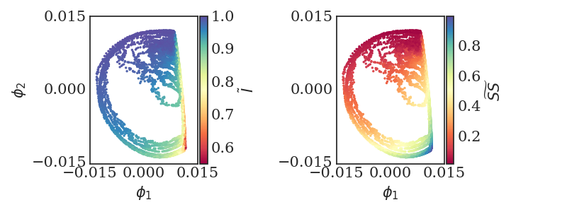
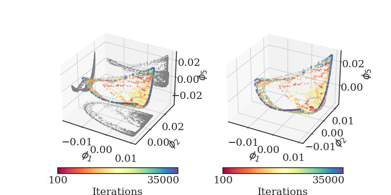
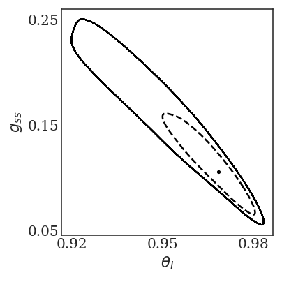
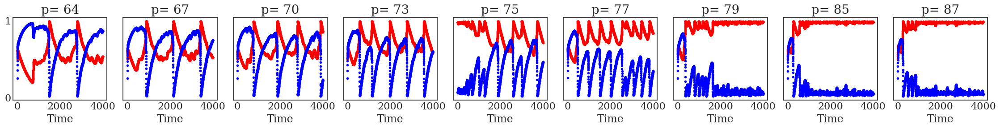

===========================
Milestone 2 Progress Report
===========================
Report on Developing Framework for the Hybrid Models
Identifying the Known and Unknown Parts Along with Mathematical
Approaches

**Approved for public release; distribution is unlimited. This material is based upon work supported by the Defense Advanced Research Projects Agency (DARPA) under Agreement No. HR00112290032.**

1      Overview
========

This technical report covers the period of January, 2022 through March,
2022. The report documents the achievement of the milestone associated
with Month 2 of the JHU/APL-led PACMAN team’s statement of work. 

2      Goals and Impact
================

The goals for this milestone include reporting on the progress of: a)
designing the experimental setup of physics-informed learning for
surrogate models, b) developing the initial architectures, loss
functions and integration plan for surrogate, causal, and neuro-
symbolic models; c) defining how scenario statements will be represented
symbolically, how what-if questions will be generated by the GAN and any
computational requirements, and d) developing a theoretical design of
the causal inference and climate neuro- symbolic language.

3      Task 3. AI Physics-Informed Surrogate Models
============================================

**Subtask 3.2. AI Physics-Informed Surrogate Model Learning**

As described in our Milestone 1 report, we are developing models in
increasing levels of complexity. As mentioned, we are using the
Gnanadesikan four box model as a surrogate model to begin. This model
offers a simplified way to observe AMOC shutoff behavior. In this first
iteration, we will develop the fold bifurcation method that could be
applied to the Gnanadesikan four box model. We will also begin
developing the reduced AI models to be used as an AI surrogates in place
of the Gnanadesikan four box model. Understanding the role of the
Gnanadesikan four box “surrogate” model will be fundamental in designing
the AI surrogate models. Thus, we have performed a detailed study of the
box model Matlab code, initial state variables, parameters, and the
model equations. From this study, we describe the methodology that will
be used.

Tipping point computation plan for the (stochastic0 Box model)
--------------------------------------------------------------

To begin, we will develop one-parameter bifurcation diagrams of the
(deterministic part) of the box model (9 differential equations) with
respect to the separate parameters; it is already known that hysteresis,
and therefore a violent “jump” between different behaviors, arises in
the regime we will explore. In the neighborhood of the turning (tipping)
point, the model reduces to an effectively one-dimensional model since
one eigenvalue is close to zero. Then stochastic simulations will give
rise to time series “jumping” across different states.

We will collect these time series as a function of the parameter and
then:

(a) Use data mining to reduce the 9-dimensional state to a one- or
    two-dimensional data driven state

(b) Learn (using NN identification technology with architectures / loss
    functions based on numerical stochastic integrators) the effective
    parameter-dependent surrogate Stochastic Differential Equations
    (SDE) and

(c) Compute the distribution of escape times from simulation and from
    the requisite model-based Partial Differential Equation (PDE)
    solution.

(d) Use some of the physical parameters to control/stabilize the
    unstable (saddle) state living on the separatrix.

(e) Approximate the states on this low-dimensional separatrix (a saddle
    and its stable manifold) based on the drift of the effective SDE.

|image1|\ Demonstration of the components
-----------------------------------------

| |image2|\ The solution steps are illustrated below for a different
  complex dynamic model (an epidemic on an adaptive network). We will
  adapt our existing method for the epidemic problem, and apply this
  method to the AMOC problem. Network dynamic stochastic simulations are
  performed for various parameter values. In **Figure 1**, we show a
  single infection
  parameter\ :math:`\text{\ p\ }\text{is\ changed}\ `\ and observe the
  bifurcation behavior with respect to it – at the “high p” limit, close
  to :math:`70 \times 10^{- 5}`, we see clear transitions between two
  stable states (a stable steady state and a large stable oscillation,
  shown in the inset.) In **Figure 1**, the white line tentatively marks
  a branch of unstable limit cycles. Shaded regions mark ranges of ρ
  observed during long individual-based simulations in the neighborhood
  of the large attractive limit cycle (light gray) and of stable of
  stationary solutions (dark gray). Computation of the Jacobian
  eigenvalues
| reveals a subcritical Hopf bifurcation (A), two fold bifurcations
  (C,E) and a transcritical bifurcation (F). In addition, there is a
  fold bifurcation of cycles (B) and a homoclinic bifurcation (D). Two
  small insets indicate the eigenvalue configuration at points A and C.
  Inset: time series on the limit cycle attractor
| at p = 0.0006. Parameters of the problem as described in (Gross T et
  al 2008): w0 = 0.06, r = 0.0002, N = 105, L = 106.

The coarse subcritical Hopf bifurcation at
:math:`p_{A} = 73.7 \times 10^{- 5}` is one example of a tipping point.
We will initially be identifying fold bifurcations for the simple box
model; however, we will need to identify other types of bifurcations
such as Hopf as we increase in model complexity. Beyond it (:math:`p` >
:math:`p_{A}`) we have BOTH a stable steady state and a stable limit
cycle – and the separatrix between them is an unstable limit cycle. In
**Figure 2,** we show the phase portrait of the coexistence of the big
stable limit cycle, a small unstable limit cycle (separatrix, \``tipping
boundary’’) and a stable steady state for
:math:`p = 75 \times 10^{- 5}`. When we initialize *inside* the unstable
(broken line, separatrix) limit cycle, we get attracted to the stable
steady state; when *outside* the unstable limit cycle, we go to the
large, stable limit cycle. When we start *very close* to the unstable
limit cycle, we “linger around it” for some time before deciding which
way to go – this “lingering” becomes much more complex in the stochastic
case, as seen in time series in Figure 3, where transients are shown.

|image3|\ In **Figure 3**, we show transitions between two states (a
stable steady state and a large oscillation). The physical coordinates
:math:`\theta_{Ι}` is in red and :math:`g_{\text{ss}}` is in blue for
different values of the parameter :math:`p\ ( \times 10^{- 5})`.
Instances of \``transitioning” between large oscillations and steady
states can be seen at intermediate parameter values. For large values of
p, we go to the stable steady state (the only attractor); for small
values, we see the large oscillations – and for intermediate values we
see large oscillations, *and* quiescent periods, *and* hovering around
“mid-level oscillations” – hovering around the separatrix.

We use a neural network, shown in **Figure 4**, to learn the effective
SDE shown in **Figure 2**.

.. image::_static/media2/image10.png
   :alt: Diagram Description automatically generated
   :width: 4.43188in
   :height: 1.7in

Figure 4. A caricature of the Neural Network architecture used to learn
the drift and diffusivity of the stochastic differential equation.

The “tipping point” reduced phase space is shown in **Figure 2** – a
stable steady state coexisting with a large amplitude oscillation; the
separatrix is the unstable limit cycle shown in a broken line. The phase
portrait in terms data driven variables (diffusion map coordinates) is
shown in **Figures 5** and **6** computed on sampled data of the full
network for :math:`p = 75 \times 10^{- 5}\ `. In **Figure 5,** we show
the same dynamic trajectories as above, plotted not in physical space,
but instead in latent, data-driven space where the first two “nonlinear
principal component” Diffusion Map coordinates come from data mining the
time series.

Figure 5: The first two, data-driven (Diffusion Maps) coordinates
colored with the two physical coordinates :math:`\theta_{Ι}`\ and
:math:`g_{\text{ss}}` indicating visually the one-to-one relation
between the physical and the data-driven coordinates.

Figure 6: A 3D figure of the transients in latent space, shown colored
with by evolution time. On the figure on the left, also the projections
on the various 2D planes are shown.

|image4|\ In Figure 6, we show the same transients in three-dimensional
latent space (the space of the first three “nonlinear principal
components”, i.e. the first three nonharmonic diffusion map components).
The transients are shown colored with by evolution time.

And the tipping point (two attractors and the separatrix) is shown in
data driven observable space is shown in **Figure 7**.

Our escape time distribution computations are shown in **Figures 8 a,
b,** and **c**. **Figure 8a** shows the escape times predicted by a
network trained on physical variable time series (the mean of the
distribution is 0.255 and 10,000 trajectories were used in these
computations), while **Figure 8b** shows the one trained on diffusion
map time series (the mean value of 13,000 sampled trajectories was
0.295\ **). Figure 8c** shows the escape times for the full network
simulation for two networks (the mean escape time of the Network 1 was
estimated at 0.527 (from 12,000 simulated trajectories) and the mean
escape time of Network 2 was estimated at 0.197 (from 6,600 simulated
trajectories).

|image5|\ An important next step will involve the integration of this
method with the GAN-based estimation of the separatrix (the unstable
limit cycle). We describe below how the GAN will learn the space of the
separatrix. The integration of the bifurcation method will support the
discriminator in learning the stabilities and instabilities in the
model. Initially the discriminator will use the Gnanadesikan four box
model as its surrogate. However, as we start to build the AI surrogate
models, we will eventually move from the Gnanadesikan four box model as
the surrogate to the AI surrogate.

4      Task 4. Multi-Agent Neuro-Symbolic AI Simulation
================================================

**Subtask 4.2. AI Simulation Development**

Initial Architectures – The GAN
-------------------------------

As proposed, we are exploring the use of a generative adversarial
network for the simulation. The architecture primarily follows model
prescribed in the original paper by Goodfellow 2014 including two
networks, a discriminative network *D* and a generative network *G,*
which engage in an adversarial game until a potential Nash equilibrium
is reached. However, we modify this initial setup by replacing the
generator *G* with a set of generators *G\ 1..m*. As previously
described in terms of the value function, *V,* is defined by:

.. math:: \frac{\min}{G}\frac{\max}{D}V(D,\ G) = \ \mathbb{E}_{x\sim pdata(x)}\lbrack\log{D(x)\rbrack + \ }\mathbb{E}_{z\sim p_{z}(Z)}\left\lbrack \log\left( 1 - D\left( G(z) \right) \right) \right\rbrack

*G* represents the generator neural network and *D* represents the
discriminator neural network, :math:`\mathbb{E}_{x}` represents the
expected value over data samples and :math:`\mathbb{E}_{z}` represents
the expected value over generated samples, with adjusted *D* parameters
to minimize *log D(x)* and adjusted *G* parameters to minimize
*log(1-D(G(x)))* define the minimax game. *D* tries to maximize its loss
and *G* tries to minimize its loss. Prior information constrains the
*p\ z\ (z)* distribution. Since there will be *M* generators *G\ 1:M ,*
this value function will be further modified.

The team has begun building a prototype GAN in order to explore using
multiple generators. In order to gain a better understanding of how this
interaction will occur with respect to *G\ 1:M*, the prototype entails a
simple 1-equation surrogate model, a basic representation of the
problem, and a multi-generator GAN. We are using this prototype to
better understand the requirements of the loss function for both the
discriminator and the generator, which needs to account for multiple
generators. Simultaneously, a deeper treatment of the adversarial game
and the job of both the discriminator and the generators is being
explored.

Our early experiment is a 1-D non-parametric density estimation using
MAD-GAN. Shown in **Figure 9** on the left is a sample from a
5-component 1-D Gaussian Mixture Model (GMM), and on the right shows an
overlay of a sample of generator outputs (in this case 4) after 50,000
updates to the discriminator and generator. The sample distributions of
all of the generators appear to be “converging” towards the real
distribution, but not necessarily one generator per modality as
described in the paper.

Figure 9. MAD-GAN 1-D GMM Experiment to better understand the behavior
of GANs with multiple generators.

The Gnanadesikan Four Box Model
-------------------------------

|image6|\ As proposed, the Gnanadesikan four box model, depicted in
**Figure 10**, will be used for the first version of this simulation.
The Gnanadesikan four box model is a simple dynamical model that
includes southern, low latitude, and northern surface boxes and one deep
box. The low latitude and the deep box are designed to allow for
adjustments based on forcings. In addition, temperature and salinity in
all four boxes support variation.

The Adversarial Game
--------------------

|image7|\ Recall as depicted in **Figure 11\ ,** the surrogate model
will be used by the discriminator to run in model time, based on initial
conditions and parameters specified. The initial simulation setup will
use the Gnanadesikan four box model. This will enable simultaneous
development of the AI surrogates and the GAN architecture without a
strong initial dependence. The Gnanadesikan four box model simulations
will be used to generate data for both the GAN and the AI surrogate
model work.

|image8|\ The adversarial game entails the generator processing data
that includes the model initial state variables, parameters, ranges, and
hard bounds allowable for perturbation (i.e., hard bounds imply states
that would violate realistic, physical states). The generator will
randomly choose a parameter to perturb and a value (bounded). This will
be presented to the discriminator as a run that would potentially result
in a shutoff of the AMOC or more generally instability in the model. The
discriminator’s goal is to maintain stability in the model. It will run
the Gnanadesikan four box model using the initial state variables and
the parameters with the suggested perturbation. The discriminator will
use a method that we are building to establish whether instability was
reached while moving through box model time. If not, it will classify
the model, initial state variables, and parameters with the suggested
perturbation as stable. If an instability is reached it will classify
the model, initial state variables, and parameters with the suggested
perturbation as unstable. The discriminator will indicate to the
generator whether the suggestion led to a tipping point. The generator
agents will continue to explore the parameter space of the model,
eventually leading to fully explored space of instability depicted in
**Figure 12**, as a 2-D representation. The generators will thus explore
the space of points that are found in the separatrix. The discriminator
will learn over time what to avoid in terms of instability and what in
parameter space could be used to avoid the instability in future runs.

|image9|\ It is important to note that there are two dimensions of time
in this adversarial setup, as shown in **Figure 13**, there is the box
model time dimension for which the model runs for **n** timesteps, and
there is the time dimension in terms of the GAN adversarial game. The
first version of this prototype will explore returning a binary label
indicating whether the AMOC shutoff was reached or was not reached. This
will either end the search for this agent, trigger another random
perturbation across parameter space, or trigger a further perturbation
of the current parameter. Understanding how the generators will work
together exploiting the parameter space and what is required of the loss
function which will include the state of the generators, is currently
under investigation.

The discriminator is also learning what combination of initial
conditions and parameters reach a shutoff. The discriminator has a set
of input samples which are built from simulated box model runs. The set
of input samples will be used to train the discriminator to learn which
combination of parameters and initial conditions lead to a shutoff and
which do not. As the generators present new potential combinations, the
discriminator will run out the model with the presented combinations.
These eventual runs will enable the discriminator to learn
generalizations that lead to both instabilities and stabilities in the
model.

Neuro-Symbolic Language
-----------------------

In order to develop the neuro-symbolic language the team has devised a
simple question that can be traced through the equations to the box
model code.

The Example Question:

*Does the stability of the overturning depend on the pathways and
sensitivities of water mass transformation in the Southern Ocean?*

How this question translates to the Gnanadesikan four box model is
defined as follows.

Water mass transformation in the South
:math:`M_{s}^{\text{trans}}`\ (representing the net transformation of
dense water to light water) is a combination of Eddy fluxes and Ekman
Fluxes

.. math:: {M_{s}^{\text{trans}} = M_{\text{ek}} - M}_{\text{eddy}}^{s} = \frac{\tau_{x}^{s}}{\text{ρf}}*L_{x}^{s} - A_{\text{GM}}*D*\frac{L_{x}^{s}}{L_{y}^{s}}

Where :math:`\tau_{x}^{s}` is a wind stress, *f* is the Coriolis
parameter :math:`L_{x}^{s}` is the length over which we integrate
(outcrop of a critical density surface?). :math:`A_{\text{GM}}` is the
eddy advection coefficient, D is the Depth of the pycnocline and
:math:`L_{y}^{s}` is the width of the ACC/length scale over which the
pycnocline shallows. The same :math:`M_{s}^{\text{trans}}`\ can be
achieved with different combinations of parameters even given the same
pycnocline depth. In general, for a given :math:`M_{s0}^{\text{trans}}`
if :math:`\tau_{x}^{s}` is changed (which can vary across different
models) then this balance is used as:

.. math:: \frac{\tau_{x}^{s}L_{x}^{s}}{\text{ρf}} - M_{s0}^{\text{trans}} = A_{\text{GM}}*D*\frac{L_{x}^{s}}{L_{y}^{s}}

to find a mixing coefficient that will give an identical water mass
transformation in the South.

The team has been working through a translation from the proposed
questions – to the Gnanadesikan four box model code – to a structured
language. The structured language represents constituents in terms of
graphs. This representation will enable both the ability to perform
inference and to apply automatic graph enrichments if need. The initial
graph structure has taken the form of representing a simulation as shown
in **Figure 14**. The team will further refine this work and will begin
experimenting with the example described above in terms of generating
graph structures. There are currently three thrusts underway (roughly
aligned with **Figure 15**) in terms of the neuro-symbolic
experimentation: a) developing the language and exploring the potential
use of a graph embedding network to support inference, b) the embedding
that converts structured problems into numeric structures for the GAN to
learn how to answer the tipping point question, and c) formalizing the
causal component of this methodology.

|image10| |image11|

*Figure 15. From Models to Language to Adversarial Learning – A
depiction of how we will incorporate the explorations of the box model
with a neuro-symbolic language, represented as graphs for
low-dimensional embeddings used for learning. Graph representations used
for representing modeling (far left), defining exploration problems in
terms of graphs (mid-left), producing low dimensional embeddings of
graphs (mid-right), and using the low dimensional embedding for
adversarial learning (far right).*

Causality
---------

As described in the Milestone 1 report, we are exploring two ways in
which causality will integrated into the AI simulation. As part of the
graph construction, we will build causal structure “templates” based on
a priori knowledge. For example, an a priori causal template could
include the fact that evaporation leads to high salinity in ocean
waters. We are exploring the use of a graph-based network that could be
used to learn these co-occurring factors. The other area relates to the
inference that could be performed over the graphs constructed. We are
exploring a set of options for how to represent what the generators
learn over time tightly coupled to the neuro-symbolic representation.
Graph representation are advantageous because inference could then be
applied to the learned graph. The work described to support the
neuro-symbolic language is fundamental to causal inference.

5      Computational Requirements
==========================

The team has been exploring computing resources to support the AI
simulation. We have estimated how much disk space will be required, how
many GPUs will be needed and how we will accommodate sharing between the
APL and JHU teams, and with the larger ACTM community.

To address these collaborations, the APL team is using internal
multi-GPU computing environment for experimenting with deep learning
models. The JHU team is using internal high-performance computing for
running oceanography models. Both teams will use a shared computing
environment located at Johns Hopkins University, respectively called
SciServer which will enable sharing of models and data between the JHU
and APL teams. In addition, APL will purchase a cloud-based virtual
machine to enable sharing of data and models to the larger ACTM
community.

6      Conclusion and Next Steps
============================

The team has made significant progress in cross-disciplinary
understanding to support building both the AI simulation experiments and
the AI-surrogate models with bifurcation. The team is now entering the
phase of experimentation setup, architecture design, and data set
generation for training the AI models. The team is also working towards
integration points that will enable sharing with the larger ACTM
community.

Bibliography
============

**Gnanadesikan**, A., R. Kelson and M. Sten, Flux correction and
overturning stability: Insights from a dynamical box model, J. Climate,
31, 9335-9350, https://doi.org/10.1175/JCLI-D-18-0388.1, (2018).

Stommel, H. Thermohaline convection with two stable regimes of flow.
Tellus 13, 224–230 (1961).

Sgubin, Giovanni, Didier Swingedouw, Sybren Drijfhout, Yannick Mary, and
Amine Bennabi. “Abrupt cooling over the North Atlantic in modern climate
models.” Nature Communications 8, no. 1 (2017): 1-12.

Rodgers, Keith B., Sun-Seon Lee, Nan Rosenbloom, Axel Timmermann, Gokhan
Danabasoglu, Clara Deser, Jim Edwards et al. “Ubiquity of human-induced
changes in climate variability.” Earth System Dynamics 12, no. 4 (2021):
1393-1411.

Goodfellow, Ian, Jean Pouget-Abadie, Mehdi Mirza, Bing Xu, David
Warde-Farley, Sherjil Ozair, Aaron Courville, and Yoshua Bengio.
"Generative adversarial nets." Advances in neural information processing
systems 27 (2014).

Hoang, Quan, Tu Dinh Nguyen, Trung Le, and Dinh Phung. “MGAN: Training
generative adversarial nets with multiple generators.” In International
conference on learning representations. 2018.

Li, Wei, Zhixuan Liang, Julian Neuman, Jinlin Chen, and Xiaohui Cui.
“Multi-generator GAN learning disconnected manifolds with mutual
information.” Knowledge-Based Systems 212 (2021): 106513.

.. |image4| image:: _static/media2/image13.png
   :width: 2.19792in
   :height: 3.94444in
.. |image5| image:: _static/media2/image15.png
   :width: 6.50101in
   :height: 3.32949in
.. |image6| image:: _static/media2/image18.png
   :width: 4.17986in
   :height: 2.08344in
.. |image7| image:: _static/media2/image20.png
   :width: 3.83403in
   :height: 2.64722in
.. |image8| image:: _static/media2/image22.png
   :width: 4.4375in
   :height: 3in
.. |image9| image:: _static/media2/image24.png
   :width: 4.63264in
   :height: 2.925in

