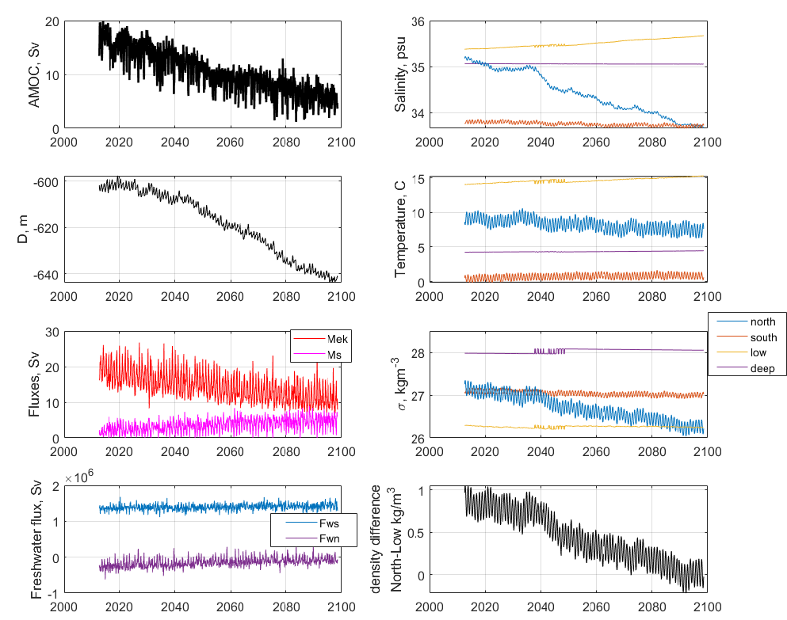

===========================
Milestone 3 Progress Report
===========================
Report on Metrics to be Used to Compare the Benefits of
Hybrid Models Over Conventional Models

**Approved for public release; distribution is unlimited. This material is based upon work supported by the Defense Advanced Research Projects Agency (DARPA) under Agreement No. HR00112290032.**

**PACMANS TEAM:**
• Jennifer Sleeman (JHU APL) PI
• Anand Gnanadesikan (JHU) Co-PI
• Yannis Kevrekidis (JHU) Co-PI
• Jay Brett (JHU APL)
• David Chung (JHU APL)
• Chace Ashcraft (JHU APL)
• Thomas Haine (JHU)
• Marie-Aude Pradal (JHU)
• Renske Gelderloos (JHU)
• Caroline Tang (DUKE)
• Anshu Saksena (JHU APL)
• Larry White (JHU APL)
• Marisa Hughes (JHU APL)

1      Overview
===============

This technical report covers the period of February 2022 through April
13, 2022. The report documents the achievement of the milestone
associated with Month 4 of the JHU/APL-led PACMAN team’s statement of
work. 

 2      Goals and Impact
========================

The goals for this milestone include CMIP data wrangling and dataset
delivery, and a report describing the metrics used for the hybrid
methods in terms of accuracy, physical consistency, reproducibility, and
consistency. As part of this milestone, we are providing both the tools
and datasets that will be used to train the AI surrogate models and the
AI simulation. We will also begin collaborating with the other teams
working on the AMOC tipping point problem including the Exeter/Waterloo
group. We have started a Slack channel for sharing information
pertaining to using the data and using the data generation tools we have
developed. We will hold tutorials with teams, as needed, and will
encourage other non-AMOC teams to take a similar approach with the goal
of developing a suite of tools and datasets across a variety of tipping
points.

3 Task 2. Global Climate Models
===============================

**Subtask 2.2. CMIP Data Wrangling and Dataset Delivery Preparation.**

This task defines the CMIP data wrangling efforts which will support
dataset generation for the purpose of training the AI surrogate models
and the AI simulation GAN. As previously described, we made an early
decision to use the Gnanadesikan four box model as a starting point for
data generation that would be used to both train and validate the AI
models. Taking this approach has enabled us to build the AI surrogates
and the AI simulation simultaneously. It also has allowed us to focus
initially on the architectures rather than the complexity of the GCM
full data domain. The Gnanadesikan four box model enables controlled
simulations of AMOC shutoff behavior that can be detected using a fold
bifurcation method. As part of this effort, we have developed a full
suite of tools for AI dataset generation in Python.

In addition to this effort, part of this milestone includes the first
dataset based on the Community Earth System Model, CESM2. This model has
been shown to have a significant weakening of the AMOC in response to a
warming climate. To build a controlled CESM2 dataset for the AI models,
the CESM2 data extraction has been calibrated to the Gnanadesikan four
box model in that the CESM2 diagnostics have been extracted that
correspond to the box model. This has enabled us to a) reduce the
complexity of the CESM2 data generation, b) better understand AMOC
behavior present in the CESM2 data, and c) create the same initial
conditions and parameter values in the box model to both test validity
and to run the model past the cut-off timestep in CESM2 runs to test for
AMOC shut-off or collapse. As part of this milestone, in addition to the
Gnanadesikan four box model Python data generation tools, we will also
provide a data generation tool for CESM2 written in Matlab (v1). Python
tools for CESM2 data generation, preferably generalized for multiple
models taking part in the CMIP experiments, are being developed and will
be delivered as part of milestone 5.

Both of these efforts are supporting our goal of applying our AI
simulation method to large GCMs to discover new insight into AMOC
tipping points, either weakenings or complete shut-offs, as shown in
Figure 1. We believe that through this exploration, we will better
understand both AMOC collapse avoidance measures and AMOC collapse
recovery.

|image2|\ Gnanadesikan Box Model DataSets and Tools
-----------------------------------------

As mentioned in the milestone 2 report, the Gnanadesikan four box model
is a simple dynamical model that includes southern, low latitude, and
northern surface boxes and one deep box as shown in Figure 2. The model
and experiments that explore AMOC shut-off were published in
(Gnanadesikan 2018) and the tools for recreating these experiments were
written in Matlab.
|image1|\ |image3|\
As part of the milestone 3 delivery, our team has developed a
set of tools based on the Gnanadesikan four box model for data
generation. Specifically, we have developed a Python version of the
Matlab four box model that allows one to specify initial conditions, and
parameter values. A highlight of this code is shown in Figure 3. The
Python package recreates the Gnanadesikan experiments contained in the
Matlab code and generates the same plots as shown in Figure 4, where
overturning behavior is visualized.

|image4|\ We use this tool to create the datasets we will use for
training both the AI surrogates/bifurcation and the GAN. We are also
using this dataset to explore building the neuro-symbolic language and
the causal model. The dataset is generated as both a labeled dataset and
a temporal dataset. The data generation process is flexible in terms of
output with netcdf as the current format.

|image5|\ The tool also allows for grid-like data generation across the
parameter space over the ranges of all 24 parameters. It starts from a
base simulation with initial conditions and generates child simulations
representing perturbed parameters sets, where a different parameter is
choosen per run. The relationship between perturbed runs is captured
through the naming convention of the data. An example of this structure
is shown in Figure 5, where child simulations are based on a parent
simulation for which a parameter is perturbed. We will use this
structure to support training the GAN and evaluating what it learns as
output. This structure intentionally covers the full parameter space, so
at each node in the tree, a single parameter is perturbed and a
perturbed value may or may not result in an AMOC shut-off. The result of
a simulation run will include an attribute, **‘mode_shift_detected’**,
which acts as a label for the run indicating whether a shut-off is
reached or not. Labeling was achieved by identifying when northern
hemisphere overturning (M_n) crossed 0. List of time steps where the
criteria was met (variably sized).

CESM2 DataSets and Tools
------------------------

CESM2 is a global, coupled atmosphere-ocean general circulation model
that has participated in the Coupled Model Intercomparison Project,
version 6 (CMIP-6), including the forward climate scenario, ocean, and
paleoclimate experiments. The results are publicly available, archived
at `cmip6 Data Search \| cmip6 \| ESGF-CoG
(llnl.gov) <https://esgf-node.llnl.gov/search/cmip6/>`__. In addition, a
variety of pre-industrial runs with varied AMOC strengths are available
through NCAR’s archive at Earth System Grid (`Dataset: CESM2 LENS Ocean
Post Processed Data Monthly Averages
(earthsystemgrid.org) <https://www.earthsystemgrid.org/dataset/ucar.cgd.cesm2le.ocn.proc.monthly_ave.html>`__).
Initial data wrangling includes processing 4-dimensional ocean variables
of temperature, salinity, and velocity (4GB/decade) into zonal-mean
(3-dimensional) temperature, salinity, potential density, and velocity
(150MB/decade). These zonal-mean variables are then processed into
1-dimensional time series (50kB/decade) that are parallel to those
created by the Atlantic box model (Gnanadesikan 2018). This includes the
spatial-mean temperature, salinity, and potential density in 4 Atlantic
sub-regions, the pycnocline depth, the overturning flux in the northern
and southern high latitudes where deep water is formed, the Ekman flux
from the Southern Ocean northward, and the freshwater fluxes between
regions. Combined with the fixed parameters used in CESM2 for
diffusivities and an estimate of the time constant for the northern
high-latitude near-surface box, the results are monthly data and fixed
parameters that could be input to the box model to estimate an
equilibrium ocean state. These data include the transient response to
fluctuations in ocean state and atmospheric forcing, and a noticeable
seasonal cycle as shown in Figures 6 (forward scenario SSP1-2.6) and 7
(historical run 1850-2014).

Figure 6 demonstrates the applicability of the box model for the CESM2
data. The changes in AMOC strength (top left), pycnocline depth (just
below AMOC), meridional density difference (difference between northern
and low-latitude boxes, bottom right), and salinity in the northern box
(top right, blue) are correlated. In the box model, these have the same
relationship: freshening of the northern box reduces its density,
leading to a reduction in the meridional density difference, a deeper
pycnocline, and a weaker AMOC. The box model has a shutoff of AMOC when
the meridional density difference is zero, and reverses if it is
negative. That state is reached around 2085 for summer months, but
winter months, when deep water formation occurs, still have a positive
density difference, and the AMOC is about 25% of its preindustrial
strength which is a larger change than any observed in the
pre-industrial or historical runs for this model.

In the search for AMOC shut-offs in CESM2 data, we have also examined
the paleoclimate runs performed for PMIP. No very weak AMOC state is
identified that persists for multiple years. However, the decadal
variability levels in these long (700-year) simulations may be useful
for determining whether AMOC weakenings, as seen in the forward
scenario, are likely leading to tipping points rather than recoveries.
An example is shown in Figure 8: 10-20% shifts in AMOC strength are
seen, both positive and negative, over decadal timescales. Using the
tools built for this milestone, we will be able to add these cases to
our dataset and study them further.

4      Task 5. Evaluation Final Report
======================================

**Subtask 5.1. Report on metrics in terms of accuracy, physical
consistency, reproducibility, and consistency**

Box Model for Consistency and Reproducibility
---------------------------------------------

In Figure 9, we show how ground truth will be established in order to
evaluate the AI simulation. As we move from left to right, we show the
project progression, the number of parameters increases, the number of
outcomes increases, eventually moving towards realistic full GCM model
runs. As shown, these non-calibrated models will be used after we have
established a strong sense of system performance. When we apply the AI
simulation to non-calibrated GCMs, we will use the climate modeling
experts of our team to evaluate the results of these runs. The climate
modeling experts will run in-house models and will perform analysis on
the results to achieve an empirical evaluation of the AI simulations.

.. image:: _static/media3/image16.png
   :width: 6.5in
   :height: 3.27299in

The Gnanadesikan Four Box Model is used to better understand both AMOC
on/off states over time and to generate the initial dataset for
validation of the AI models. Model configurations discovered by the GAN
that led to a AMOC shut-off can be reproduced using the box model.

In addition, the model calibration can be performed and used to validate
CESM2 model runs that indicate weakening of the AMOC. By recreating the
CESM2 model configurations in the box model, the box model can be run
beyond the last timestep in the CEMS2 model. When an AMOC shut-off is
not present in the CESM2 model but weakening is observed, the box model
can be used to determine if the state of the model in the presence of a
weakening would result in a shut-off.

Model calibration can be further extended against other climate models.
Using this approach, we will be able to capture both mean state and
variability.

Future box model improvements will seek to increase the dynamics
included in the model and potentially the boundaries. For example, the
box model can be extended to include the Pacific Basin and to include
the seasonal cycle.

The box model enables evaluating what is learned by the AI components in
a consistent and reproducible way. As we move away from the box model
surrogate to the GCMs, the calibrated versions will be evaluated using
the box model to confirm expected outcomes. The uncalibrated models will
be used as a “model-in-the-wild”, as we will not have “ground truth”.
When we run a “model-in-the-wild”, we will use our in-house expertise to
validate the outcomes. We will want to explore these models only when
the AI simulation passes the other evaluations. When we get to the point
of running a “model-in-the-wild”, our objective will be to discover new
AMOC behavior.

Evaluation of AI Surrogates and Bifurcation
-------------------------------------------

The performance of surrogate models in estimating/predicting tipping
point/escape probabilities is measured in comparison to the full model
simulation. It is performed in two ways:

a) by direct simulation (when multiple random perturbation scenarios are
   simulated

..

   with the full model, and then also simulated by the surrogate model)
   to escape until the probability distribution of escape times
   visually/approximately converges. 

b) for a low-dimensional enough targeted surrogate model in the
   neighborhood of a tipping point, one can approximate the distribution
   of tipping times by solving a PDE for the escape time distribution
   itself. 

In both cases, the evaluation combines (a) the cost of running the full
model versus the cost of running the reduced one and (b) the evaluation
of the difference of the two escape time distributions after convergence
(i.e., of the accuracy of the surrogate model).

In the early stages of experimentation, we will develop surrogates based
on the box model. As we progress, we will work towards building
surrogates of the full GCM models.

Evaluation of Multi-Agent GAN
-----------------------------

The GAN architecture is described by two deep neural networks, one which
learns a supervised model and the other which learns an unsupervised
model.

We will evaluate the unsupervised part of the GAN (the generators which
are learning a latent space) using multiple metrics. The first metric
will be a qualitative measure of performance. In this measure, we will
evaluate how the generators learned different modalities of the
distribution.

Since we are building a multi-class discriminator GAN, the discriminator
will learn a classification model classifying configurations as shut-off
or non-shut-off initially, and eventually will perform classifications
in terms of shut-off, weakening, strengthening and potentially more
fine-grained classifications. The discriminator will learn how to
predict these outcomes given the input. We will use the box model
generated data to evaluate this method in terms of accurately predicted
whether a given set of initial conditions, and parameter configuration
will or will not lead to a shut-off. We will initially use a standard
machine learning measure of accuracy for the classification as we will
have a 2-class or binary classification setup. Accuracy is calculated
with respect to the true positive (TP), true negative (TN), false
positive (FP), false negative (FN) classifications, as seen below.

.. math:: Accuracy = \ \frac{TP + TN}{TP + TN + FP + FN}

As classifications move to a multi-class setup, we will measure
classification performance in terms of precision (P), recall (R), and
F-Measure (F1) which provides are more granular understanding of the
classification performance.

+----------------------+----------------------+----------------------+
| .                    | .                    | .. math:: F1 = \     |
| . math:: P = \ \frac | . math:: R = \ \frac |  \frac{2*P*R}{P + R} |
| {\text{TP}}{TP + FP} | {\text{TP}}{TP + FN} |                      |
+----------------------+----------------------+----------------------+

As we incorporate the neuro-symbolic model into the simulation, measures
of performance will change. As we develop the models further, we will
report on these changes.

Evaluation of Neuro-Symbolic Model
----------------------------------

The neuro-symbolic model will need to be evaluated independently from
the other parts of the AI simulation. In this evaluation, we will
measure the effectiveness of the language and its representation. We
will measure how we structurally represent the constituents of the
domain in terms of performance and in terms of representativeness.

To evaluate the effectiveness of using the neuro-symbolic model, we will
run the GAN with and without the neuro-symbolic model as part of the
workflow. We will measure the downstream task of causality and
explainability in terms of this comparison.

In addition, we will measure the effectiveness of the language in
support of question answering of the model. Representation of questions
and answers will be fundamental in linking these into the AI-learned
causal model.

The neuro-symbolic language will initially use the structurally
represented graphs based on the Four Box model as the problem domain and
a set of questions that imply potential causes of AMOC shut-off. This is
be the basis for developing the model and evaluating its effectiveness.
As we progress, the structure of this model will also be further
developed based on the calibrated CESM2 model and eventually a large
uncalibrated GCM.

Measuring Explainability and Causality of Final Learned Latent Space
--------------------------------------------------------------------

As outlined in the publication (Hoffman 2018) which formalized
explainability metrics shown in Figure 10, explainability will be
measured roughly in terms of the described AI Explainability (XAI)
measures.

.. image:: _static/media3/image18.png
   :width: 6.05972in
   :height: 3in

The causal model that results from the AI simulation will be evaluated
based on four measures: goodness criteria, satisfaction, comprehension,
and performance and are outlined below.

**Goodness criteria** – addresses factors such as clarity and precision
in terms of conclusions

   **Satisfaction** – modeler understandability of the resulting causal
   model and the conclusions obtained

   **Comprehension** – is the resulting model understandable and can the
   modeler comprehend both the conclusions and the pathways which lead
   to the conclusions

   **Performance** – is one able to ask questions of the resulting model
   and does the approach scale to large GCM model runs

5 PACMANS Website, Documentation, Datasets and Source Code
==========================================================

The PACMANS website will be hosted by Johns Hopkins University
SciServer. It will contain a link to our documentation, datasets and
source code. APL website development started. We will send an updated
email when we have completed the website development.

Project Homepage
----------------

https://www.sciserver.org/public-data/PACMANS/ (Under construction - to
be opened shortly.)

Source Code
-----------

https://github.com/JHUAPL/PACMANs

Datasets
--------

Currently available to DARPA on Github and will be transferred to
SciServer and available on the project homepage when open.

6 Conclusion and Next Steps
===========================

The milestone 3 deliverables exhibit both our team’s commitment to
developing a large-scale system that can be used for discovering tipping
points and for building a collaborative approach in working with other
performers on the team. By building a scalable approach to modeling the
problem, with a clear early start developing ground truth datasets that
can be used for deep learning model, we enable both time for developing
the research and for better understanding the behavior of the AMOC. This
approach will better inform how this AI simulation could be built as a
generalized approach applied to other climate tipping point phenomena.

Bibliography
============

**Gnanadesikan**, A., R. Kelson and M. Sten, Flux correction and
overturning stability: Insights from a dynamical box model, J. Climate,
31, 9335-9350, https://doi.org/10.1175/JCLI-D-18-0388.1, (2018).

Stommel, H. Thermohaline convection with two stable regimes of flow.
Tellus 13, 224–230 (1961).

Sgubin, Giovanni, Didier Swingedouw, Sybren Drijfhout, Yannick Mary, and
Amine Bennabi. “Abrupt cooling over the North Atlantic in modern climate
models.” Nature Communications 8, no. 1 (2017): 1-12.

Rodgers, Keith B., Sun-Seon Lee, Nan Rosenbloom, Axel Timmermann, Gokhan
Danabasoglu, Clara Deser, Jim Edwards et al. "Ubiquity of human-induced
changes in climate variability." Earth System Dynamics 12, no. 4 (2021):
1393-1411.

Goodfellow, Ian, Jean Pouget-Abadie, Mehdi Mirza, Bing Xu, David
Warde-Farley, Sherjil Ozair, Aaron Courville, and Yoshua Bengio.
"Generative adversarial nets." Advances in neural information processing
systems 27 (2014).

Hoang, Quan, Tu Dinh Nguyen, Trung Le, and Dinh Phung. "MGAN: Training
generative adversarial nets with multiple generators." In International
conference on learning representations. 2018.

Li, Wei, Zhixuan Liang, Julian Neuman, Jinlin Chen, and Xiaohui Cui.
"Multi-generator GAN learning disconnected manifolds with mutual
information." Knowledge-Based Systems 212 (2021): 106513.

Hoffman, Robert R., Shane T. Mueller, Gary Klein, and Jordan Litman.
"Metrics for explainable AI: Challenges and prospects." *arXiv preprint
arXiv:1812.04608* (2018).

.. |image2| image:: _static/media3/image4.png
   :width: 6.5in
   :height: 0.77431in

.. |image5| image:: _static/media3/image9.png
   :width: 4.44028in
   :height: 2.52083in
