===========================
Milestone 4 Progress Report
===========================
Approved for public release; distribution is unlimited. This material is based upon work supported by the Defense Advanced Research Projects Agency (DARPA) under Agreement No. HR00112290032.

**PACMANS TEAM:**

Jennifer Sleeman (JHU APL) PI

Anand Gnanadesikan (JHU) Co-PI

Yannis Kevrekidis (JHU) Co-PI

Jay Brett (JHU APL)

David Chung (JHU APL)

Chace Ashcraft (JHU APL)

Thomas Haine (JHU)

Marie-Aude Pradal (JHU)

Renske Gelderloos (JHU)

Caroline Tang (DUKE)

Anshu Saksena (JHU APL)

Larry White (JHU APL)

Marisa Hughes (JHU APL)

1      Overview
===============

   This technical report covers the period of April 2022 through May
   13, 2022. The report documents the achievement of the milestone associated with Month 5 of the JHU/APL-led PACMAN team’s statement of work. The delivery for this milestone is this report which highlights
   progress made for the AI surrogate modeling and the AI simulation research.

   | • This report includes:
   | • New architectures
   | • Experimental definitions
   | • Findings based on experimental results
   | • Next steps\ |image26|

2      Goals and Impact
===============

Goals for this milestone included:
    • Obtain the first set of experimental results for the AI surrogate modeling based on testing the formalizations described in Milestone 3
    • Perform early experimentation of a baseline GAN for a subset of explorations and what-if questions
    • Show feasibility of the causal model
    • Obtain baseline symbolic language experimental results\ |image27|

3      Key Findings
===============

    • Surrogate Learning (Task 3.3)
        • Completed the first set of bifurcation diagrams for the box model equations
        • Discovered a new type of tipping point in the Box model using the non-dimensionalized equations
            • In Gnanadesikan 2018 paper a fold bifurcation was assumed, we discovered subcritical Hopf bifurcation also exists for the reverse transition
            • **Plan to publish these findings – this represents a new insight into potential AMOC behavior**

    • AI simulation (Task 4.3)
        • Completed first set of multi-agent generator GAN experiments using the box model data
            • **Generators show a positive tendency towards AMOC collapse**
        • Setup a baseline neuro-symbolic experiment using rules-based model with a set of questions which correlate with the box model Gnanadesikan 2018 experiments
        • Developed a first approach for bi-directional translation between the neuro-symbolic language and the GAN perturbations
            • **If successful, this model will show how a GAN’s perturbations of symbols can be translated to “purely generative” natural language questions**
        • To address questions around AMOC slowing vs. complete shut-off and recovery from AMOC, we are exploring causality at the model level
            • **we expect to address these two areas with a probabilistic causal model**\ |image28|

4      Task 3.3 – Surrogate Learning
==============================================================

   *Subtask Description: Report on the first set of experimental results
   based on testing the formalizations set forth in Milestone 3.*

   | Accomplishments:
   | • **Major breakthrough** in terms of bifurcation modeling

   • We have been able to perform detailed bifurcation diagrams of the box model

   • This was enabled by a careful non-dimensionalization of the related equations, without which the accuracy of the numerical computations would be unsatisfactory

   • With the non-dimensionalized equations, the problem possesses not one but two tipping points (fold and Hopf bifurcations)\ |image29|

   With the non-dimensionalized equations, the problem possesses not one
   but two tipping points (from the “upper” branch to the lower, but
   also from the lower to the upper) as shown in Figures 1-2.

   .. image:: _static/media4/image28.png
      :width: 5.01806in
      :height: 3.7625in

   .. image:: _static/media4/image29.png
      :width: 5.01805in
      :height: 3.7625in

   **Figures 1a-1b. Diagram of NH Overturning Mn (a) and Zoomed-In View
   of the subcritical Hopf Bifurcation Point (b).** |image30|

   Second view - the two tipping points are of different nature: one of
   the two is the fold point bifurcation, but the second one is a
   subcritical Hopf, highlighted in Figures 1-2. The Hopf at
   TrFWn=0.0384 is subcritical.

   |image31| |image32|

   **Figures 2a-2b. Diagram of Low Latitude Depth D\* (a) and Zoomed-In
   View of the Hopf Bifurcation Point (b).**

   • The value where the limit cycle branch appears to become  vertical (an infinite period, homoclinic orbit) is 0.0375.

   • The subcritical Hopf gives birth to an unstable limit cycle “backwards” in parameter space (that surrounds the exiting stable steady state).

   • This steady state loses stability at the Hopf bifurcation (red branch in Figures 1-2).

   • The escape (the “tipping") arises when a stochastic trajectory wandering around the stable state manages to "cross” the unstable limit cycle and escape to either large oscillations or to a completely different lower circulation branch.\ |image34|

   Where the initial condition with D=1 (where D is the Low latitude
   pycnocline depth) is attracted by the upper branch because there is
   an early switch activation, so the sharp transition that we see is
   given by the upper limit point LP. While for D=4 we observe the sharp
   transition close to the subcritical Hopf (the solution loses
   stability at the exact Hopf point, because the initial condition may
   start outside the unstable limit cycle).

   |image35| |image36|

   **Figures 3a-3b. Temporal Bifurcation Diagram for Depth (a) and the
   Limit Cycle Continuation (b).** |image37|

   | Next Steps:
   | • We are working on a stochastic simulation close to the presented tipping points, to collect data towards a targeted surrogate model. This will allow us to efficiently and accurately estimate escape time distributions.

   | • We will learn targeted effective stochastic DEs (one-dimensional at the LP tipping, two-dimensional at the Hopf tipping) and use them to estimate escape time statistics in both cases.\ |image38|

5      Task 4.3 – AI Simulation
==============================================================

   *Subtask Description: Report on early experimentation of a baseline
   GAN for a subset of explorations and what-if questions, including a
   set of experiments that show feasibility of the causal model, and
   baseline symbolic language experimental results.*

   | Accomplishments:
   | • Started conducting GAN experiments using the box model data •
     Exploring behavior of multi-agent GAN loss function

   | • Exploring optimal number of generators
   | • Developed architectures needed for a baseline neuro-symbolic
     language that enables a translation from human-specific questions
     to the GAN simulation, and from perturbed GAN runs to questions.

   • Set up a baseline model that will be used for experimentation

   • Defined causality in terms of model behavior/time\ |image39|

GAN Experiments
---------------

   | • Three experiments using the Box model simulation data
   | • With a vector of 3 dimensions and perturbations of parameters

   | (bounded):
        • Dlow0 (Thermocline depth of lower latitudes): [100.0, 400.0]
        • Mek (Ekman flux from the southern ocean): [1.5e7, 3.5e7]
        • Fwn (Fresh water flux (North)): [5.0e4, 1.55e6]

   • Data was augmented for uniform sampling from a 3-D space
   • In addition to samples, generated 1,000 synthetic samples

   • Distribution of shutoff vs non-shutoff samples 743/413 |image40|

   | • Trained the GAN using equally-weighted generators
   | • Shutoff classification cross-entropy loss functions
   | • Ran for ~250 epochs
   | • Ran experiments with n = to the number of generators where n ∈ [1,2,4]
   | • Generated samples result in shutoffs/non-shutoffs\ |image41|

• Discriminator performance in classifying runs as shut-off or not•
• High F-measure scores indicate the discriminator was able to accuracy classify shut-off from non-shut-off runs for held-out test
   set
**Table 1. Precision, Recall, F-Measure scores for 1,2,4 generator GANs.**

=================== ================ ============= = ================
\                      **Precision**    **Recall**      **F-Measure**
=================== ================ ============= = ================
   **1 Generator**  1                              1 1
   **2 Generators** 0.993                          1 0.997
   **4 Generators** 0.929                          1 0.963
=================== ================ ============= = ================

**Small initial experiment- but very promising results from
discriminator in classifying runs**

   | • After training the GAN, sampled 500 times
   | • Generators tend to favor exploring areas of shut-offs

   | • Training data had some imbalance
   | • Larger dataset would provide verification

   **Table 2. For 1,2,4 generator GANs – Fraction of 500 samples that
   resulted in a shut-off.**

**Generator Idx**

============== ===== ===== ===== ===== =====
\                    **0** **1** **2** **3**
============== ===== ===== ===== ===== =====
**Number of**  **1** 0.854 n/a   n/a   n/a
\              **2** 0.992 0.998 n/a   n/a
**Generators**
\              **4** 0.982 0.986 0.972 1
============== ===== ===== ===== ===== =====

**The trained generators are successfully generating a latent space of
shut-offs**

• Early GAN results show interesting results regarding M_n and shut-off

   behavior. More experimentation is underway to explore this further.

**Figure 4a-c. GAN generated shut-offs for 1 generator (a), 2 generators
(b), and 4 generators (c).**\ |image42|\ |image43|\ |image44|\ |image45|

   | Observations:
   | • The n=1 generator case produces the greatest fraction of
     configurations that are non-shutoff states. This could be attributed to the GAN having
   more synthetic samples to learn from (i.e. n=2 and n=4 training loops
   versus n=1 training loop per epoch).

   • For this particular scenario (i.e. 3 perturbed features w/ fixed
   bounds), it appears that n=1 generator is enough to roughly capture
   the shutoff configurations in this feature space. However, it’s still
   to be determined how the generators will perform when allowed to
   perturb more than 3 features.\ |image46|

 • For Fwn the n=1 generator GAN learns a bi-modal sampling
   distribution with modes centered at approx.. 0.65e6 and 1.3e6.

   • When n=2 or n=4, generators learns a left-skewed uni-modal sampling distribution with mode centered at approx.. 1.3e6.

   **Figure 5a-c. Histograms showing distribution of generated shut-offs
   for 1 generator (a), 2 generators (b), and 4 generators
   (c).**\ |image47|\ |image48|\ |image49|\ |image50|

   | Observations:
   | • The mode at 0.65e6 has a large cluster of non-shutoff states,
     while the mode at 1.3e6 appears to be a cluster for a shutoff state. This finding
     also coincides with the larger fraction of non-shutoff states generated
     by the n=1 GAN vs. n=2 and n=4 GANs.

   • Discriminators incorrectly classify a larger fraction of real
   samples as synthetic as the number of generators increases.

Neuro-Symbolic Learning
--------------------------------------------------

   | Neuro-symbolic architecture has been defined in terms of levels ofrepresentation:

   • Text level – climate modeler asks questions

   • Symbolic level – “programs” generated from natural language

   • Vector level – GAN works at vector-level perturbing parameters

   | • Model level – Surrogate receives input in terms of initial conditions and parameters to run model

   .. image:: _static/media4/image40.png
      :width: 6.36805in
      :height: 3.54167in

   **Figure 6. Levels of Representation from Natural Language to Model
   runs.**

   • In training mode: GAN explores space through perturbations

   • Perturbations are translated into “programs”

   • “Programs” are translated into natural language

   • In trained mode: Questions can be asked of the model

   • Questions are translated into ‘programs’

   • ‘Programs’ are used to find answers using latent space

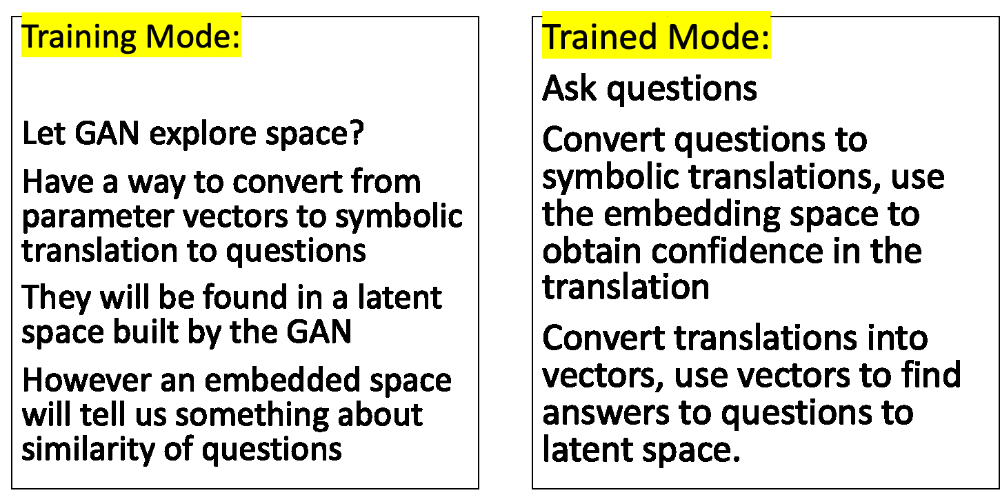

   **Figure 7. Training vs. Trained Mode and AI vs. Human Question and
   Answers.**

   • Programs are embedded in a latent shared space with the GAN

   • GAN perturbations and human-generated questions can be bi-directionally translated using this space

   • Question “programs” similar to each other will be embedded near each other in this space

   .. image:: _static/media4/image42.png
      :width: 5.24306in
      :height: 2.41806in

   | **Figure 8. Notional low dimensional embedding of “programs” that
     represent natural language questions.**

   • **Designed a question template for experimentation**

   • Simple template as shown in Figure 9a

   • Will be used as a first version of questions for training networks

   • Questions are generated similar to the example question in Figure 9b

   • These questions correlate tightly to the box model experiments and also with the GAN experiments

+-----+--------------------------------------------------------+
| (a) |    .. image:: /_static/media4/image43.png              |
|     |       :width: 5.01111in                                |
|     |       :height: 1.95972in                               |
+-----+--------------------------------------------------------+

+-----+--------------------------------------------------------+
| (b) |    .. image:: /_static/media4/image44.png              |
|     |       :width: 5.01111in                                |
|     |       :height: 1.95972in                               |
+-----+--------------------------------------------------------+

   **Figure 9a-b. Question Template for Version 1 of Neuro-symbolic
   language (a) and Example Question Using this Template
   (b).**\ |image55|

    • **Have currently developed a rule-based method that generates encodings of questions as “programs”**
    • Based on a defined Domain Specific Language (DSL)
    • Will be used as a baseline for evaluating deep learning methods
    • Built an automatic question generator for questions following the form in Figure 9a.\ |image56|

    • Experimenting with a sequence-to-sequence autoencoder to encode questions, and decode into vector input for a GAN

    • Based on a sequence-to-sequence machine translation

    • Includes an encoder, encoder vector, and decoder

    • Encoder has LSTM units stacked, each accepting an element from the question

    • Encoder vector captures information across the question

    • Decoder has a stack of LSTMs each predicting an output

    • This model supports varying length input/output though we are starting with a fixed length and using padding

   .. image:: _static/media4/image45.png
      :width: 4.35694in
      :height: 2.0375in

   **Figure 10. Seq-to-seq Deep Autoencoder for Learning Translations
   Between Text and Programs, and Programs and Vectors.**

   | |image58|\
    • Also, beginning to experiment with the workflow shown in Figure 11
    • Starting with experiments that focus on question to program translation• A model that learns a fixed sized embedding of the question
    • Translatable to programs and readable text
    • Based on Neuro-Symbolic Concept Learner

   **Figure 11. Novel Neuro-Symbolic Architecture for Translating
   Questions to Programs based on Neuro-Symbolic Concept Learner
   (NS-CL).**\ |image59|

   • Next Steps:
        • Measure performance of the following translations:
        • Questions to programs \*\*
        • Vectors to programs

   .. image:: _static/media4/image47.png
      :width: 8.60833in
      :height: 2.12083in

   **Figure 12. Visualizing Translations Between Levels – Questions
   to/from Symbolic Programs (top) and Symbolic Programs to/from Vectors
   (bottom).**\ |image60|

Causality
------------------------

**New Insights**

   To address two outstanding issues:

   1.) AMOC slowing as shown in Figure 13 and inferring likelihood of shutoff, and

   2.) Learning how to recover from an AMOC shutoff

   • Developing causal inference based on temporal evolution of system state

   • Working on a model to learn relevant causal structures that are occurring as a result of dynamics included in surrogate model\ |image61|\ |image62|

   • Causal model will capture intermediate states along the way to AMOC shutoffs, focusing on particular states that lie at causal forks in the road of the system’s temporal evolution and that are most
   relevant to whether there will be a shutoff or not

   • Will be used to assign probabilities to potential outcomes

   **Figure 13. CESM-2 Model Runs that show weakening of the AMOC.**

6 Summary
=======
   In summary, we have shared results from our initial experimentation
   related to the surrogate modeling and the AI simulation, specifically
   related to the GAN and the neuro-symbolic language.

   With Milestone 5, we will continue to push forward with building
   large GCM calibrated data sets and extensions to the box model.

   |image63|\ |image64|

|image65|\ |image66|

JHU/APL Proprietary - For Internal Use Only **30**

   **Appendix A**

+-------------------------+-------------------------+-----------+---+
|    **Task 3.3**         |                         | **L**     |   |
+=========================+=========================+===========+===+
|    **Objective**        |    Task Description     |           |   |
+-------------------------+-------------------------+-----------+---+
|    **AI                 |    Report on the first  | **o**     |   |
|    Physics-Informed     |    set of experimental  |           |   |
|    Surrogate Learning** |    results based on     |           |   |
|                         |    testing the          |           |   |
|                         |    formalizations set   |           |   |
|                         |    forth in Milestone   |           |   |
|                         |    3.                   |           |   |
+-------------------------+-------------------------+-----------+---+
|    **Formalizations**   | **c**                   |           |   |
+-------------------------+-------------------------+-----------+---+
|                         | **a**                   |           |   |
+-------------------------+-------------------------+-----------+---+
|                         | **t**                   |           |   |
+-------------------------+-------------------------+-----------+---+
|                         | **i**                   |           |   |
+-------------------------+-------------------------+-----------+---+
|                         | **o**                   |           |   |
+-------------------------+-------------------------+-----------+---+
|                         | **n**                   |           |   |
+-------------------------+-------------------------+-----------+---+
|                         | **J**                   |           |   |
+-------------------------+-------------------------+-----------+---+
|                         | **H**                   |           |   |
+-------------------------+-------------------------+-----------+---+
|                         | **U**                   |           |   |
+-------------------------+-------------------------+-----------+---+
|    **Primary            |    **JHU**              |           |   |
|    Organization         |                         |           |   |
|    Responsible**        |                         |           |   |
+-------------------------+-------------------------+-----------+---+
|    **Human Subjects or  |    **No**               |           |   |
|    Animal Research?**   |                         |           |   |
+-------------------------+-------------------------+-----------+---+
|    **Associated         |    Deliverables         |           |   |
|    Milestones**         |                         |           |   |
+-------------------------+-------------------------+-----------+---+
|    **Milestone 4**      |    **Report on 'beta    |           |   |
|                         |    version' of hybrid   |           |   |
|                         |    model analysis       |           |   |
|                         |    including new        |           |   |
|                         |    mathematical         |           |   |
|                         |    insights, along with |           |   |
|                         |    insights in data**   |           |   |
+-------------------------+-------------------------+-----------+---+
|                         |    **analysis.**        |           |   |
+-------------------------+-------------------------+-----------+---+
|                         | 3 December 2022         |    **31** |   |
+-------------------------+-------------------------+-----------+---+

..

   **Appendix B**

+-------------------------+-------------------------+-----------+---+
|    **Task 4.3**         |                         | **L**     |   |
+=========================+=========================+===========+===+
|    **Objective**        |    Subtask Description  |           |   |
+-------------------------+-------------------------+-----------+---+
|    **AI Simulation      | Report on early         | **o**     |   |
|    Formalizations**     | experimentation of a    |           |   |
|                         | baseline GAN for a      |           |   |
|                         | subset of explorations  |           |   |
|                         | and what-if questions,  |           |   |
|                         | including a set of      |           |   |
+-------------------------+-------------------------+-----------+---+
|                         |    experiments that     | **c**     |   |
|                         |    show feasibility of  |           |   |
|                         |    the causal model,    |           |   |
|                         |    and baseline         |           |   |
|                         |    symbolic language    |           |   |
|                         |    experimental         |           |   |
|                         |    results.             |           |   |
+-------------------------+-------------------------+-----------+---+
|                         | **a**                   |           |   |
+-------------------------+-------------------------+-----------+---+
|                         | **t**                   |           |   |
+-------------------------+-------------------------+-----------+---+
|                         | **i**                   |           |   |
+-------------------------+-------------------------+-----------+---+
|                         | **o**                   |           |   |
+-------------------------+-------------------------+-----------+---+
|                         | **n**                   |           |   |
+-------------------------+-------------------------+-----------+---+
|                         | **A**                   |           |   |
+-------------------------+-------------------------+-----------+---+
|                         | **P**                   |           |   |
+-------------------------+-------------------------+-----------+---+
|                         | **L**                   |           |   |
+-------------------------+-------------------------+-----------+---+
|                         | **,**                   |           |   |
+-------------------------+-------------------------+-----------+---+
|                         | **J**                   |           |   |
+-------------------------+-------------------------+-----------+---+
|                         | **H**                   |           |   |
+-------------------------+-------------------------+-----------+---+
|                         | **U**                   |           |   |
+-------------------------+-------------------------+-----------+---+
|    **Primary            |    **APL**              |           |   |
|    Organization         |                         |           |   |
|    Responsible**        |                         |           |   |
+-------------------------+-------------------------+-----------+---+
|    **Human Subjects or  |    **No**               |           |   |
|    Animal Research?**   |                         |           |   |
+-------------------------+-------------------------+-----------+---+
|    **Associated         |    Deliverables         |           |   |
|    Milestones**         |                         |           |   |
+-------------------------+-------------------------+-----------+---+
|    **Milestone 4**      |    **Milestone report – |           |   |
|                         |    report on 'beta      |           |   |
|                         |    version' of hybrid   |           |   |
|                         |    model analysis       |           |   |
|                         |    including new        |           |   |
|                         |    mathematical         |           |   |
|                         |    insights, along**    |           |   |
+-------------------------+-------------------------+-----------+---+
|                         |    **with insights in   |           |   |
|                         |    data analysis.**     |           |   |
+-------------------------+-------------------------+-----------+---+
|                         | 3 December 2022         |    **32** |   |
+-------------------------+-------------------------+-----------+---+

**Citations**

   1. Boers, Niklas. "Observation-based early-warning signals for a
   collapse of the Atlantic Meridional Overturning Circulation." Nature
   Climate Change 11, no. 8 (2021): 680-688.

   2. Gnanadesikan, A., A simple model for the structure of the oceanic
   pycnocline, Science., 283:2077-2079, (1999).

   | 3. Forget, G., J.-M. Campin, P. Heimbach, C. N. Hill, R. M. Ponte,
     C. Wunsch, ECCO version 4: An integrated framework for non-linear
     inverse modeling and global ocean state estimation. Geosci. Model
     Dev. 8, 3071–3104 (2015)
   | 4. Gnanadesikan, A., R. Kelson and M. Sten, Flux correction and
     overturning stability: Insights from a dynamical box model, J.
     Climate, 31, 9335-9350, https://doi.org/10.1175/JCLI-D-18-0388.1,
     (2018).

   5. Kaufhold, John Patrick, and Jennifer Alexander Sleeman. "Systems
   and methods for deep model translation generation." U.S. Patent No.
   10,504,004. 10 Dec. 2019.

   6. Garcez, Artur d'Avila, and Luis C. Lamb. "Neurosymbolic AI: the
   3rd Wave." arXiv preprint arXiv:2012.05876 (2020).

   7. Stommel, H. Thermohaline convection with two stable regimes of
   flow. Tellus 13, 224–230 (1961).

   8. Karniadakis, George Em, Ioannis G. Kevrekidis, Lu Lu, Paris
   Perdikaris, Sifan Wang, and Liu Yang. "Physics-informed machine
   learning." Nature Reviews Physics 3, no. 6 (2021): 422-440.

   9. Sleeman, Jennifer, Milton Halem, Zhifeng Yang, Vanessa Caicedo,
   Belay Demoz, and Ruben Delgado. "A Deep Machine Learning Approach for
   LIDAR Based Boundary Layer Height Detection." In IGARSS 2020-2020
   IEEE International Geoscience and Remote Sensing Symposium, pp.
   3676-3679. IEEE, 2020.

   10. Patel, Kinjal, Jennifer Sleeman, and Milton Halem. "Physics-aware
   deep edge detection network." In Remote Sensing of Clouds and the
   Atmosphere XXVI, vol. 11859, pp. 32-38. SPIE, 2021.

   11.Brulé, Joshua. "A causation coefficient and taxonomy of
   correlation/causation relationships." arXiv preprint arXiv:1708.05069
   (2017).

   12. Rasp, Stephan, Michael S. Pritchard, and Pierre Gentine. "Deep
   learning to represent subgrid processes in climate models."
   Proceedings of the National Academy of Sciences 115, no. 39 (2018):
   9684-9689.

   13. Bolton, Thomas, and Laure Zanna. "Applications of deep learning
   to ocean data inference and subgrid parameterization." Journal of
   Advances in Modeling Earth Systems 11, no. 1 (2019): 376-399.

   14. Kurth, Thorsten, Sean Treichler, Joshua Romero, Mayur Mudigonda,
   Nathan Luehr, Everett Phillips, Ankur Mahesh et al. "Exascale deep
   learning for climate analytics." In SC18: International Conference
   for High Performance Computing, Networking, Storage and Analysis, pp.
   649-660. IEEE, 2018.

   15. Weber, Theodore, Austin Corotan, Brian Hutchinson, Ben Kravitz,
   and Robert Link. "Deep learning for creating surrogate models of
   precipitation in Earth system models." Atmospheric Chemistry and
   Physics 20, no. 4 (2020): 2303-2317.

   16. Matsubara, Takashi, Ai Ishikawa, and Takaharu Yaguchi. "Deep
   energy-based modeling of discrete-time physics." arXiv preprint
   arXiv:1905.08604 (2019).

   17. Kleinen, T., Held, H. & Petschel-Held, G. The potential role of
   spectral properties in detecting thresholds in the Earth system:
   application to the thermohaline circulation. Ocean Dyn. 53, 53–63
   (2003).

   18. Kocaoglu, Murat, Christopher Snyder, Alexandros G. Dimakis, and
   Sriram Vishwanath. "Causalgan: Learning causal implicit generative
   models with adversarial training." arXiv preprint arXiv:1709.02023
   (2017).

   19. Feinman, Reuben, and Brenden M. Lake. "Learning Task-General
   Representations with Generative Neuro-Symbolic Modeling." arXiv
   preprint arXiv:2006.14448 (2020).

   20. Yi, Kexin, Chuang Gan, Yunzhu Li, Pushmeet Kohli, Jiajun Wu,
   Antonio Torralba, and Joshua B. Tenenbaum. "Clevrer: Collision events
   for video representation and reasoning." arXiv preprint
   arXiv:1910.01442 (2019).

   21. Nowack, Peer, Jakob Runge, Veronika Eyring, and Joanna D. Haigh.
   "Causal networks for climate model evaluation and constrained
   projections." Nature communications 11, no. 1 (2020): 1-11.

   22. Andersson, Tom R., J. Scott Hosking, María Pérez-Ortiz, Brooks
   Paige, Andrew Elliott, Chris Russell, Stephen Law et al. "Seasonal
   Arctic sea ice forecasting with probabilistic deep learning." Nature
   communications 12, no. 1 (2021): 1-12.

   23. Storchan, Victor, Svitlana Vyetrenko, and Tucker Balch. "MAS-GAN:
   Adversarial Calibration of Multi-Agent Market Simulators." (2020).

   24. De Raedt, Luc, Robin Manhaeve, Sebastijan Dumancic, Thomas
   Demeester, and Angelika Kimmig. "Neuro-symbolic=neural+ logical+
   probabilistic." In NeSy'19@ IJCAI, the 14th International Workshop on
   Neural-Symbolic Learning and Reasoning. 2019.

   25. Eyring, V., Bony, S., Meehl, G. A., Senior, C. A., Stevens, B.,
   Stouffer, R. J., and Taylor, K. E.: Overview of the Coupled Model
   Intercomparison Project Phase 6 (CMIP6) experimental design and
   organization, Geosci. Model Dev., 9, 1937-1958,
   doi:10.5194/gmd-9-1937-2016, 2016.

   26. Swingedouw, Didier, Chinwe Ifejika Speranza, Annett Bartsch, Gael
   Durand, Cedric Jamet, Gregory Beaugrand, and Alessandra Conversi.

   "Early warning from space for a few key tipping points in physical,
   biological, and social-ecological systems." Surveys in geophysics 41,
   no. 6 (2020): 1237-1284.

   27. Reichstein, Markus, Gustau Camps-Valls, Bjorn Stevens, Martin
   Jung, Joachim Denzler, and Nuno Carvalhais. "Deep learning and
   process understanding for data-driven Earth system science." Nature
   566, no. 7743 (2019): 195-204.

.. image:: _static/media/image27.png
   :width: 13.33333in
   :height: 0.41667in

   28. Sleeman, Jennifer, Ivanka Stajner, Christoph Keller, Milton
   Halem, Christopher Hamer, Raffaele Montuoro, and Barry Baker. "The
   Integration of Artificial Intelligence for Improved Operational Air
   Quality Forecasting." In AGU Fall Meeting 2021. 2021.

   | 29. Bellomo, K., Angeloni, M., Corti, S. *et al.* Future climate
     change shaped by inter-model differences in Atlantic meridional
     overturning circulation response. *Nat Commun* **12,** 3659 (2021).
   | 30. Sgubin, G., Swingedouw, D., Drijfhout, S. *et al.* Abrupt
     cooling over the North Atlantic in modern climate models. *Nat
     Commun* **8,** 14375 (2017).
   | 31. Swingedouw, D., Bily, A., Esquerdo, C., Borchert, L. F.,
     Sgubin, G., Mignot, J., & Menary, M. (2021). On the risk of abrupt
     changes in the North Atlantic subpolar gyre in CMIP6 models.
     *Annals of the New York Academy of Sciences*, *1504*\ (1), 187-201.
     32. Mao, Jiayuan, Chuang Gan, Pushmeet Kohli, Joshua B. Tenenbaum,
     and Jiajun Wu. "The neuro-symbolic concept learner: Interpreting
     scenes, words, and sentences from natural supervision." *arXiv
     preprint arXiv:1904.12584* (2019).

   .. image:: _static/media4/image53.png
      :width: 3.09722in
      :height: 0.11111in

.. image:: _static/media4/image54.png
   :width: 2.97222in
   :height: 0.11111in

   3 December 2022 **35**

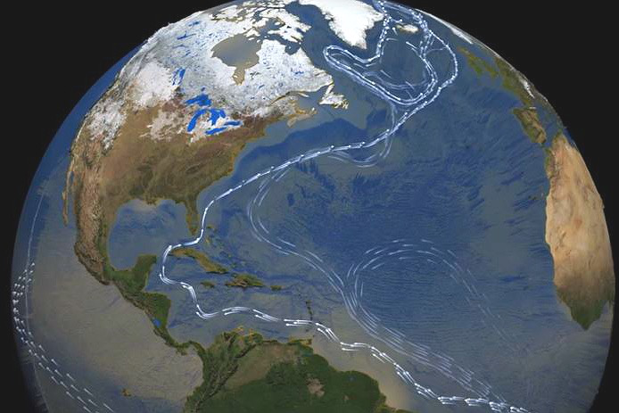

.. |image16| image:: _static/media4/image17.png

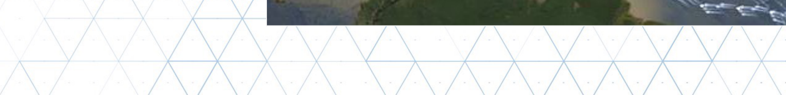

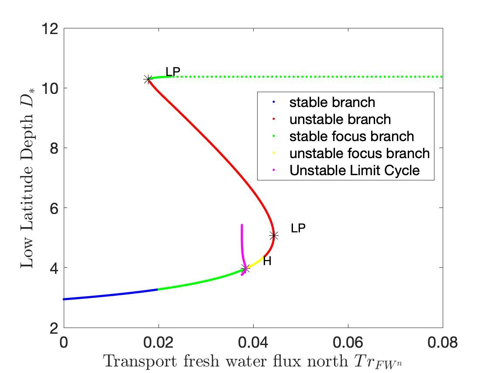
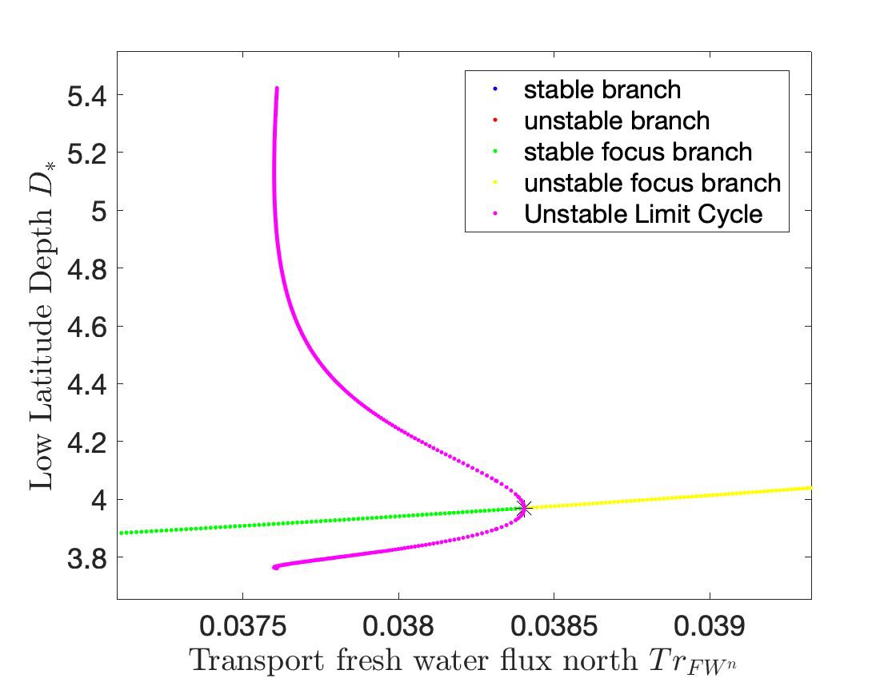

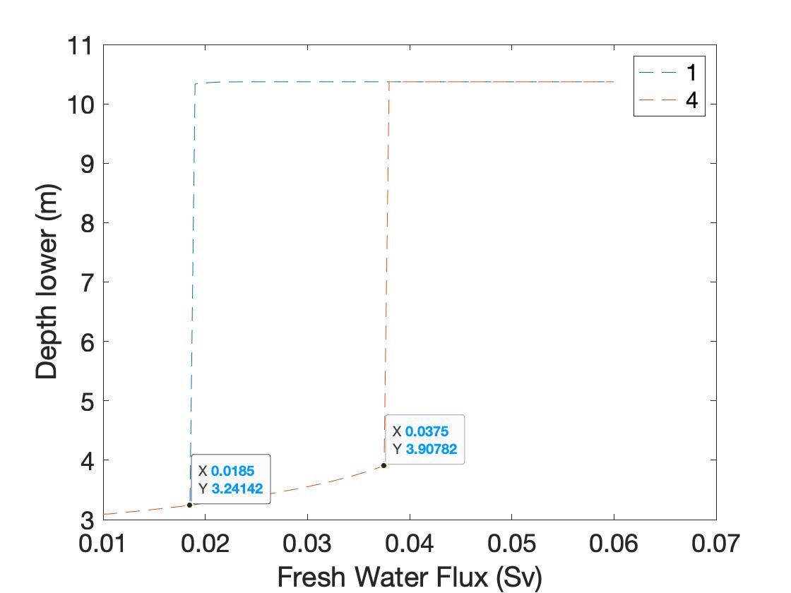
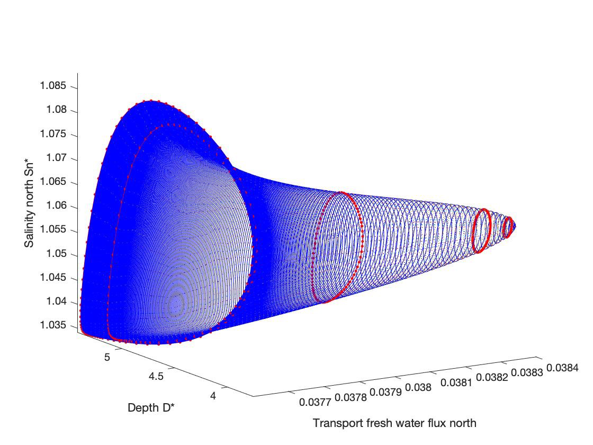

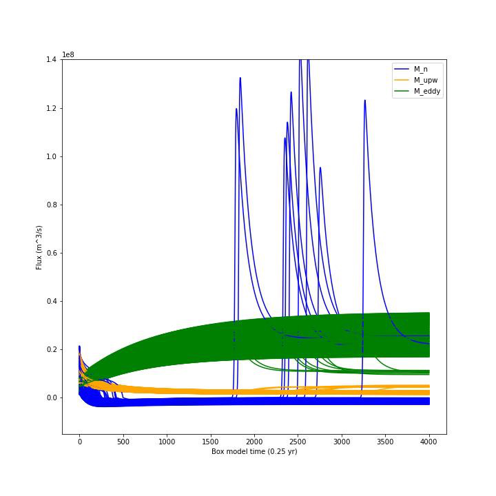
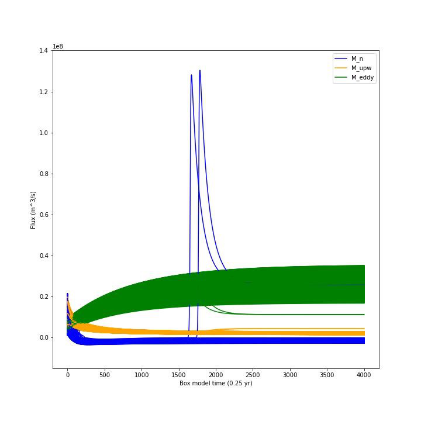
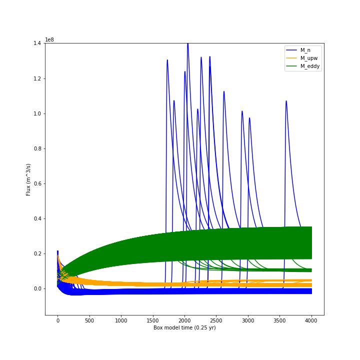

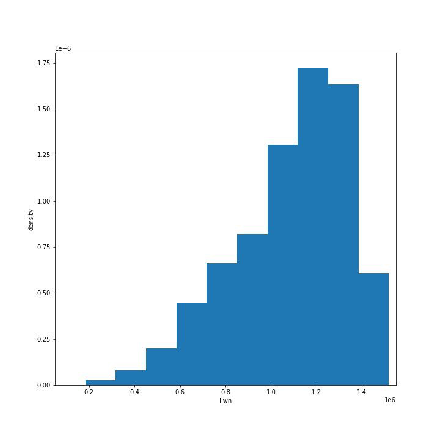
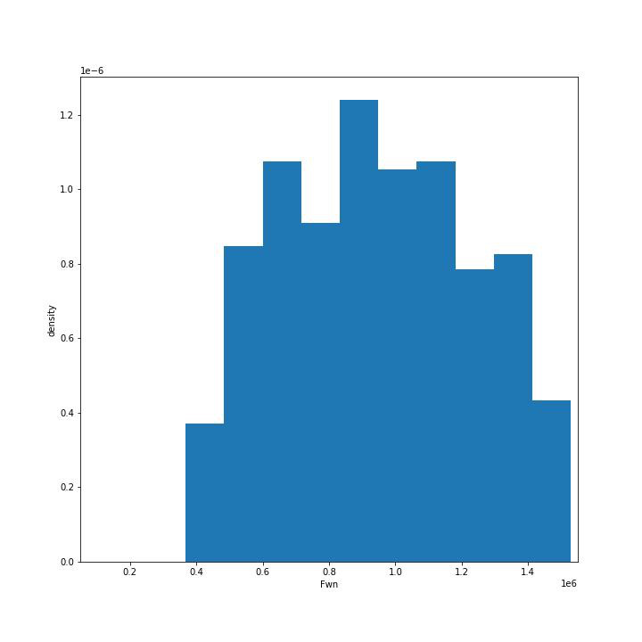
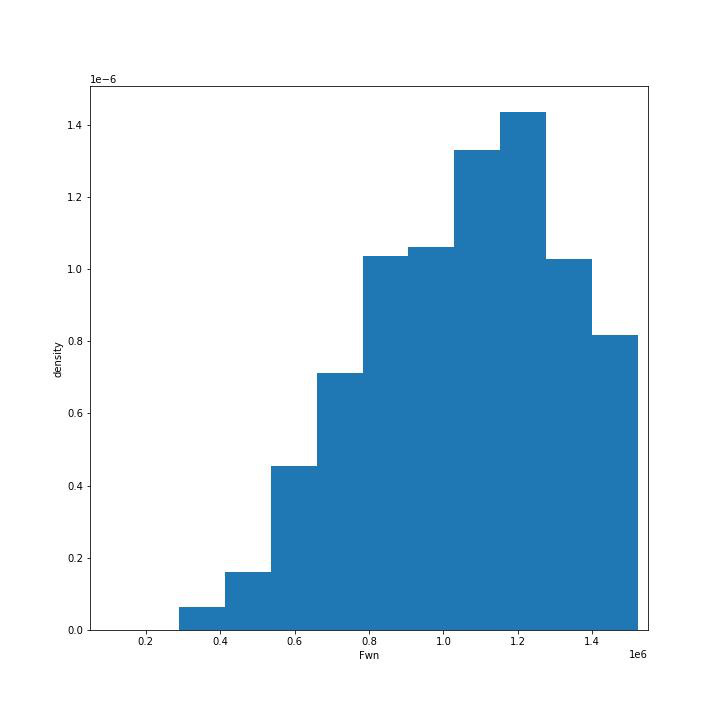

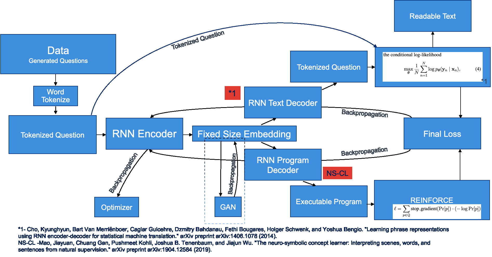

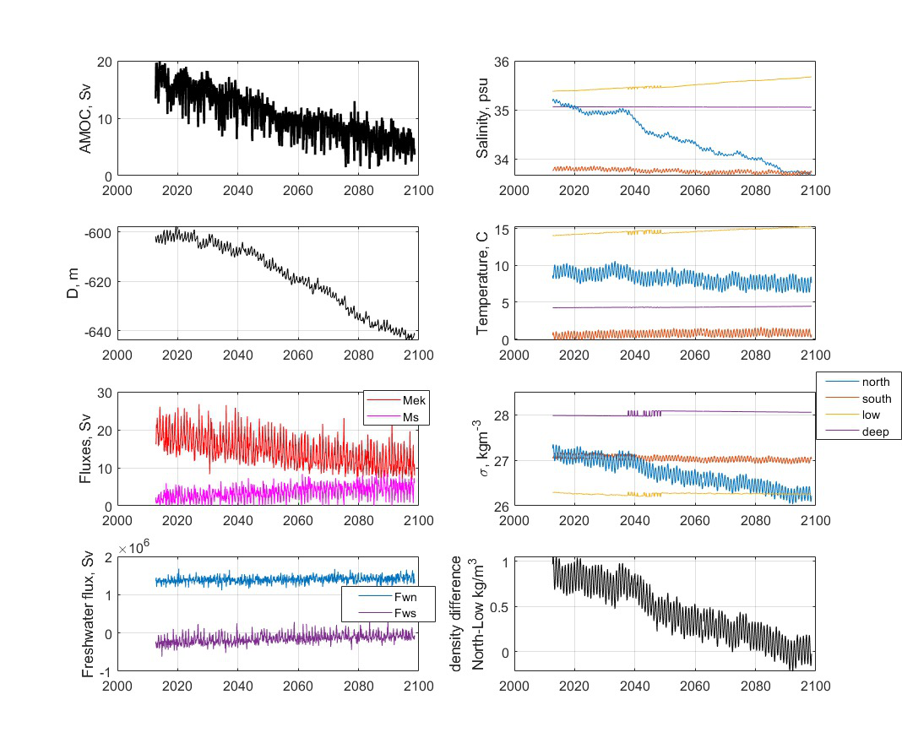

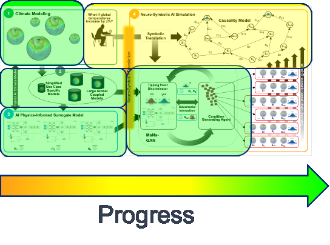

