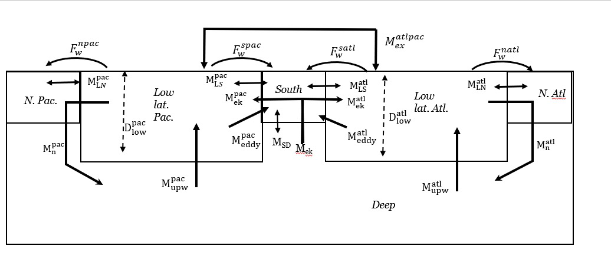
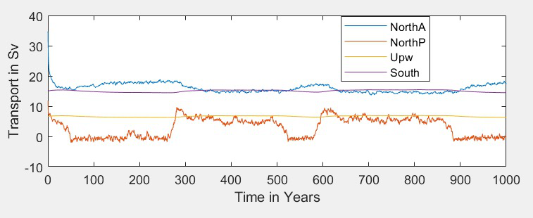
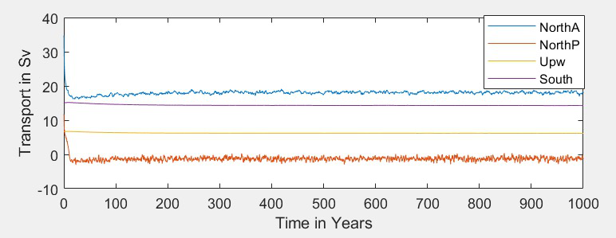
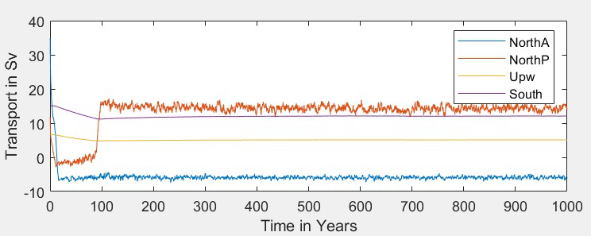
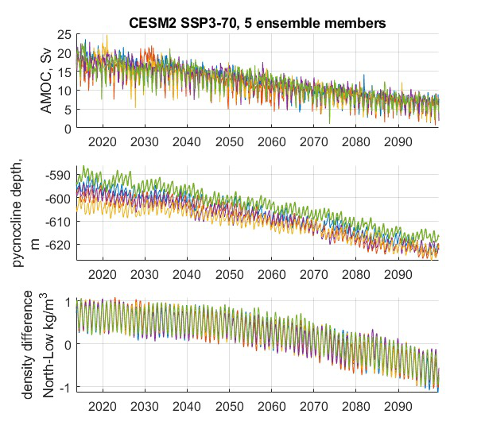
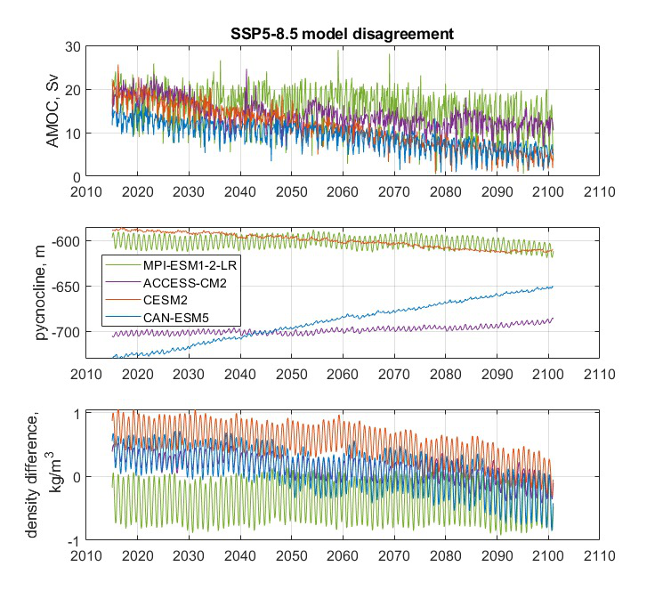

===========================
Milestone 5 Progress Report
===========================
Approved for public release; distribution is unlimited. This material is based upon work supported by the Defense Advanced Research Projects Agency (DARPA) under Agreement No. HR00112290032.

**PACMANS TEAM:**
• Jennifer Sleeman (JHU APL) PI
• Anand Gnanadesikan (JHU) Co-PI
• Yannis Kevrekidis (JHU) Co-PI
• Jay Brett (JHU APL)
• David Chung (JHU APL)
• Chace Ashcraft (JHU APL)
• Thomas Haine (JHU)
• Marie-Aude Pradal (JHU)
• Renske Gelderloos (JHU)
• Caroline Tang (DUKE)
• Anshu Saksena (JHU APL)
• Larry White (JHU APL)
• Marisa Hughes (JHU APL)

1 Overview
----------

• This technical report covers the period of May 2022 through June 13, 2022. 
• The report documents the achievement of the milestone associated with Month 6 of the JHU/APL-led PACMAN team’s statement of work.
• The delivery for this milestone is this report which highlights identifying potential datasets (and providers) for Phase 2 to address predictability of climate effects at 1-to-3 decade time scales, regional or global spatial extents. 
• This report includes a discussion of how our work will determine the most important measures to make with future observations and the value of that data. It also includes a description of progress for tasks 1.2 and 2.3.

2 Goals and Impact
------------------
In support of establishing additional data source requirements for Phase 2 and applying the AI simulation method to the AMOC use case, we have begun identifying GCM models and additional features that could be exposed through other data sources.

**Goals for this milestone included:**
• Identifying GCM models that will be developed for atmosphere-ocean coupled physical processes including the AMOC (Task 1.2)

• Further development of the calibrated GCMs datasets and tools that will be used for testbeds for AI-supported integration (Task 2.3)

3 Key Findings
---------------

• Newly developed 6-box model (see more about the development of this next generation box model on slide 10) has provided the following insights:
	• Oscillatory behavior indicates that on/off states are possibly occurring over time and potential shut-offs could be recoverable from
	• The study of these oscillations could give insight into how slow-downs could lead to full collapses and how recovery from slow-downs vs. complete collapse could imply different reversal strategies
• Applying the 4-box model to multiple CMIP6 model projections shows that this box model theory does not fully explain the connection between AMOC strength and pycnocline depth.

4 Phase 2 - Dataset Discussion
------------------------------

   • The primary dataset for scientific discovery will be the CMIP6 archive of global coupled models.
   	• Those models with ensembles of runs for certain forward projections will be valuable in understanding *predictability* of the changes in AMOC.

   • Model disagreement, paired with GAN discovery of tipping points, will identify the important parameters or conditions that control the AMOC shutoff.

   • Observations that could put limits on these parameters or indicate these conditions will be the most valuable new data that could be generated.

   	• We expect important initial conditions to include the AMOC strength, which could be better measured with added data from floats for improved T, S structure measures, moorings for bottom pressure, or satellite SST and SSS.

   	• We expect an important forcing to be the freshwater flux from the Arctic, which might be measured by floats and satellites.

   	• We expect the important parameters to be mixing rates, which can be measured with in-situ and satellite monitoring of significant salinity anomalies for their decay rate or potentially dye experiments at the (sub)mesoscale.

   	• Existing satellite and ARGO datasets will be examined to determine what we can already learn of freshwater fluxes, AMOC strength, and salinity anomalies to constrain our model analyses.

**Key ideas to explore in Phase 2**

Is there **emergent behavior** that can serve as a an index of whether models are approaching a tipping point?
   - Amplitude of variability in the overturning circulation?
   - Appearance or disappearance of oscillations in overturning transport?
   - Damping time and/or persistence of salinity anomalies
   - Relative phase of salinity and pycnocline depth anomalies
Is this emergent behavior **detectable** with relatively short time series?
   - Example: In box model, overturning variability increases as tipping point is approached… but hundreds of years of output are needed to see changes.
   - Examine whether this is true in models with different periodicities in overturning variability.
How does the GAN exploit this emergent behavior?
   - Could the GAN be directed to exploit spaces that have high probability of causing a tip?
   - Could additional data be used to improve the adversarial game?

5 Task 1.2: Use Case Ocean Modeling Summary
-------------------------------------------
   *Subtask Description: We will provide a report which identifies the
   GCM models that will be developed for atmosphere-ocean coupled
   physical processes including the AMOC. We will include the relevance
   of these models to both time scales and spatial extents, keeping in
   mind the questions we set out to answer with respect to AMOC focus on
   drivers that could indicate the need for additional measurements and
   how the surrogate model disagreement could explain true model
   disagreement, in addition to the questions related to the specific
   collapse of the AMOC.*

   **Accomplishments:**
	• Development of a plan of experiments in a fully-coupled global climate model to locate the overturning tipping point, allowing us to find changes in state preceding that tipping point
	• Determination to use the Community Earth System Model, CESM
	• Porting of CESM to JHU’s Rockfish computing center is underway

**Experimental plan:**
From a steady 2000s climate, we increase atmospheric CO2 at a constant rate of 4ppm/year (1%). 
Each 35 years, at an effective radiative increase of 2W/m2, we branch off two simulations, one with constant CO2 and one with decreasing CO2 at the same 1% annual rate. 
These will determine whether the AMOC recovers, stabilizes, or continues to collapse. 

   .. image:: _static/media5/image28.png
      :width: 7.19722in
      :height: 4.30139in

**Experiment plan:**
Several runs of this experiment will be undertaken for a small ensemble, varying initial conditions (e.g. Atlantic Multidecadal Oscillation (AMO) phase and AMOC strength) and the parameters from the box model that the GAN indicates the tipping point or separatrix is most sensitive to.

We will also repeat runs with roundoff-level differences in the atmosphere’s initial conditions. This will allow us to understand the sensitivity of AMOC collapse and recovery, determine what additional measurements could reduce uncertainty in such projections, and enable a parallel understanding of collapse to that of the GAN.\ |image32|

6 Task 2.3: Data Acquisition Dataset Delivery
---------------------------------------------

   *Subtask Description: We will report upon the simplified GCMs that
   will be used for testbeds for AIsupported integration while retaining
   the necessary physics to recreate the physical processes identified
   in the full GCM dataset. These models are less computationally
   intensive, require less storage, and can be run on modest high
   performance computing clusters.*

   **Accomplishments:**
	• Development of the next generation of the box model, adding the Pacific Ocean and expanding from 4 to 6 boxes.
	• Continued processing of the CESM2 large ensemble to the 4 box model calibrated time series for use in ML
	• Beginning processing of other CMIP models’ forward scenarios to calibrated 4 box model time series

**Task 2.3: Data Acquisition Dataset Delivery**

   • New 6-box model, adding a Pacific and Indian ocean low-latitude box and a North Pacific high-latitude box.
   • Matlab code built, small dataset of runs with varied parameters for exploration. 
   • Enables more use cases for the AI methods.

+----------------------------------------------------+----------------+
|    .. image:: vertopal_                            |     |
| a2c01c03231e47d0a4c997fb53adb88c/media/image29.png |                |
|       :width: 4.31111in                            |                |
|       :height: 2.74306in                           |                |
|                                                    |                |
|    4-box Model                                     |                |
+----------------------------------------------------+----------------+

   
   6-box Model
   

• New 6-box model
• Bifurcation over freshwater flux strength shows switch between Atlantic and Pacific overturning. 3 time series at right for different freshwater flux conditions
	• Top, baseline, showing strong AMOC (blue) and no significant Pacific overturning (orange)
	• Middle, slightly lower fluxes in both basins
	• Bottom, higher flux in Atlantic only, as from increased meltwater
• Oscillation of AMOC strength with Pacific overturning switching on and off has been observed
	• See middle case on right. Southern Ocean overturning (purple) and low-latitude upwelling (yellow) are near constant, while AMOC (blue) oscillates by about 3Sv as Pacific overturning turns on and off. 
|image36|\ |image37|\ |image38|\ |image39|

• 5 ensemble members of CESM2, showing variability related to varied initial conditions. Matlab generation code now released.
• 4 CMIP models’ SSP5-85 runs processed, showing model disagreement. Python code will be released after internal review.
• CESM2 calibrated data will take us in the direction of working with larger parameter spaces as we apply the AI methods to the large GCM runs.
• This is a necessary first step in understanding the behavior of these models and the implication on the AI-based training datasets.

**Note:  See Appendix A for details of publicly-available data and code**

 • 5 ensemble members of CESM2, showing variability related to varied initial conditions. 4 CMIP models’ SSP5-85 runs processed, showing model disagreement.
 • All CESM2 SSP3-7.0 show reduced AMOC strength, deepening pycnocline, and reduced meridional density differences in the Atlantic. This is consistent with the theory behind the box model.
 • Different initial conditions affect inter-annual and decadal-scale variability

| |image41|

  All CESM2 SSP3-7.0, 5 ensemble members |image42|

• 5 ensemble members of CESM2, showing variability related to varied initial conditions. 4 CMIP models’ SSP5-85 runs processed, showing model disagreement.
	• MPI-ESM1-2-LR: Max Planck Institute for Meteorology Earth System Model
	• ACCESS-CM2: Australian Community Climate and Earth System Simulator
	• CESM2: USA, Community Earth System Model
	• CAN-ESM5: Canadian Earth System Model
• 3 of 4 models show strong decrease in AMOC strength, but only CESM2 shows 4-box style agreement with both pycnocline and meridional density gradient changes, supporting potential disagreement causes
\ |image43|

**Summary**

With Milestone 6, we will build new datasets based on the newly developed 6-box model and incorporate that into the training/evaluation of the AI models.  

We continue to build out the AI Physics-Informed Surrogate models and the AI Simulation methods.  

Furthermore, a group effort is underway to clearly define requirements for additional datasets that could further improve the discovery of tipping points for the AMOC use case. 

   |image45|

**Appendix A: data and code available**

   Milestone 5 Dataset Delivery:

   | https://github.com/JHUAPL/PACMANs/blob/tmp_datasets/datasets_v1_ms5_delivery.zip
   | Code Available:
   | https://github.com/JHUAPL/PACMANs
   | Includes:
   | • CESM2 tools
   | • 6 Box Model
   | • New calibrated CESM2 and CMIP6 dataset

   3 December 2022 **18**

.. image:: _static/media5/image27.png
   :width: 13.33333in
   :height: 0.41667in

**Approved for public release; distribution is unlimited. This material is based upon work supported by the Defense Advanced Research Projects Agency (DARPA) under Agreement No. HR00112290032.**

**Citations**

   1. Boers, Niklas. "Observation-based early-warning signals for a
   collapse of the Atlantic Meridional Overturning Circulation." Nature
   Climate Change 11, no. 8 (2021): 680-688.

   2. Gnanadesikan, A., A simple model for the structure of the oceanic
   pycnocline, Science., 283:2077-2079, (1999).

   | 3. Forget, G., J.-M. Campin, P. Heimbach, C. N. Hill, R. M. Ponte,
     C. Wunsch, ECCO version 4: An integrated framework for non-linear
     inverse modeling and global ocean state estimation. Geosci. Model
     Dev. 8, 3071–3104 (2015)
   | 4. Gnanadesikan, A., R. Kelson and M. Sten, Flux correction and
     overturning stability: Insights from a dynamical box model, J.
     Climate, 31, 9335-9350, https://doi.org/10.1175/JCLI-D-18-0388.1,
     (2018).

   5. Kaufhold, John Patrick, and Jennifer Alexander Sleeman. "Systems
   and methods for deep model translation generation." U.S. Patent No.
   10,504,004. 10 Dec. 2019.

   6. Garcez, Artur d'Avila, and Luis C. Lamb. "Neurosymbolic AI: the
   3rd Wave." arXiv preprint arXiv:2012.05876 (2020).

   7. Stommel, H. Thermohaline convection with two stable regimes of
   flow. Tellus 13, 224–230 (1961).

   8. Karniadakis, George Em, Ioannis G. Kevrekidis, Lu Lu, Paris
   Perdikaris, Sifan Wang, and Liu Yang. "Physics-informed machine
   learning." Nature Reviews Physics 3, no. 6 (2021): 422-440.

   9. Sleeman, Jennifer, Milton Halem, Zhifeng Yang, Vanessa Caicedo,
   Belay Demoz, and Ruben Delgado. "A Deep Machine Learning Approach for
   LIDAR Based Boundary Layer Height Detection." In IGARSS 2020-2020
   IEEE International Geoscience and Remote Sensing Symposium, pp.
   3676-3679. IEEE, 2020.

   10. Patel, Kinjal, Jennifer Sleeman, and Milton Halem. "Physics-aware
   deep edge detection network." In Remote Sensing of Clouds and the
   Atmosphere XXVI, vol. 11859, pp. 32-38. SPIE, 2021.

   11.Brulé, Joshua. "A causation coefficient and taxonomy of
   correlation/causation relationships." arXiv preprint arXiv:1708.05069
   (2017).

   12. Rasp, Stephan, Michael S. Pritchard, and Pierre Gentine. "Deep
   learning to represent subgrid processes in climate models."
   Proceedings of the National Academy of Sciences 115, no. 39 (2018):
   9684-9689.

   13. Bolton, Thomas, and Laure Zanna. "Applications of deep learning
   to ocean data inference and subgrid parameterization." Journal of
   Advances in Modeling Earth Systems 11, no. 1 (2019): 376-399.

   14. Kurth, Thorsten, Sean Treichler, Joshua Romero, Mayur Mudigonda,
   Nathan Luehr, Everett Phillips, Ankur Mahesh et al. "Exascale deep
   learning for climate analytics." In SC18: International Conference
   for High Performance Computing, Networking, Storage and Analysis, pp.
   649-660. IEEE, 2018.

   15. Weber, Theodore, Austin Corotan, Brian Hutchinson, Ben Kravitz,
   and Robert Link. "Deep learning for creating surrogate models of
   precipitation in Earth system models." Atmospheric Chemistry and
   Physics 20, no. 4 (2020): 2303-2317.

   16. Matsubara, Takashi, Ai Ishikawa, and Takaharu Yaguchi. "Deep
   energy-based modeling of discrete-time physics." arXiv preprint
   arXiv:1905.08604 (2019).

   17. Kleinen, T., Held, H. & Petschel-Held, G. The potential role of
   spectral properties in detecting thresholds in the Earth system:
   application to the thermohaline circulation. Ocean Dyn. 53, 53–63
   (2003).

   18. Kocaoglu, Murat, Christopher Snyder, Alexandros G. Dimakis, and
   Sriram Vishwanath. "Causalgan: Learning causal implicit generative
   models with adversarial training." arXiv preprint arXiv:1709.02023
   (2017).

   19. Feinman, Reuben, and Brenden M. Lake. "Learning Task-General
   Representations with Generative Neuro-Symbolic Modeling." arXiv
   preprint arXiv:2006.14448 (2020).

   20. Yi, Kexin, Chuang Gan, Yunzhu Li, Pushmeet Kohli, Jiajun Wu,
   Antonio Torralba, and Joshua B. Tenenbaum. "Clevrer: Collision events
   for video representation and reasoning." arXiv preprint
   arXiv:1910.01442 (2019).

   21. Nowack, Peer, Jakob Runge, Veronika Eyring, and Joanna D. Haigh.
   "Causal networks for climate model evaluation and constrained
   projections." Nature communications 11, no. 1 (2020): 1-11.

   22. Andersson, Tom R., J. Scott Hosking, María Pérez-Ortiz, Brooks
   Paige, Andrew Elliott, Chris Russell, Stephen Law et al. "Seasonal
   Arctic sea ice forecasting with probabilistic deep learning." Nature
   communications 12, no. 1 (2021): 1-12.

   23. Storchan, Victor, Svitlana Vyetrenko, and Tucker Balch. "MAS-GAN:
   Adversarial Calibration of Multi-Agent Market Simulators." (2020).

   24. De Raedt, Luc, Robin Manhaeve, Sebastijan Dumancic, Thomas
   Demeester, and Angelika Kimmig. "Neuro-symbolic=neural+ logical+
   probabilistic." In NeSy'19@ IJCAI, the 14th International Workshop on
   Neural-Symbolic Learning and Reasoning. 2019.

   25. Eyring, V., Bony, S., Meehl, G. A., Senior, C. A., Stevens, B.,
   Stouffer, R. J., and Taylor, K. E.: Overview of the Coupled Model
   Intercomparison Project Phase 6 (CMIP6) experimental design and
   organization, Geosci. Model Dev., 9, 1937-1958,
   doi:10.5194/gmd-9-1937-2016, 2016.

   26. Swingedouw, Didier, Chinwe Ifejika Speranza, Annett Bartsch, Gael
   Durand, Cedric Jamet, Gregory Beaugrand, and Alessandra Conversi.

   "Early warning from space for a few key tipping points in physical,
   biological, and social-ecological systems." Surveys in geophysics 41,
   no. 6 (2020): 1237-1284.

   27. Reichstein, Markus, Gustau Camps-Valls, Bjorn Stevens, Martin
   Jung, Joachim Denzler, and Nuno Carvalhais. "Deep learning and
   process understanding for data-driven Earth system science." Nature
   566, no. 7743 (2019): 195-204.

   28. Sleeman, Jennifer, Ivanka Stajner, Christoph Keller, Milton
   Halem, Christopher Hamer, Raffaele Montuoro, and Barry Baker. "The
   Integration of Artificial Intelligence for Improved Operational Air
   Quality Forecasting." In AGU Fall Meeting 2021. 2021.

   | 29. Bellomo, K., Angeloni, M., Corti, S. *et al.* Future climate
     change shaped by inter-model differences in Atlantic meridional
     overturning circulation response. *Nat Commun* **12,** 3659 (2021).
   | 30. Sgubin, G., Swingedouw, D., Drijfhout, S. *et al.* Abrupt
     cooling over the North Atlantic in modern climate models. *Nat
     Commun* **8,** 14375 (2017).
   | 31. Swingedouw, D., Bily, A., Esquerdo, C., Borchert, L. F.,
     Sgubin, G., Mignot, J., & Menary, M. (2021). On the risk of abrupt
     changes in the North Atlantic subpolar gyre in CMIP6 models.
     *Annals of the New York Academy of Sciences*, *1504*\ (1), 187-201.
     32. Mao, Jiayuan, Chuang Gan, Pushmeet Kohli, Joshua B. Tenenbaum,
     and Jiajun Wu. "The neuro-symbolic concept learner: Interpreting
     scenes, words, and sentences from natural supervision." *arXiv
     preprint arXiv:1904.12584* (2019).

.. image:: _static/media5/image41.png
   :width: 3.61111in
   :height: 0.11111in

   .. image:: _static/media5/image42.png
      :width: 3.09722in
      :height: 0.11111in

.. image:: _static/media5/image43.png
   :width: 2.97222in
   :height: 0.11111in

   3 December 2022 **21**

.. |image1| image:: _static/media5/image2.png
   :width: 1.375in
   :height: 0.45833in
.. |image2| image:: _static/media5/image3.png
   :width: 1.75in
   :height: 0.45833in
.. |image3| image:: _static/media5/image4.png
   :width: 1.625in
   :height: 0.45833in
.. |image4| image:: _static/media5/image5.png
   :width: 13.33056in
   :height: 7.49844in
.. |image5| image:: _static/media5/image6.png
   :width: 0.625in
   :height: 0.11111in
.. |image6| image:: _static/media5/image7.png
   :width: 9.40278in
   :height: 6.27303in
.. |image7| image:: _static/media5/image8.png
   :width: 2.68056in
   :height: 0.56944in
.. |image8| image:: _static/media5/image9.png
.. |image9| image:: _static/media5/image10.png
   :height: 0.11111in
.. |image10| image:: _static/media5/image11.png
.. |image11| image:: _static/media5/image12.png
.. |image12| image:: _static/media5/image13.png
.. |image13| image:: _static/media5/image14.png
.. |image14| image:: _static/media5/image15.png
   :width: 0.72222in
   :height: 0.59722in
.. |image15| image:: _static/media5/image16.png
.. |image16| image:: _static/media5/image17.png
.. |image17| image:: _static/media5/image18.png
   :height: 0.125in
.. |image18| image:: _static/media5/image19.png
.. |image19| image:: _static/media5/image20.png
.. |image20| image:: _static/media5/image21.png
   :width: 8.83333in
   :height: 1.06944in
.. |image21| image:: _static/media5/image22.png
.. |image22| image:: _static/media5/image23.png
.. |image23| image:: _static/media5/image24.png
.. |image24| image:: _static/media5/image25.png
.. |image25| image:: _static/media5/image26.png
.. |image26| image:: _static/media5/image27.png
   :width: 13.33333in
   :height: 0.41667in
.. |image27| image:: _static/media5/image27.png
   :width: 13.33333in
   :height: 0.41667in
.. |image28| image:: _static/media5/image27.png
   :width: 13.33333in
   :height: 0.41667in
.. |image29| image:: _static/media5/image27.png
   :width: 13.33333in
   :height: 0.41667in
.. |image30| image:: _static/media5/image27.png
   :width: 13.33333in
   :height: 0.41667in
.. |image31| image:: _static/media5/image27.png
   :width: 13.33333in
   :height: 0.41667in
.. |image32| image:: _static/media5/image27.png
   :width: 13.33333in
   :height: 0.41667in
.. |image33| image:: _static/media5/image27.png
   :width: 13.33333in
   :height: 0.41667in

.. |image35| image:: _static/media5/image27.png
   :width: 13.33333in
   :height: 0.41667in

.. |image39| image:: _static/media5/image27.png
   :width: 13.33333in
   :height: 0.41667in
.. |image40| image:: _static/media5/image27.png
   :width: 13.33333in
   :height: 0.41667in

.. |image42| image:: _static/media5/image35.png
   :width: 13.33333in
   :height: 0.41667in

.. |image44| image:: _static/media5/image37.png
   :width: 13.33333in
   :height: 0.41667in
.. |image45| image:: _static/media5/image38.png
   :width: 5.49444in
   :height: 4.08056in
.. |image46| image:: _static/media5/image27.png
   :width: 13.33333in
   :height: 0.41667in
.. |image47| image:: _static/media5/image39.png
   :width: 13.33333in
   :height: 7.5in
.. |image48| image:: _static/media5/image40.png
   :width: 13.33056in
   :height: 7.49844in
