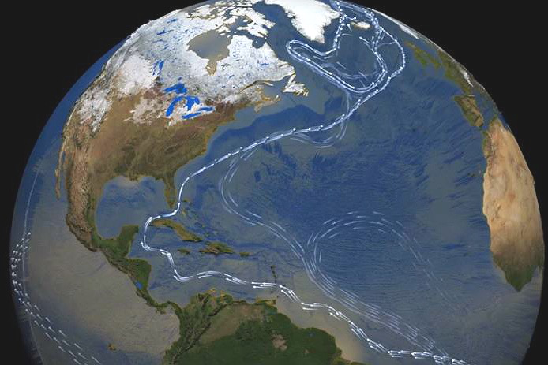

==================
Milestone 6 Progress Report
==================

**Approved for public release; distribution is unlimited. This material is based upon work supported by the Defense Advanced Research Projects Agency (DARPA) under Agreement No. HR00112290032.**

**PACMANS TEAM:**
• Jennifer Sleeman (JHU APL) PI
• Anand Gnanadesikan (JHU) Co-PI
• Yannis Kevrekidis (JHU) Co-PI
• Jay Brett (JHU APL)
• David Chung (JHU APL)
• Chace Ashcraft (JHU APL)
• Thomas Haine (JHU)
• Marie-Aude Pradal (JHU)
• Renske Gelderloos (JHU)
• Caroline Tang (DUKE)
• Anshu Saksena (JHU APL)
• Larry White (JHU APL)
• Marisa Hughes (JHU APL)

1 Overview
------------

   The Physics-informed AI Climate Model Agent Neuro-symbolic Simulator
   (PACMANS) for Tipping Point Discovery

   • This technical report covers the period of June 14, 2022 through August 13, 2022.

   • The report documents the achievement of the milestone associated with Month 8 of the JHU/APL-led PACMAN team’s statement of work.

   • The delivery for this milestone is this report which highlights AI Physics-informed surrogate model progress and the AI Simulation progress.

   • This milestone includes:
       | • A progress report
       | • Preliminary software\

2 Goals and Impact
-------------------

Goal for this milestone included:
	• Deliver progress report and preliminary software for the hybrid models/methods

	• The report is included in this document and preliminary software for methods described are located here:

	• The project website is located here:

   |image27|\

3 Key Findings
---------------

**Surrogate Models:**

   • We have achieved the first calculation of escape time distributions for the 4-box model (non-dimensionalized)

**AI Simulation:**

   • We showed that the GAN could be used to exploit the area of uncertainty, consistent with the separatrix of the fold bifurcations, consistent with the Gnanadesikan 2018 paper

   • By fixing the loss function to include information from the discriminator’s uncertainty and increasing the number of generators using this generative setup, as the number of generators increases, the GAN becomes more focused on this area of uncertainty

   • We believe we could extend the GAN to explore additional types of bifurcations

   • Using the CLEVR dataset we are now able to measure performance of the neuro-symbolic architectures and have strong preliminary results using Levenstein distance as a metric\

4 Task 3.4: AI Physics-Informed Surrogate Model Summary
--------------------------------------------------------

   *Subtask Description: We will provide a progress report of the early
   proof of concept experimental results.*

   Accomplishments:

   • Have developed a first version of the Python code for the surrogates consistent with the bifurcation diagrams

   • In-process to integrate this code to be used by the GAN
   • Working on estimating the escape time distributions\

   **The Model**
We consider a dynamical box model with four boxes:
	• the southern high latitudes (0.308S)
	• the northern high latitudes (0.458N)
	• mid- to low latitudes
	• a deep box that lies beneath all of the surface boxes.
State variables:
	• 𝐷: Low latitude pycnocline depth.
	• 𝑇_S, 𝑇_n, 𝑇_l, 𝑇_d: Temperatures of the four boxes 
	• 𝑆_S, 𝑆_n, 𝑆_l, 𝑆_d: Salinities of the four boxes

\ |image31|\

• Single-headed bold arrows denote net fluxes of water.

• Double-headed arrows denote mixing fluxes.

**Nine Equations**

|image32|\

   These are the equations that we start with (nine differential
   equations)

   
**Salt Conservation**

|image33|\

   IMPORTANTLY, we explicitly used the fact that there exists an
   algebraic constraint (a salt balance) that reduces the equations by
   one, and removes a neutral direction; this helps the conditioning of
   the Jacobian

**Non-Dimensional Equations**

|image34|\

   To make computations more accurate numerically, we
   non-dimensionalized the equations in ways **meaningful to the domain
   scientist** (Anand G.) to reduce the number of free parameters

**Numerical Bifurcation Analysis**

   .. image:: _static/media6/image89.png
      :width: 3.61806in
      :height: 2.71389in

   .. image:: _static/media6/image90.png
      :width: 3.44167in
      :height: 2.58055in

   The Hysteretic behavior found in [Gnanadesikan, Kelson, Sten 2018],
   can be described as:

   	The ‘switching’ between ‘off’ and ‘on’ state is given by a subcritical Hopf bifurcation: H for 𝑇𝑟>?\* = 0.03529

   	And a saddle-node bifurcation: LP for 𝑇𝑟>?\* = 0.01798

	Reminder: we found two different tipping points ("up to down" and "down to up” that also happened to do be of different nature ("turning point" and "subcritical Hopf")
\ |image93|\ |image94|\

**Stochastic version**

To the non-dimensional system of 8 equations, we add fluctuations in the fresh water flux coefficient: :math:`𝑇𝑟_{FW}^n ∼ 𝒩(𝑇𝑟_{FW0}^n, 𝜎^2)`

With :math:`𝜎 = 4\% 𝑇𝑟_{FW}^n = 0.002`

|image97|\ |image98|

| • Sitting close to the subcritical Hopf tipping point, on its "safe side" we performed our first stochastic simulations (with fluctuating freshwater flux coefficient, again designed in collaboration with the domain expert, Anand G.)
| • Notice on the left the simulations, the variable **oscillates over time near 4.7 before it eventually "tips"** 
| • Notice also, on the right, some initial statistics of **escape times** for a fixed parameter value

**AI Surrogate Learning Progress**
Next Steps:
	• We started collecting data towards a targeted surrogate model. This will allow us to efficiently and accurately estimate escape time distributions.

	• We will learn targeted effective stochastic DEs (one-dimensional at the LP tipping, two-dimensional at the Hopf tipping) and use them to estimate escape time statistics in both cases.

	• We have a very good handle on data-driven causality; the enabling tools are “Alternating Diffusion” / “Jointly Smooth Functions”

	• **We plan to use this in the discovery of good predictors/advance indicators of tipping.**

5 Task 4.4: AI Simulation Progress Summary
------------------------------------------
   *Subtask Description: We will provide a progress report of the early
   proof of concept experimental results for the MA-GAN, the causal
   model and the neuro-symbolic models, including isolated experimental
   results and early integration results.*

   | Accomplishments:
   | • Showed that the GAN could be used to exploit the area of uncertainty consistent with the separatrix in the Gnanadesikan 2018 paper
   | • Developed architectures needed for a baseline neuro-symbolic language that enables a translation from human-specific questions to the GAN simulation, and from perturbed GAN runs to questions
   | • Begun integrating the neuro-symbolic work with GAN output\

**AI Simulation – GAN Uncertainty Experiment Objective**

   | • Initial Questions:
   	| • How does increasing generators affect learning behavior?

   	| • How should we modify the loss function (best function for finding optimal gradients of model) for this problem domain?

   | • Can the GAN discover input configurations for a climate model whose outputs are unstable or uncertain?

	| • i.e. explore separatrix

   | • How well can the GAN accurately predict the climate model outputs for configurations spanning these regions of uncertainty?\

**AI Simulation – GAN Uncertainty Experiments**

• Reproduced one of the Box model simulation experiments to validate the GAN architecture

• With a vector of 3 dimensions and perturbations of parameters (bounded):

   • Dlow0 (Thermocline depth of lower latitudes): [100.0, 400.0]
   • Mek (Ekman flux from the southern ocean): [1.5e7, 3.5e7]
   • Fwn (Fresh water flux (North)): [5.0e4, 1.55e6]

• Other variables were held constant\

|image103|\

**AI Simulation – GAN Uncertainty Experiment Discriminator**

   • Given a configuration, the discriminator has two objectives:

   	• Identify the origin of the configuration (i.e. which generator produced it or if it was sampled from the real data distribution)

   	• Correctly predict if the configuration will induce a shutoff state

   • At each update step, the discriminator will achieve these two objectives for m(n+1) configurations (m samples per each of n generators, +1 batch from the real data distribution)

   • Ground-truth shutoff labels are determined for the generated configurations by consulting the surrogate model before the training step\

**AI Simulation – GAN Uncertainty Experiment Generator**

   • *n* Generators:

   	• for i=1,…, n

   		• Generator *i* (𝐺𝑖 ) produces m configurations for the surrogate model (m = batch size)

   		• The generated configurations are passed through the discriminator to compute both the GAN logits and the AMOC state classification logits

   • Each generator has two objectives:

   	• Guide the discriminator into predicting that its configurations are sampled from the real data distribution

   	• Generate model configurations where the discriminator is least certain about the output state (i.e. AMOC shutoff vs. non-shutoff)\

**AI Simulation – GAN Uncertainty Experiments**

   • Real dataset generated by uniformly sampling vectors of perturbed variables from bounded 3-D subspace.

   • Goal of GAN is to learn a distribution that explores this space, but with a bias to identify regions of AMOC instability (e.g. bifurcation region)

   • Number of generators varied (*n* = 1, 2, 3)

   • Evaluation metrics:

   	• Percentage of generated samples within the bifurcation region

   	• Discriminator shutoff classification metrics (precision, recall, F1, confusion matrices)

		•    Test/generated sets

 		• Inside/outside bifurcation region

.. image:: _static/media6/image99.png
   :width: 5.66667in
   :height: 3.77778in

   𝐹_{wn} bifurcation region: 0.348 – 0.848 Sv

   Test Set Based on Dataset Generated From Box Model.

   **AI Simulation – GAN Experiments – Uncertainty Region Sampling**

============== =================================
   **Dataset** **Percent in uncertainty region**
============== =================================
   Training    34.9%
   Test        35.5%
   GAN (N=1)   67.4%
   GAN (N=2)   91.4%
   GAN (N=3)   98.7%
============== =================================

+---------------------------------------------------+
|    | Training samples: 10,774 Test samples: 2,694 |
|    | GAN samples: 2,694                           |
|    | N = number of generators                     |
+---------------------------------------------------+

+------------------------+
| |image109|             |
+========================+
|    Generated Set (N=3) |
+------------------------+

+-------------+
| |image110|  |
+=============+
|    Test set |
+-------------+

+------------------------+
| |image111|             |
+========================+
|    Generated Set (N=1) |
+------------------------+

+------------------------+
| |image112|             |
+========================+
|    Generated Set (N=2) |
+------------------------+

Comparing GAN Generated Results for N = (1,2,3) with the Test Set.

+---------------------------------------------------------+-----------+
| The GAN successfully learned to sample configurations   |           |
| from the bifurcation region                             |           |
+=========================================================+===========+
| This selectivity *increases* w/ the number of           |           |
| generators – supporting our multiGAN approach           |           |
+---------------------------------------------------------+-----------+

**AI Simulation – Neuro-Symbolic Learning**

   .. image:: _static/media6/image104.png
      :width: 7.69444in
      :height: 4.60556in

   Neuro-Symbolic Translations and GAN Input/Output

   .. image:: _static/media6/image105.png
      :width: 8.76111in
      :height: 4.94722in

   Learning to Translate Questions into Programs and Programs into
   Questions\

   | Using the CLEVR dataset to validate architectures:
   | (https://cs.stanford.edu/people/jcjohns/clevr/)

	• Common dataset for neuro-symbolic method evaluation

   	• Specific to image object understanding

   	• We adapt this dataset and use only the question and program portions of the data

   .. image:: _static/media6/image106.png
      :width: 6.275in
      :height: 4.67639in                                                                         

   • Used 59,307 training samples and 12,698 test samples

   • Trained network with shared word embeddings

   • Evaluated using test samples

   • Test samples contained both natural language questions and equivalent programs

   • Early results showed a range of 65%-75% accuracy overall translating from questions to questions, questions to programs, and programs to questions dependent up the token length

   • We show better results with longer token length

   **Example Output:**

   **Predicted text:** BOS how many small cyan things are there ? EOS\ 

   **Ground Truth Text:** BOS how many small cyan things are there ? EOS

    **Predicted program:** BOS count ( filter_color ( filter_size ( scene , small ) , cyan ) ) EOS

   **Ground Truth program:** BOS count ( filter_color ( filter_size ( scene , small ) , cyan ) ) EOS\ 

    **Predicted text from program:** BOS how many of cyan things are are ? ? EOS\

   .. image:: _static/media6/image108.png
      :width: 5.48056in
      :height: 3.84722in

   .. image:: _static/media6/image109.png
      :width: 5.95in
      :height: 3.79167in

   Levenshtein distance shows the number of transformations from one
   sentence to another.

   Initial results are promising; transfer learning into the climate
   domain in progress |image116|

**Summary**

   In summary, we have described consistent progress across both the
   surrogate methods and the AI Simulation methods.

   All source code is open and available in Github.

   Initial evaluations have been performed and module integrations is
   in-progress.

   |image117|\

**Approved for public release; distribution is unlimited. This material is based upon work supported by the Defense Advanced Research Projects Agency (DARPA) under Agreement No. HR00112290032.**

**Citations**

   1. Boers, Niklas. "Observation-based early-warning signals for a
   collapse of the Atlantic Meridional Overturning Circulation." Nature
   Climate Change 11, no. 8 (2021): 680-688.

   2. Gnanadesikan, A., A simple model for the structure of the oceanic
   pycnocline, Science., 283:2077-2079, (1999).

   | 3. Forget, G., J.-M. Campin, P. Heimbach, C. N. Hill, R. M. Ponte,
     C. Wunsch, ECCO version 4: An integrated framework for non-linear
     inverse modeling and global ocean state estimation. Geosci. Model
     Dev. 8, 3071–3104 (2015)
   | 4. Gnanadesikan, A., R. Kelson and M. Sten, Flux correction and
     overturning stability: Insights from a dynamical box model, J.
     Climate, 31, 9335-9350, https://doi.org/10.1175/JCLI-D-18-0388.1,
     (2018).

   5. Kaufhold, John Patrick, and Jennifer Alexander Sleeman. "Systems
   and methods for deep model translation generation." U.S. Patent No.
   10,504,004. 10 Dec. 2019.

   6. Garcez, Artur d'Avila, and Luis C. Lamb. "Neurosymbolic AI: the
   3rd Wave." arXiv preprint arXiv:2012.05876 (2020).

   7. Stommel, H. Thermohaline convection with two stable regimes of
   flow. Tellus 13, 224–230 (1961).

   8. Karniadakis, George Em, Ioannis G. Kevrekidis, Lu Lu, Paris
   Perdikaris, Sifan Wang, and Liu Yang. "Physics-informed machine
   learning." Nature Reviews Physics 3, no. 6 (2021): 422-440.

   9. Sleeman, Jennifer, Milton Halem, Zhifeng Yang, Vanessa Caicedo,
   Belay Demoz, and Ruben Delgado. "A Deep Machine Learning Approach for
   LIDAR Based Boundary Layer Height Detection." In IGARSS 2020-2020
   IEEE International Geoscience and Remote Sensing Symposium, pp.
   3676-3679. IEEE, 2020.

   10. Patel, Kinjal, Jennifer Sleeman, and Milton Halem. "Physics-aware
   deep edge detection network." In Remote Sensing of Clouds and the
   Atmosphere XXVI, vol. 11859, pp. 32-38. SPIE, 2021.

   11.Brulé, Joshua. "A causation coefficient and taxonomy of
   correlation/causation relationships." arXiv preprint arXiv:1708.05069
   (2017).

   12. Rasp, Stephan, Michael S. Pritchard, and Pierre Gentine. "Deep
   learning to represent subgrid processes in climate models."
   Proceedings of the National Academy of Sciences 115, no. 39 (2018):
   9684-9689.

   13. Bolton, Thomas, and Laure Zanna. "Applications of deep learning
   to ocean data inference and subgrid parameterization." Journal of
   Advances in Modeling Earth Systems 11, no. 1 (2019): 376-399.

   14. Kurth, Thorsten, Sean Treichler, Joshua Romero, Mayur Mudigonda,
   Nathan Luehr, Everett Phillips, Ankur Mahesh et al. "Exascale deep
   learning for climate analytics." In SC18: International Conference
   for High Performance Computing, Networking, Storage and Analysis, pp.
   649-660. IEEE, 2018.

   15. Weber, Theodore, Austin Corotan, Brian Hutchinson, Ben Kravitz,
   and Robert Link. "Deep learning for creating surrogate models of
   precipitation in Earth system models." Atmospheric Chemistry and
   Physics 20, no. 4 (2020): 2303-2317.

   16. Matsubara, Takashi, Ai Ishikawa, and Takaharu Yaguchi. "Deep
   energy-based modeling of discrete-time physics." arXiv preprint
   arXiv:1905.08604 (2019).

   17. Kleinen, T., Held, H. & Petschel-Held, G. The potential role of
   spectral properties in detecting thresholds in the Earth system:
   application to the thermohaline circulation. Ocean Dyn. 53, 53–63
   (2003).

   18. Kocaoglu, Murat, Christopher Snyder, Alexandros G. Dimakis, and
   Sriram Vishwanath. "Causalgan: Learning causal implicit generative
   models with adversarial training." arXiv preprint arXiv:1709.02023
   (2017).

   19. Feinman, Reuben, and Brenden M. Lake. "Learning Task-General
   Representations with Generative Neuro-Symbolic Modeling." arXiv
   preprint arXiv:2006.14448 (2020).

   20. Yi, Kexin, Chuang Gan, Yunzhu Li, Pushmeet Kohli, Jiajun Wu,
   Antonio Torralba, and Joshua B. Tenenbaum. "Clevrer: Collision events
   for video representation and reasoning." arXiv preprint
   arXiv:1910.01442 (2019).

   21. Nowack, Peer, Jakob Runge, Veronika Eyring, and Joanna D. Haigh.
   "Causal networks for climate model evaluation and constrained
   projections." Nature communications 11, no. 1 (2020): 1-11.

   22. Andersson, Tom R., J. Scott Hosking, María Pérez-Ortiz, Brooks
   Paige, Andrew Elliott, Chris Russell, Stephen Law et al. "Seasonal
   Arctic sea ice forecasting with probabilistic deep learning." Nature
   communications 12, no. 1 (2021): 1-12.

   23. Storchan, Victor, Svitlana Vyetrenko, and Tucker Balch. "MAS-GAN:
   Adversarial Calibration of Multi-Agent Market Simulators." (2020).

   24. De Raedt, Luc, Robin Manhaeve, Sebastijan Dumancic, Thomas
   Demeester, and Angelika Kimmig. "Neuro-symbolic=neural+ logical+
   probabilistic." In NeSy'19@ IJCAI, the 14th International Workshop on
   Neural-Symbolic Learning and Reasoning. 2019.

   25. Eyring, V., Bony, S., Meehl, G. A., Senior, C. A., Stevens, B.,
   Stouffer, R. J., and Taylor, K. E.: Overview of the Coupled Model
   Intercomparison Project Phase 6 (CMIP6) experimental design and
   organization, Geosci. Model Dev., 9, 1937-1958,
   doi:10.5194/gmd-9-1937-2016, 2016.

   26. Swingedouw, Didier, Chinwe Ifejika Speranza, Annett Bartsch, Gael
   Durand, Cedric Jamet, Gregory Beaugrand, and Alessandra Conversi.

   "Early warning from space for a few key tipping points in physical,
   biological, and social-ecological systems." Surveys in geophysics 41,
   no. 6 (2020): 1237-1284.

   27. Reichstein, Markus, Gustau Camps-Valls, Bjorn Stevens, Martin
   Jung, Joachim Denzler, and Nuno Carvalhais. "Deep learning and
   process understanding for data-driven Earth system science." Nature
   566, no. 7743 (2019): 195-204.

   28. Sleeman, Jennifer, Ivanka Stajner, Christoph Keller, Milton
   Halem, Christopher Hamer, Raffaele Montuoro, and Barry Baker. "The
   Integration of Artificial Intelligence for Improved Operational Air
   Quality Forecasting." In AGU Fall Meeting 2021. 2021.

   | 29. Bellomo, K., Angeloni, M., Corti, S. *et al.* Future climate
     change shaped by inter-model differences in Atlantic meridional
     overturning circulation response. *Nat Commun* **12,** 3659 (2021).
   | 30. Sgubin, G., Swingedouw, D., Drijfhout, S. *et al.* Abrupt
     cooling over the North Atlantic in modern climate models. *Nat
     Commun* **8,** 14375 (2017).
   | 31. Swingedouw, D., Bily, A., Esquerdo, C., Borchert, L. F.,
     Sgubin, G., Mignot, J., & Menary, M. (2021). On the risk of abrupt
     changes in the North Atlantic subpolar gyre in CMIP6 models.
     *Annals of the New York Academy of Sciences*, *1504*\ (1), 187-201.
     32. Mao, Jiayuan, Chuang Gan, Pushmeet Kohli, Joshua B. Tenenbaum,
     and Jiajun Wu. "The neuro-symbolic concept learner: Interpreting
     scenes, words, and sentences from natural supervision." *arXiv
     preprint arXiv:1904.12584* (2019).

.. image:: _static/media6/image114.png
   :width: 3.61111in
   :height: 0.11111in

   .. image:: _static/media6/image115.png
      :width: 3.09722in
      :height: 0.11111in

.. image:: _static/media6/image116.png
   :width: 2.97222in
   :height: 0.11111in

   3 December 2022 **31**

.. |image1| image:: _static/media6/image2.png
   :width: 1.375in
   :height: 0.45833in
.. |image2| image:: _static/media6/image3.png
   :width: 1.75in
   :height: 0.45833in
.. |image3| image:: _static/media6/image4.png
   :width: 1.625in
   :height: 0.45833in
.. |image4| image:: _static/media6/image5.png
   :width: 13.33056in
   :height: 7.49844in
.. |image5| image:: _static/media6/image6.png
   :width: 0.625in
   :height: 0.11111in

.. |image7| image:: _static/media6/image8.png
   :width: 2.68056in
   :height: 0.56944in
.. |image8| image:: _static/media6/image9.png

.. |image11| image:: _static/media6/image12.png
.. |image12| image:: _static/media6/image13.png
.. |image13| image:: _static/media6/image14.png
.. |image14| image:: _static/media6/image15.png
   :width: 0.72222in
   :height: 0.59722in
.. |image15| image:: _static/media6/image16.png
.. |image16| image:: _static/media6/image17.png
.. |image17| image:: _static/media6/image18.png
   :height: 0.125in
.. |image18| image:: _static/media6/image19.png
.. |image19| image:: _static/media6/image20.png
.. |image20| image:: _static/media6/image21.png
   :width: 8.83333in
   :height: 1.06944in
.. |image21| image:: _static/media6/image22.png
.. |image22| image:: _static/media6/image23.png
.. |image23| image:: _static/media6/image24.png
.. |image24| image:: _static/media6/image25.png
.. |image25| image:: _static/media6/image26.png
.. |image26| image:: _static/media6/image27.png
   :width: 13.33333in
   :height: 0.41667in
.. |image27| image:: _static/media6/image29.png
   :width: 3.98611in
   :height: 0.11111in
.. |image28| image:: _static/media6/image27.png
   :width: 13.33333in
   :height: 0.41667in
.. |image29| image:: _static/media6/image27.png
   :width: 13.33333in
   :height: 0.41667in
.. |image30| image:: _static/media6/image27.png
   :width: 13.33333in
   :height: 0.41667in

.. |image32| image:: _static/media6/image39.png
   :width: 0.80556in
   :height: 0.30556in
.. |image33| image:: _static/media6/image40.png
   :width: 0.98611in
   :height: 0.29167in

.. |image35| image:: _static/media6/image42.png
   :width: 0.13889in
   :height: 0.23611in
.. |image36| image:: _static/media6/image43.png
   :width: 0.34722in
   :height: 0.23611in
.. |image37| image:: _static/media6/image44.png
   :width: 0.95833in
   :height: 0.375in
.. |image38| image:: _static/media6/image45.png
   :width: 0.125in
   :height: 0.23611in
.. |image39| image:: _static/media6/image46.png
   :width: 0.44444in
   :height: 0.30556in
.. |image40| image:: _static/media6/image47.png
   :width: 0.36111in
   :height: 0.29167in
.. |image41| image:: _static/media6/image48.png
   :width: 0.34722in
   :height: 0.23611in
.. |image42| image:: _static/media6/image49.png
   :width: 0.125in
   :height: 0.23611in
.. |image43| image:: _static/media6/image50.png
   :width: 1.91667in
   :height: 0.90278in
.. |image44| image:: _static/media6/image51.png
   :width: 0.125in
   :height: 0.23611in
.. |image45| image:: _static/media6/image52.png
   :width: 0.125in
   :height: 0.23611in
.. |image46| image:: _static/media6/image53.png
   :width: 0.125in
   :height: 0.23611in
.. |image47| image:: _static/media6/image54.png
   :width: 0.125in
   :height: 0.23611in
.. |image48| image:: _static/media6/image55.png
   :width: 0.13889in
   :height: 0.29167in
.. |image49| image:: _static/media6/image56.png
   :width: 0.125in
   :height: 0.23611in
.. |image50| image:: _static/media6/image57.png
   :width: 0.13889in
   :height: 0.30556in
.. |image51| image:: _static/media6/image58.png
   :width: 0.13889in
   :height: 0.29167in
.. |image52| image:: _static/media6/image59.png
   :width: 0.13889in
   :height: 0.29167in
.. |image53| image:: _static/media6/image60.png
   :width: 0.13889in
   :height: 0.29167in
.. |image54| image:: _static/media6/image61.png
   :width: 0.91667in
   :height: 0.29167in
.. |image55| image:: _static/media6/image62.png
   :width: 0.125in
   :height: 0.23611in
.. |image56| image:: _static/media6/image63.png
   :width: 0.13889in
   :height: 0.23611in
.. |image57| image:: _static/media6/image64.png
   :width: 0.125in
   :height: 0.23611in
.. |image58| image:: _static/media6/image65.png
   :width: 0.95833in
   :height: 0.375in
.. |image59| image:: _static/media6/image66.png
   :width: 0.44444in
   :height: 0.29167in
.. |image60| image:: _static/media6/image67.png
   :width: 0.36111in
   :height: 0.29167in
.. |image61| image:: _static/media6/image68.png
   :width: 0.34722in
   :height: 0.25in
.. |image62| image:: _static/media6/image69.png
   :width: 0.13889in
   :height: 0.23611in
.. |image63| image:: _static/media6/image70.png
   :width: 0.125in
   :height: 0.30556in
.. |image64| image:: _static/media6/image71.png
   :width: 1.36111in
   :height: 0.86111in
.. |image65| image:: _static/media6/image72.png
   :width: 0.125in
   :height: 0.23611in
.. |image66| image:: _static/media6/image73.png
   :width: 0.125in
   :height: 0.23611in
.. |image67| image:: _static/media6/image74.png
   :width: 0.125in
   :height: 0.23611in
.. |image68| image:: _static/media6/image75.png
   :width: 0.13889in
   :height: 0.29167in
.. |image69| image:: _static/media6/image76.png
   :width: 13.33333in
   :height: 1.29167in
.. |image70| image:: _static/media6/image31.png
   :width: 0.13889in
   :height: 0.29167in
.. |image71| image:: _static/media6/image32.png
   :width: 0.20833in
   :height: 0.29167in
.. |image72| image:: _static/media6/image33.png
   :width: 0.22222in
   :height: 0.375in
.. |image73| image:: _static/media6/image34.png
   :width: 0.23611in
   :height: 0.375in
.. |image74| image:: _static/media6/image35.png
   :width: 0.13889in
   :height: 0.375in
.. |image75| image:: _static/media6/image36.png
   :width: 0.20833in
   :height: 0.29167in
.. |image76| image:: _static/media6/image35.png
   :width: 0.13889in
   :height: 0.375in
.. |image77| image:: _static/media6/image37.png
   :width: 0.22222in
   :height: 0.375in
.. |image78| image:: _static/media6/image38.png
   :width: 0.13889in
   :height: 0.29167in
.. |image79| image:: _static/media6/image77.png
   :width: 4.20833in
   :height: 0.375in
.. |image80| image:: _static/media6/image78.png
   :width: 2.44444in
.. |image81| image:: _static/media6/image27.png
   :width: 13.33333in
   :height: 0.41667in
.. |image82| image:: _static/media6/image79.png
   :width: 0.19444in
   :height: 0.625in
.. |image83| image:: _static/media6/image80.png
   :width: 0.68056in
   :height: 0.625in
.. |image84| image:: _static/media6/image81.png
   :width: 2.30556in
   :height: 0.33333in
.. |image85| image:: _static/media6/image82.png
   :width: 0.55556in
   :height: 0.11111in
.. |image86| image:: _static/media6/image83.png
   :width: 0.94444in
   :height: 0.11111in
.. |image87| image:: _static/media6/image84.png
   :width: 1in
   :height: 0.11111in
.. |image88| image:: _static/media6/image85.png
   :width: 0.59722in
   :height: 0.11111in
.. |image89| image:: _static/media6/image86.png
   :width: 0.48611in
   :height: 0.11111in
.. |image90| image:: _static/media6/image87.png
   :width: 0.45833in
   :height: 0.11111in
.. |image91| image:: _static/media6/image87.png
   :width: 0.45833in
   :height: 0.11111in
.. |image92| image:: _static/media6/image88.png
   :width: 13.33333in
   :height: 1.36111in
.. |image93| image:: _static/media6/image91.png
   :width: 3.61806in
   :height: 2.71354in

.. |image96| image:: _static/media6/image94.png
   :width: 13.33333in
   :height: 0.41667in

.. |image98| image:: _static/media6/image96.png
   :width: 4.37917in
   :height: 3.28472in
.. |image99| image:: _static/media6/image27.png
   :width: 13.33333in
   :height: 0.41667in
.. |image100| image:: _static/media6/image27.png
   :width: 13.33333in
   :height: 0.41667in
.. |image101| image:: _static/media6/image27.png
   :width: 13.33333in
   :height: 0.41667in
.. |image102| image:: _static/media6/image27.png
   :width: 13.33333in
   :height: 0.41667in
.. |image103| image:: _static/media6/image97.png
   :width: 11.84722in
   :height: 5.27778in
.. |image104| image:: _static/media6/image98.png
   :width: 13.33333in
   :height: 0.625in
.. |image105| image:: _static/media6/image27.png
   :width: 13.33333in
   :height: 0.41667in
.. |image106| image:: _static/media6/image27.png
   :width: 13.33333in
   :height: 0.41667in

.. |image108| image:: _static/media6/image27.png
   :width: 13.33333in
   :height: 0.41667in
.. |image109| image:: _static/media6/image101.png
   :width: 3.00694in
   :height: 2.00417in
.. |image110| image:: _static/media6/image99.png
   :width: 3.00556in
   :height: 2.00417in
.. |image111| image:: _static/media6/image102.png
   :width: 3.00694in
   :height: 2.00417in
.. |image112| image:: _static/media6/image103.png
   :width: 3.00694in
   :height: 2.00417in
.. |image113| image:: _static/media6/image27.png
   :width: 13.33333in
   :height: 0.41667in
.. |image114| image:: _static/media6/image27.png
   :width: 13.33333in
   :height: 0.41667in
.. |image115| image:: _static/media6/image27.png
   :width: 13.33333in
   :height: 0.41667in
.. |image116| image:: _static/media6/image110.png
   :width: 13.33333in
   :height: 1.36111in
.. |image117| image:: _static/media6/image111.png
   :width: 5.49444in
   :height: 4.08056in
.. |image118| image:: _static/media6/image27.png
   :width: 13.33333in
   :height: 0.41667in
.. |image119| image:: _static/media6/image112.png
   :width: 13.33333in
   :height: 7.5in
.. |image120| image:: _static/media6/image113.png
   :width: 13.33056in
   :height: 7.49844in
