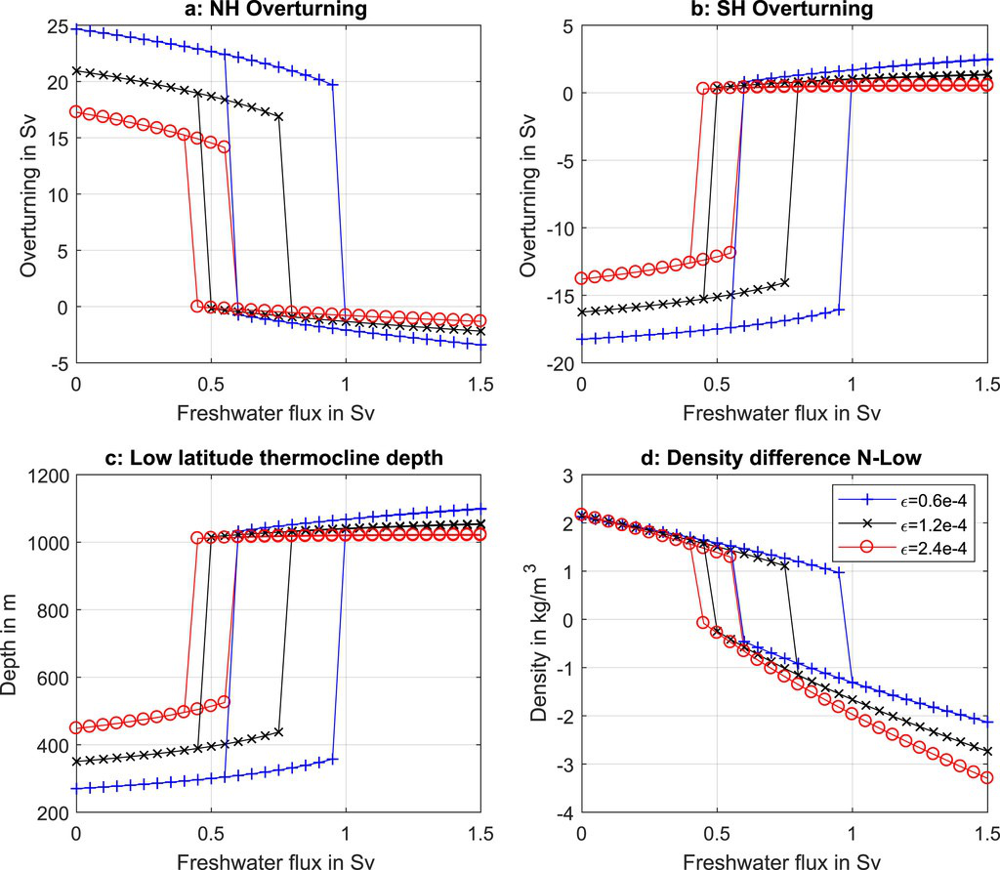

==========================
Milestone 7 Progress Report
==========================

**PACMANS TEAM:**

Jennifer Sleeman (JHU APL) PI

Anand Gnanadesikan (JHU) Co-PI

Yannis Kevrekidis (JHU) Co-PI

Jay Brett (JHU APL)

David Chung (JHU APL)

Chace Ashcraft (JHU APL)

Thomas Haine (JHU)

Marie-Aude Pradal (JHU)

Renske Gelderloos (JHU)

Caroline Tang (DUKE)

Anshu Saksena (JHU APL)

Larry White (JHU APL)

Marisa Hughes (JHU APL)

1 Overview
-----------

   • This technical report covers the period of August 14, 2022 through October 13, 2022.

   • The report documents the achievement of the milestone associated with Month 10 of the JHU/APL-led PACMAN team’s statement of work.

   • The deliverable for this milestone is this report which includes a research plan for Phase 2.\ |image26|

2 Team Resources
----------------

   • Code

   	• https://github.com/JHUAPL/PACMANs - Public to all (Up to date with all code from start to MS 3 deliverables)

	• https://github.com/JHUAPL/PACMANs_internal - Public to DARPA, JHU, and APL (Hold until internal approvals)

   • Documentation

   	• https://pacmans.readthedocs.io/en/latest/

   • Datasets

   	• http://sciserver.org/public-data/PACMANS/datasets\ |image27|

3 Goals and Impact
------------------

   Goal for this milestone included:

   	• Develop a detailed research plan for Phase 2 to include specifics of data, specifying data providers and availability

   	• Describe expected updates to the AI climate modeling methods\ |image28|

4 Phase 1 Accomplishments To Date
---------------------------------
• Generation of **novel AMOC tipping point datasets** geared toward machine learning
	• Includes open sourced models being used by other performers
• CEMS2 4-box model Verification – Path for AI Learning of Large GCM Models
	• Research showed 4-box model captures 60-90% of the variation in the AMOC and pycnocline of CESM2, suggesting 4-box results can be used to understand
CMIP-class AMOC model disagreement
• Development of the **new 6-box model** for AMOC overturning research
	• Enables the study of oscillations providing insights into why some slow-downs lead to full collapses whereas some lead to recovery, which could inform climate
intervention strategies
• **New bifurcation method** for stochastic differential equations to estimate escape times in addition to identifying
bifurcations
	• Goes beyond SOA providing measurements for determining how far away we are from a tipping point and likelihood of recovering – applied to the stochastic 4-
box model
• New AI-based method – TIP-GAN – a **generative adversarial network that is used to discover AMOC tipping points**
	• Generalizable to other types of tipping points
• Newly developed **neuro-symbolic deep learning architecture** that provides a means to ask questions of what is learned by TIP-GAN and a way to explore **causal paths**
• First version of causal models based on TIP-GAN learned paths
• Three accepted AGU presentations (2 oral, 1 poster), one **AAAI Fall Symposium paper acceptance**, first phase of reviews acceptance AAAI Conference, draft of two journal papers, proposal submission to the AAAI Spring Symposium for AI Climate Tipping-Point Discovery (ACTD)

5 Phase 2 Discussion
--------------------

   This report includes a detailed experimental plan for each component
   of the PACMANS project including:

• Use Case Modeling: Development of fully coupled climate models with identified AMOC tipping points for AI model evaluations
• AMOC Use Case: AI experimental runs based on the 6-box model and calibrated CESM2 models, validated against in-house runs, discussion of additional model data
• AI Physics-Informed Surrogate: Next generation bifurcation method which supports bifurcation analysis beyond the 4-box model to include stochastic models, the 6-box model, calibrated CESM2 models, and a plan for next step GCMs
• AI Simulation: New integration between the GAN and the surrogate models
• AI Simulation: New integration between the GAN and the neuro-symbolic methods including an advancement in the language and realistic questions that could be evaluated against in-house model runs, and the inclusion of an explainability module that uses causal paths learned by the GAN

.. image:: _static/media7/image27.png
   :width: 13.33333in
   :height: 0.41667in

**Phase 2 Discussion – Value of Data**

Three areas where additional data sources could be of use
   | • As additional data for training the AI simulation
   | • After the AI simulation is trained and identifies areas of the search space that likely to exhibit collapse, apply modeling and additional observational data to better understand this behavior

   | • Use the AI simulation to identify variables\ |image29|

**Phase 2 Discussion – Data Sources**

   • The primary dataset for scientific discovery will be the CMIP6
   archive of global coupled models.

   	• Those models with ensembles of runs for certain forward projections will be valuable in understanding *predictability* of the changes in AMOC.

   • Model disagreement, paired with GAN discovery of tipping points, will identify the important parameters or conditions that control the AMOC shutoff.

   • Observations that could put limits on these parameters or indicate
   these conditions will be the most valuable new data that could be
   generated.

   	• We expect important initial conditions to include the AMOC strength, which could be better measured with added data from floats for improved T, S structure measures, moorings for bottom pressure, or satellite SST and SSS.

   	• We expect an important forcing to be the freshwater flux from the Arctic, which might be measured by floats and satellites.

   	• We expect the important parameters to be mixing rates, which can be
   measured with in-situ and satellite monitoring of significant salinity anomalies for their decay rate or potentially dye experiments at the (sub)mesoscale.

   	• Existing satellite and ARGO datasets will be examined to determine what we can already learn of freshwater fluxes, AMOC strength, and salinity anomalies to constrain our model analyses.\ |image30|

**Phase 2 Discussion – Value of New Data**
   | • *Emergent parameters-* efficiency with which large scale available potential energy is converted to overturning.

   | • *Emergent behavior-* low damping of salinity anomalies near collapse. (requires measuring air-sea water fluxes/salt transports)

   | • *Precursor patterns-* focus modeling activity near tipping point, look for common precursors of collapse.

   |image31|\ |image32|

.. image:: _static/media7/image27.png
   :width: 13.33333in
   :height: 0.41667in

**Phase 2 Discussion – Questions to Explore**

   Is there **emergent behavior** that can serve as a an index of
   whether models are approaching a tipping point?

   	- Amplitude of variability in the overturning circulation?

   	- Appearance or disappearance of oscillations in overturning transport?

	- Damping time and/or persistence of salinity anomalies

	- Relative phase of salinity and pycnocline depth anomalies

   Is this emergent behavior **detectable** with relatively short time
   series?

   	- Example: In box model, overturning variability increases as tipping point is approached… but hundreds of years of output are needed to see changes.

   	- Examine whether this is true in models with different periodicities in overturning variability.
   
    How does the AI simulation exploit this emergent behavior?

   	- Could the GAN be directed to exploit spaces that have high probability of causing a tip?- Could additional data be used to improve the adversarial game?

6 Task 1.3: Use Case Ocean Modeling Research Plan
--------------------------------------------------

   *Subtask Description: We will deliver a research plan for Phase 2
   regarding the use case models that will be generated.*

   *Tasks to Complete for Phase 2:*
   	• Development of a plan of experiments in a fully-coupled global climate model to locate the overturning tipping point, allowing us to find changes in state preceding that tipping point
	• Determination to use the Community Earth System Model, CESM
	• Port CESM to JHU’s Rockfish computing center
	• Development of a plan to use the fully-coupled CESM to validate GAN discoveries
	• Develop a plan for incorporating observational data to constrain parameters

**Experimental plan:**
From a steady 2000s climate, we increase atmospheric CO2 at a constant rate of 4ppm/year (1%).

Each 35 years, at an effective radiative increase of 2W/m2, we branch off two simulations, one with constant CO2 and one with decreasing CO2 at the same 1% annual rate.

These will determine whether the AMOC recovers, stabilizes, or continues to collapse.

\ |image34|

   Atmospheric CO2 concentration for CESM2 experiments

   .. image:: _static/media7/image29.png
      :width: 7.19722in
      :height: 4.30139in

   | **Experiment plan:**
   | When we identify the CO2 range for collapse, we will run a small
     ensemble of runs covering the lead up and collapse. This will have
     two methods: 
   1. Targeted: Several runs will have varying initial
     conditions of known climate oscillations (e.g. Atlantic
     Multidecadal Oscillation (AMO) phase) and AMOC strength. We will
     also adjust the parameters from the box model that the GAN
     indicates the tipping point or separatrix is most sensitive to. We
     will further incorporate observations to constrain parameters and
     evaluate their effects.

   2. Random: We will also repeat runs with roundoff-level differences
   in the atmosphere’s initial conditions. This will allow us to
   understand the sensitivity of AMOC collapse and recovery, determine
   what additional measurements could reduce uncertainty in such
   projections, and enable a parallel understanding of collapse to that
   of the GAN.\ |image35|

5 Task 2.4: Data Plan for AMOC Use Case
----------------------------------------

   The Physics-informed AI Climate Model Agent Neuro-symbolic Simulator
   (PACMANS) for Tipping Point Discovery

   *Subtask Description: We will report how and which datasets will be
   used to support the use case experiments.*

   | *Tasks to Complete for Phase 2:*
   	• Code for calibrating CMIP-archived data to the 4 and 6 box models.
	• Calibration of CESM2 Large Ensemble members to the 4 and 6 box model.
	• Development of a plan for integrating the GAN with the calibrated data for identification of several model-specific separatrix
	• Development of a plan for integrating the calibrated data into the surrogate
modeling
	• Development of a plan to evaluate the GAN results with our use case modeling
	 Identify new informative observations to limit parameters based on GAN results

**Experiment plan:**
1. Calibration of historical and forward scenarios of multiple CMIP models will be used to study AMOC collapse through integration in the GAN
	• **Additional Data/Models:**
		• Current using CESM2: USA, Community Earth System Model
		• New: MPI-ESM1-2-LR: Max Planck Institute for Meteorology Earth System Model; ACCESS-CM2: Australian Community Climate and Earth System Simulator; CAN-ESM5: Canadian Earth System Model
	• These are all z-level models (they use depth below sea surface as their vertical coordinate). Continued code development for calibrating models with other vertical coordinates would be required.
2. Calibrated data will be used to fit the 4 and 6 box model for multiple CMIP-class global coupled models
	CESM2: Fitting historical run of LE ensemble member 1 yields AI=1429, epsilon=1.6724e-04,Kv=3.3703e-05.
	In the forward scenario, these allow for 4box AMOC to explain 91% of variation in CESM2 AMOC.\ |image38|\ |image39|\ |image40|

3. The GAN (see GAN experiments) will be used to explore the AMOC dynamics for the different models using the 4 and 6 box model with parameters fitted to the individual models

4. The parameters and initial conditions identified for tipping in CESM2 will be tested as part of the targeted ensemble of tipping runs in the use case modeling

5. Differences in model parameters that cause higher/lower risk of AMOC collapse analyzed with respect to the different AMOC reduction rates in the forward scenarios, with the goal of explaining model disagreements.

6. Acquire new observational data to constrain parameters based on GAN results

7 Task 3.5: AI Physics-Informed Surrogate Updated Models
---------------------------------------------------------

   *Subtask Description: We will report how the surrogate models will be
   built/used for the AMOC tipping model use case and experiments which
   will show how surrogate models can be used to highlight locations
   that need additional measurements.*

	*Tasks to Complete for Phase 2:*
		• Transition from 4 to 6 box models
		• Extend existing work with introduction of a GAN\ |image42|

   **Experiment plan (Transitioning from the 4 box to the 6 box model):** 
1. 6-box model equation set and nondimensionalization will be used to implement a new set of equations

2. Will use numerical bifurcation computations with respect to the same parameters we used in the 4-box case to computer several one-parameter bifurcation diagrams in comparable operating regimes

3. Will pinpoint the candidate tipping point bifurcations (turning points involving a stable and an unstable steady branch as well as possibly subcritical Hopf bifurcations where a stable focus loses stability “backwards” and an unstable limit cycle is born in the reverse direction.\ |image43|

   
4. In the neighborhood of these candidate tipping points will include noise terms for deterministic evolution equations, and perform stochastic simulations from rich ensembles of initial conditions.

5. Will collect these stochastic trajectories, and then use our stochastic integrator-inspired neural network SDE
identification software to learn low-dimensional effective SDEs targeted to the neighborhood of said candidate
tipping points.

6. In a separate effort, will use fully developed weather simulations to calibrate mathematical six-equation model.

7. Will collect time series of the “six model variables” from the full simulation, and then using recurrent neural
network architectures (e.g. Runge-Kutta recurrent Resnets that we originally proposed) identify black box six-
box models

8. In collaboration with Prof. Gnanadesikan, will decide which constitutive and balance terms from the six equation
model are firmly established and which are more tenuous

   **Experiment plan (Exploring modifications and extensions of GAN
   usage):**

1. Using GANs to assist and enhance multiscale simulations. In traditional statistical physics there exist physics inspired algorithms (like umbrella sampling) using intelligently biased dynamics to generate these configurations. GANs provide a machine-learning alternative, where instead of using dynamic simulations, a database of acceptable microscopic configurations are used.

2. Will use the same generating philosophy to determine separatrices between flipped states; yet in typical conditional GAN architectures only a single random seed is used in the generator, giving us an effectively one- dimensional set of possible points on the separatrix – which in general is an (n-1) dimensional surface

3. Have promising preliminary results using more than one random seed generators to create higher dimensional separatrices in model problems, and we plan to use them also here to create tipping classifications in more than two effective dimensions.

8 Task 4.5: AI Simulation Updated Models
------------------------------------------

   *Subtask Description: We will report how the simulation will be
   evaluated for the AMOC tipping point experiments. What-if questions
   related to the AMOC tipping point, including an evaluation of the
   causal model to answer specific questions.*

*Tasks to Complete for Phase 2:*
	• New GAN experiments based on the 6-box model and calibrated CEMS2 model 
		• Validated using the expected 6-box model output and JHU in-house models
	• New integration between the surrogate models (non-box) and the GAN
	• New integration between the GAN and the neuro-symbolic methods
	• Expansion of the neuro-symbolic language to include locations (each box) and questions
that address model dynamics beyond binary AMOC collapse
	• Development of a plan to integration the questions into the experimental evaluations, i.e.
we will setup a set of questions that will be used to query the learned latent space and will compare these answers with what is proven from running the models directly
		• Validated using the JHU in-house models

**Experiment plan 6-box model - GAN:
1. Train the GAN using the 6-box model data 
	• 6-box model surrogate will be used
2. Compare models learned by GAN that “tip” with in-house model runs
3. Compare models learned by GAN that did not “tip” with in-house model runs
4. Compare models learned by GAN that “tipped and recovered” with in-house model runs 
\ |image46|

**Experiment plan CESM2 calibrated model - GAN:**
1. Build a calibrated surrogate model using the 6-box model as a template

2. Train the GAN using the 6-box model data
	• 6-box model surrogate will be used
3. Compare models learned by GAN that “tip” with in-house model runs 
4. Compare models learned by GAN that did not “tip” with in-house model runs
5. Compare models learned by GAN that “tipped and recovered” with in-house model runs
6. Expansion to fitting less-calibrated data (zonal means rather than
   boxes)

**Experiment plan - Neuro-Symbolic Research Question Evaluation:**
1. Define a set of questions and programs consulting with JHU collaborators
	• that are realistic scientific questions one would ask
	• that can be validated using a standard in-house modeling approach
2. Build a new vocabulary based on these questions
3. Build a set of programs for these questions
4. Train the neuro-symbolic translators based on new vocabulary
5. Perform transfer learning based on new questions/programs
6. Evaluate the performance using a held-out set of questions/programs 
7. Evaluate the performance comparing answers to answers achieved by running in-house models

**Experiment plan – Causal Model Evaluation:**
1. Define a set of known causal relationships among parameters and variables for a set of experiments devised using the 4-box and 6-box models
	• Carefully devise experiments using 4-box and 6-box models
	• Consult with JHU collaborators for expected outcomes
2. Run the GAN on this dataset
	• GAN output includes storing model state after each epoch
3. Apply the causal reasoning logic to the output after the GAN completes training
4. Compare what is learned from the causal model with what is expected
5. Validate surprising results/findings with JHU collaborators
6. Repeat experiments using the CEMS2-calibrated data(if time permits)

8 Summary – Phase 2 Plans
-------------------------
• Expand from 4 to 6 box model
• Calibration of CESM2 and the box models
• Introduction of new data
• 6-box model equation set and nondimensionalization with integration of a new state space GAN
• New TIP-GAN CESM2 experiments with in-house model benchmarking
• Integration of the surrogates, TIP-GAN, and the neuro-symbolic work
• Expansion of the causal work

**Approved for public release; distribution is unlimited. This material is based upon work supported by the Defense Advanced Research Projects Agency (DARPA) under Agreement No. HR00112290032.**

Citations
---------

   1. Boers, Niklas. "Observation-based early-warning signals for a
   collapse of the Atlantic Meridional Overturning Circulation." Nature
   Climate Change 11, no. 8 (2021): 680-688.

   2. Gnanadesikan, A., A simple model for the structure of the oceanic
   pycnocline, Science., 283:2077-2079, (1999).

   | 3. Forget, G., J.-M. Campin, P. Heimbach, C. N. Hill, R. M. Ponte,
     C. Wunsch, ECCO version 4: An integrated framework for non-linear
     inverse modeling and global ocean state estimation. Geosci. Model
     Dev. 8, 3071–3104 (2015)
   | 4. Gnanadesikan, A., R. Kelson and M. Sten, Flux correction and
     overturning stability: Insights from a dynamical box model, J.
     Climate, 31, 9335-9350, https://doi.org/10.1175/JCLI-D-18-0388.1,
     (2018).

   5. Kaufhold, John Patrick, and Jennifer Alexander Sleeman. "Systems
   and methods for deep model translation generation." U.S. Patent No.
   10,504,004. 10 Dec. 2019.

   6. Garcez, Artur d'Avila, and Luis C. Lamb. "Neurosymbolic AI: the
   3rd Wave." arXiv preprint arXiv:2012.05876 (2020).

   7. Stommel, H. Thermohaline convection with two stable regimes of
   flow. Tellus 13, 224–230 (1961).

   8. Karniadakis, George Em, Ioannis G. Kevrekidis, Lu Lu, Paris
   Perdikaris, Sifan Wang, and Liu Yang. "Physics-informed machine
   learning." Nature Reviews Physics 3, no. 6 (2021): 422-440.

   9. Sleeman, Jennifer, Milton Halem, Zhifeng Yang, Vanessa Caicedo,
   Belay Demoz, and Ruben Delgado. "A Deep Machine Learning Approach for
   LIDAR Based Boundary Layer Height Detection." In IGARSS 2020-2020
   IEEE International Geoscience and Remote Sensing Symposium, pp.
   3676-3679. IEEE, 2020.

   10. Patel, Kinjal, Jennifer Sleeman, and Milton Halem. "Physics-aware
   deep edge detection network." In Remote Sensing of Clouds and the
   Atmosphere XXVI, vol. 11859, pp. 32-38. SPIE, 2021.

   11.Brulé, Joshua. "A causation coefficient and taxonomy of
   correlation/causation relationships." arXiv preprint arXiv:1708.05069
   (2017).

   12. Rasp, Stephan, Michael S. Pritchard, and Pierre Gentine. "Deep
   learning to represent subgrid processes in climate models."
   Proceedings of the National Academy of Sciences 115, no. 39 (2018):
   9684-9689.

   13. Bolton, Thomas, and Laure Zanna. "Applications of deep learning
   to ocean data inference and subgrid parameterization." Journal of
   Advances in Modeling Earth Systems 11, no. 1 (2019): 376-399.

   14. Kurth, Thorsten, Sean Treichler, Joshua Romero, Mayur Mudigonda,
   Nathan Luehr, Everett Phillips, Ankur Mahesh et al. "Exascale deep
   learning for climate analytics." In SC18: International Conference
   for High Performance Computing, Networking, Storage and Analysis, pp.
   649-660. IEEE, 2018.

   15. Weber, Theodore, Austin Corotan, Brian Hutchinson, Ben Kravitz,
   and Robert Link. "Deep learning for creating surrogate models of
   precipitation in Earth system models." Atmospheric Chemistry and
   Physics 20, no. 4 (2020): 2303-2317.

   16. Matsubara, Takashi, Ai Ishikawa, and Takaharu Yaguchi. "Deep
   energy-based modeling of discrete-time physics." arXiv preprint
   arXiv:1905.08604 (2019).

   17. Kleinen, T., Held, H. & Petschel-Held, G. The potential role of
   spectral properties in detecting thresholds in the Earth system:
   application to the thermohaline circulation. Ocean Dyn. 53, 53–63
   (2003).

   18. Kocaoglu, Murat, Christopher Snyder, Alexandros G. Dimakis, and
   Sriram Vishwanath. "Causalgan: Learning causal implicit generative
   models with adversarial training." arXiv preprint arXiv:1709.02023
   (2017).

   19. Feinman, Reuben, and Brenden M. Lake. "Learning Task-General
   Representations with Generative Neuro-Symbolic Modeling." arXiv
   preprint arXiv:2006.14448 (2020).

   20. Yi, Kexin, Chuang Gan, Yunzhu Li, Pushmeet Kohli, Jiajun Wu,
   Antonio Torralba, and Joshua B. Tenenbaum. "Clevrer: Collision events
   for video representation and reasoning." arXiv preprint
   arXiv:1910.01442 (2019).

   21. Nowack, Peer, Jakob Runge, Veronika Eyring, and Joanna D. Haigh.
   "Causal networks for climate model evaluation and constrained
   projections." Nature communications 11, no. 1 (2020): 1-11.

   22. Andersson, Tom R., J. Scott Hosking, María Pérez-Ortiz, Brooks
   Paige, Andrew Elliott, Chris Russell, Stephen Law et al. "Seasonal
   Arctic sea ice forecasting with probabilistic deep learning." Nature
   communications 12, no. 1 (2021): 1-12.

   23. Storchan, Victor, Svitlana Vyetrenko, and Tucker Balch. "MAS-GAN:
   Adversarial Calibration of Multi-Agent Market Simulators." (2020).

   24. De Raedt, Luc, Robin Manhaeve, Sebastijan Dumancic, Thomas
   Demeester, and Angelika Kimmig. "Neuro-symbolic=neural+ logical+
   probabilistic." In NeSy'19@ IJCAI, the 14th International Workshop on
   Neural-Symbolic Learning and Reasoning. 2019.

   25. Eyring, V., Bony, S., Meehl, G. A., Senior, C. A., Stevens, B.,
   Stouffer, R. J., and Taylor, K. E.: Overview of the Coupled Model
   Intercomparison Project Phase 6 (CMIP6) experimental design and
   organization, Geosci. Model Dev., 9, 1937-1958,
   doi:10.5194/gmd-9-1937-2016, 2016.

   26. Swingedouw, Didier, Chinwe Ifejika Speranza, Annett Bartsch, Gael
   Durand, Cedric Jamet, Gregory Beaugrand, and Alessandra Conversi.

   "Early warning from space for a few key tipping points in physical,
   biological, and social-ecological systems." Surveys in geophysics 41,
   no. 6 (2020): 1237-1284.

   27. Reichstein, Markus, Gustau Camps-Valls, Bjorn Stevens, Martin
   Jung, Joachim Denzler, and Nuno Carvalhais. "Deep learning and
   process understanding for data-driven Earth system science." Nature
   566, no. 7743 (2019): 195-204.

   28. Sleeman, Jennifer, Ivanka Stajner, Christoph Keller, Milton
   Halem, Christopher Hamer, Raffaele Montuoro, and Barry Baker. "The
   Integration of Artificial Intelligence for Improved Operational Air
   Quality Forecasting." In AGU Fall Meeting 2021. 2021.

   | 29. Bellomo, K., Angeloni, M., Corti, S. *et al.* Future climate
     change shaped by inter-model differences in Atlantic meridional
     overturning circulation response. *Nat Commun* **12,** 3659 (2021).
   | 30. Sgubin, G., Swingedouw, D., Drijfhout, S. *et al.* Abrupt
     cooling over the North Atlantic in modern climate models. *Nat
     Commun* **8,** 14375 (2017).
   | 31. Swingedouw, D., Bily, A., Esquerdo, C., Borchert, L. F.,
     Sgubin, G., Mignot, J., & Menary, M. (2021). On the risk of abrupt
     changes in the North Atlantic subpolar gyre in CMIP6 models.
     *Annals of the New York Academy of Sciences*, *1504*\ (1), 187-201.
     32. Mao, Jiayuan, Chuang Gan, Pushmeet Kohli, Joshua B. Tenenbaum,
     and Jiajun Wu. "The neuro-symbolic concept learner: Interpreting
     scenes, words, and sentences from natural supervision." *arXiv
     preprint arXiv:1904.12584* (2019).

.. |image1| image:: _static/media7/image2.png
   :width: 1.375in
   :height: 0.45833in
.. |image2| image:: _static/media7/image3.png
   :width: 1.75in
   :height: 0.45833in
.. |image3| image:: _static/media7/image4.png
   :width: 1.625in
   :height: 0.45833in
.. |image4| image:: _static/media7/image5.png
   :width: 13.33056in
   :height: 7.49844in
.. |image5| image:: _static/media7/image6.png
   :width: 0.625in
   :height: 0.11111in
.. |image6| image:: _static/media7/image7.png
   :width: 9.40278in
   :height: 6.27303in

.. |image8| image:: _static/media7/image9.png
.. |image9| image:: _static/media7/image10.png
   :height: 0.11111in
.. |image10| image:: _static/media7/image11.png
.. |image11| image:: _static/media7/image12.png
.. |image12| image:: _static/media7/image13.png
.. |image13| image:: _static/media7/image14.png
.. |image14| image:: _static/media7/image15.png
   :width: 0.72222in
   :height: 0.59722in
.. |image15| image:: _static/media7/image16.png
.. |image16| image:: _static/media7/image17.png
.. |image17| image:: _static/media7/image18.png
   :height: 0.125in
.. |image18| image:: _static/media7/image19.png
.. |image19| image:: _static/media7/image20.png
.. |image20| image:: _static/media7/image21.png
   :width: 8.83333in
   :height: 1.06944in
.. |image21| image:: _static/media7/image22.png
.. |image22| image:: _static/media7/image23.png
.. |image23| image:: _static/media7/image24.png
.. |image24| image:: _static/media7/image25.png
.. |image25| image:: _static/media7/image26.png
.. |image26| image:: _static/media7/image27.png
   :width: 13.33333in
   :height: 0.41667in
.. |image27| image:: _static/media7/image27.png
   :width: 13.33333in
   :height: 0.41667in
.. |image28| image:: _static/media7/image27.png
   :width: 13.33333in
   :height: 0.41667in
.. |image29| image:: _static/media7/image27.png
   :width: 13.33333in
   :height: 0.41667in
.. |image30| image:: _static/media7/image27.png
   :width: 13.33333in
   :height: 0.41667in

.. |image32| image:: _static/media7/image27.png
   :width: 13.33333in
   :height: 0.41667in
.. |image33| image:: _static/media7/image27.png
   :width: 13.33333in
   :height: 0.41667in
.. |image34| image:: _static/media7/image27.png
   :width: 13.33333in
   :height: 0.41667in
.. |image35| image:: _static/media7/image27.png
   :width: 13.33333in
   :height: 0.41667in
.. |image36| image:: _static/media7/image27.png
   :width: 13.33333in
   :height: 0.41667in
.. |image37| image:: _static/media7/image27.png
   :width: 13.33333in
   :height: 0.41667in
.. |image38| image:: _static/media7/image31.png
   :width: 5.175in
   :height: 4.74991in

.. |image40| image:: _static/media7/image27.png
   :width: 13.33333in
   :height: 0.41667in
.. |image41| image:: _static/media7/image27.png
   :width: 13.33333in
   :height: 0.41667in
.. |image42| image:: _static/media7/image27.png
   :width: 13.33333in
   :height: 0.41667in
.. |image43| image:: _static/media7/image27.png
   :width: 13.33333in
   :height: 0.41667in
.. |image44| image:: _static/media7/image27.png
   :width: 13.33333in
   :height: 0.41667in
.. |image45| image:: _static/media7/image27.png
   :width: 13.33333in
   :height: 0.41667in
.. |image46| image:: _static/media7/image27.png
   :width: 13.33333in
   :height: 0.41667in
.. |image47| image:: _static/media7/image27.png
   :width: 13.33333in
   :height: 0.41667in
.. |image48| image:: _static/media7/image27.png
   :width: 13.33333in
   :height: 0.41667in
.. |image49| image:: _static/media7/image27.png
   :width: 13.33333in
   :height: 0.41667in
.. |image50| image:: _static/media7/image33.png
   :width: 13.33333in
   :height: 7.5in
.. |image51| image:: _static/media7/image34.png
   :width: 13.33056in
   :height: 7.49844in
