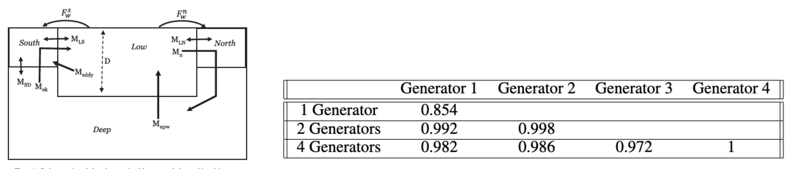
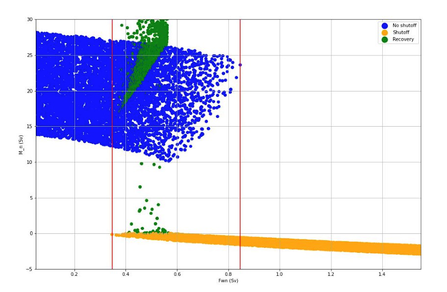

.. image:: _static/media8/image1.png
   :width: 9.40278in
   :height: 6.27303in
==========================
Milestone 8 Progress Report
==========================

**Approved for public release; distribution is unlimited. This material is based upon work supported by the Defense Advanced Research Projects Agency (DARPA) under Agreement No. HR00112290032.**

**PACMANS TEAM:**
• Jennifer Sleeman (JHU APL) PI
• Anand Gnanadesikan (JHU) Co-PI
• Yannis Kevrekidis (JHU) Co-PI
• Jay Brett (JHU APL)
• David Chung (JHU APL)
• Chace Ashcraft (JHU APL)
• Thomas Haine (JHU)
• Marie-Aude Pradal (JHU)
• Renske Gelderloos (JHU)
• Caroline Tang (DUKE)
• Anshu Saksena (JHU APL)
• Larry White (JHU APL)
• Marisa Hughes (JHU APL)

1   Overview
------------

   • This technical report covers the period of October 14, 2022, through December 12, 2022

   • The report documents the achievement of the milestone associated with Month 12 of the JHU/APL-led PACMAN team’s statement of work

   • The delivery for this milestone is this final report for Phase 1

**Goals **
The goal for this milestone included:
    • Deliver final report of all modules to conclude the Phase 1 effort including: • Data analysis

    • Characterization of benefits of new hybrid models over conventional models

    • Evaluations

    • All models, source code, and datasets to support results

2   Final Report Accomplishments
--------------------------------
• Development of the new 6-box model for AMOC tipping point research
    • Enables the study of oscillations providing insights into why some slow-downs lead to full collapses whereas some lead to recovery, which could inform climate intervention strategies

• Generation of novel AMOC tipping point datasets geared toward machine learning
    • Includes open sourced models being used by other performers

• CEMS2 4-box model Verification – Path for AI Learning of Large GCM Models
    • Research showed 4-box model captures 60-90% of the variation in the AMOC and pycnocline of CESM2, suggesting 4-box results can be used to understand CMIP-class AMOC model disagreement

• New bifurcation method for stochastic differential equations to estimate escape times in addition to identifying bifurcations
    • Goes beyond state of the art in providing measurements for determining distance from a tipping point and likelihood of recovering – applied to the stochastic 4-box model

• New AI-based method: TIP-GAN, a generative adversarial network that is used to discover AMOC tipping points
    • Generalizable to other types of tipping points

• Newly developed neuro-symbolic deep learning architecture that provides a means to ask questions of what is learned by TIP-GAN and a way to explore causal paths

• First version of causal models based on TIP-GAN learned paths

• Three accepted AGU presentations (2 oral, 1 poster), one AAAI Fall Symposium paper acceptance, draft of two journal papers, proposal acceptance to the AAAI Spring Symposium for AI Climate Tipping-Point Discovery (ACTD)

3 Final Report Accomplishments
------------------------------

This report includes a detailed final report for Phase 1 of:

• The conventional use of ocean models in terms of climate forecasting

• Updates and delivery of any new datasets

• Surrogate models performance with a comparison to conventional models using metrics defined in Milestone 3

• Performance of the simulation, causal model, and neuro-symbolic translation, including a comparison with conventional models using metrics defined in Milestone 3

• Benchmark comparison between the AI approach and the conventional approach, comparing their performance

4 Task 1.4 Use Case Ocean Models Comparisons
--------------------------------------------

*Subtask Description: We will provide a final report detailing the conventional use of ocean models in terms of climate forecastig*

In this report we provide a detailed discussion around the 4-box and 6-box models and the benefits of using these models to train machine learning algorithms with a path towards applying machine learning algorithms to large coupled GCMs.

**Task 1.4: Use Case Ocean Models Comparisons – 4-Box Model**
On long time scales, Atlantic overturning can often be described by the simple box model...
... which exhibits tipping points.

• We used the box model as a first-step data set

• We then extended this to include the larger climate models

    • Extend to include Pacific Basin

    • Calibrated model against specific climate models (NCAR+CMIP6) using preindustrial and historical simulations

    • Showed that model can capture both mean state and variability

    • Used surrogate model to project tipping points, examine for accuracy of prediction

|image1|

   | *Gnanadesikan, 1999;*
   | *Gnanadesikan, Kelson and Sten, J. Climate 2018*

** Task 1.4: Use Case Ocean Models Comparisons – 6-Box Model**

• In the calibrating model, Pacific shows more “resistance” to overturning than Southern Ocean. Why?
    - Atlantic is denser than Southern Ocean
    - Sinking gets kick from both intermediate and shallow water (low resistance)
    - Pacific is lighter than Southern Ocean. Sinking is opposed by AAIW... (higher resistance)

• North Pacific receives less freshwater than North Atlantic +Arctic

..
If freshwater flux is higher in the Pacific, increasing hydrological cycle shuts off Pacific first, then Atlantic.

If freshwater flux is higher in Atlantic/Arctic, potential for restart of Pacific overturning when Arctic turns off.

Three ways of increasing Pacific overturning!

..

When Atlantic overturning shuts off, pycnocline deepens.
This increases the mixing between high and low latitudes... more in Pacific than Atlantic.
For realistic range of mixing fluxes this can lead to restart of strong intermediate water formation in Pacific.

.. image:: _static/media8/image8.png
   :width: 4in
   :height: 6in

..

5   Task 2.5: Phase 1 Data Final Delivery
-----------------------------------------

*Subtask Description: We will document updates and deliver any new datasets.*

The final delivery of data will include the following:

• 4-box Model Python machine learning generated datasets

• Stochastic 4-box Model Python machine learning generated datasets

• 6-box Model Matlab code on github, but the machine learning generated datasets are not finalized yet

• Calibrated 4-box Model CESM2 Large Ensemble datasets

**Task 2.5: Phase 1 Data Final Delivery – 4-Box Model **

• Using the 4-box model as a way to generate data for the AI methods

• For long time scales, Atlantic overturning can often be described by the simple box model

   .. image:: _static/media8/image9.png
      :width: 7.80278in
      :height: 3.72917in

The Gnanadesikan 4-Box Model

• Created a python package of the 4-box model that allows one to specify initial conditions, and parameter values

• The python package recreates the Gnanadesikan experiments (in Matlab code)

• Generates the same plots

• Enables creation of labeled training data for training machine learning algorithms and temporal training data for training the AI surrogates

• Produces datasets in netcdf format

   .. image:: _static/media8/image10.png
      :width: 4.80278in
      :height: 2.72917in

   .. image:: _static/media8/image11.png
      :width: 3.80278in
      :height: 2.72917in

..

• Data available on sciserver.org

• Code available at https://github.com/JHUAPL/PACMANs

• 4-box model tutorial is on the ACTM Gallery

.. image:: _static/media8/image15.png
      :width: 3.80278in
      :height: 2.72917in

** Task 2.5: Phase 1 Data Final Delivery – 6-Box Model**

• 6-box model Matlab code is in github
• Python code for the 6-box model has been developed
• Scripts to generate Machine Learning datasets are also built
• However, the code requires formal review, documentation and tutorials before release in github public
    ‒ Will be part of Phase2

**Task 2.5: Phase 1 Data Final Delivery – CESM2**

Fitting CESM2 Large Ensemble to the Gnanadesikan 4-box model

.. image:: _static/media8/image209.png
      :width: 6.80278in
      :height: 4.72917in

   Task 2.5: Phase 1 Data Final Delivery - CESM2

**Goodness of fit**

For each of the 11 ensemble members, the correlation coefficient and the rms error normalized by the mean are shown for both the AMOC (Mn) and the pycnocline depth (D). Recall that member 1 is used to fit the data- it is excluded from the following:

The mean correlation coefficient is 0.9 for Mn and 0.8 for D.

On average, the rms error is 12% of the mean Mn and 1% of the mean D.

6   Task 3.6: AI Physics-Informed Surrogate Model Phase 1 Final Report
----------------------------------------------------------------------
   *Subtask Description: We will provide a final report of the surrogate models performance with a comparison to conventional models using metrics defined in Milestone 3.*

In this report we review the findings of the bifurcation analysis and provide a comparative estimate of the time required to compute the Escape Time Distribution with the Full Model and the Learned Parameter Dependent effective Stochastic Differential Equation target tipping point surrogate model.

**Task 3.6: AI Physics-Informed Surrogate Model Phase 1 Final Report – Bifurcation Analysis**

.. image:: _static/media8/image98.png
    :width: 5.62in
    :height: 3.59in

We consider a dynamical box model with four boxes:
    • The southern high latitudes (0.308S)

    • The northern high latitudes (0.458N)

    • Mid-to-low latitudes

    • A deep box that lies beneath all of the surface boxes

State variables:

    • 𝐷: Low latitude pycnocline depth

    • T_S,T_n,T_l, T_d: Temperatures of the four boxes

    • S_S,S_n,S_l, S_d: Salinities of the four boxes •

    • Single-headed bold arrows denote net fluxes of water

    • Double-headed arrows denote mixing fluxes

..

\ |image211|
These are the equations that we start with (nine differential equations)

\ |image212|

IMPORTANTLY, we explicitly used the fact that there exists an algebraic constraint (a salt balance) that reduces the equations by one and removes a neutral direction. This helps the conditioning of the Jacobian

\ |image213|

To make computations more accurate numerically, we non-dimensionalized the equations in ways *meaningful to the domain scientist* (Anand G.) to reduce the number of free parameters

..

With the non-dimensionalized equations, the problem possesses not one, but two tipping points (from the “upper” branch to the lower, but also from the lower to the upper) as shown in figures below.

.. image:: _static/media8/image134.png
   :width: 5.04583in
   :height: 3.06944in

Diagram of NH Overturning Mn

Zoomed-In View of the subcritical Hopf Bifurcation Point

+-----------------------------------------------------------------------+
|    Second view - the two tipping points are of different nature: one  |
|    of the two is the fold point bifurcation, but the second one is a  |
|    subcritical Hopf, highlighted in below figures. The Hopf at        |
|    TrFWn=0.0384 is subcritical.                                       |
|                                                                       |
|    |image122| |image123|                                              |
+=======================================================================+
+-----------------------------------------------------------------------+
Diagram of Low Latitude Depth D\* (left) and Zoomed-In View of the Hopf Bifurcation Point (right).

The Hysteretic behavior found in [Gnanadesikan, Kelson, Sten 2018], can be described as:

  • The ‘switching’ between ‘off’ and ‘on’ state is given by a subcritical Hopf bifurcation: H for 𝑇𝑟@ = 0.03529

  • And a saddle-node bifurcation: LP for 𝑇𝑟@ = 0.01798 TU

\ |image138|

• The value where the limit cycle branch appears to become vertical (an infinite period, homoclinic orbit) is 0.0375

• The subcritical Hopf gives birth to an unstable limit cycle “backwards” in parameter space (that surrounds the exiting stable steady state)

• This steady state loses stability at the Hopf bifurcation (red branch in figures)

• The escape (the “tipping") arises when a stochastic trajectory wandering around the stable state manages to "cross” the unstable limit cycle and escape to either large oscillations or to a completely different lower circulation branch

..

Where the initial condition with D=1 (where D is the low latitude pycnocline depth) is attracted by the upper branch because there is an early switch activation, so the sharp transition that we see is given by the upper limit point (LP). While for D=4 we observe the sharp transition close to the subcritical Hopf (the solution loses stability at the exact Hopf point because the initial condition may start outside the unstable limit cycle).

    |image126| |image127|

Temporal Bifurcation Diagram for Depth (top) and the Limit Cycle Continuation (bottom)

**Task 3.6: AI Physics-Informed Surrogate Model Phase 1 Final Report – Stochastic Model**

• Sitting close to the subcritical Hopf tipping point, on its "safe side" we performed our first stochastic simulations (with fluctuating freshwater flux coefficient, again, designed in collaboration with the domain expert, Anand G.)

• Notice on the left simulations, the variable oscillates over time near 4.7 before it eventually "tips"

• Also notice on the right some initial statistics of escape times for a fixed parameter value

\ |image215|

The Stochastic Differential Equation (SDE) model was trained by using sampled data of the Full Network’s Dynamics. Those data were used to train a parameter dependent SDE network (for two values of the parameter p).

For the neural network’s training we used snapshots of the Full Model every five iterations of the full model assuming a time step h=0.01.

To estimate the computational time needed per approach, we first obtain an evaluation of the time needed for a function evaluation of the Full Model and of the estimated SDE (eSDE) model:
+------------------------------------+----------------------------------+
|              **Function Evaluation Time (seconds)**                   |
+------------------------------------+----------------------------------+
|            Full Model              |            eSDE Model            |
+------------------------------------+----------------------------------+
|             0.0529                 |            0.00188               |
+------------------------------------+----------------------------------+

..

To obtain an estimate of the number of trajectories needed for each model to compute the escape time distribution, a bootstrapping method was used for each model.

For both models, the number of samples needed was estimated to be N=2000.

Given this information, we then estimate the number of iterations (evaluations) needed for each model, on average, to escape.

For the Full Model, this number was estimated as 281.

For the Reduced Model, since the escape time was estimated as 0.289 (for a time step of the Euler Maryama simulation equal to the one assumed when training of the model (h=0.01)), we estimate that the number of iterations is 28.9 ~29.

By considering the Function Evaluation time for each model, the number of samples needed to obtain an accurate estimate of the escape times, but also the number of iterations per model, we obtain an estimate of the computational time required to compute the exit time distribution per model.
+-----------------------------------+-----------------------------------+
| | **Escape Time Computational  |  |                                   |
| | Effort (hours)**             |  |                                   |
+===================================+===================================+
| +------------------------------+  | **eSDE Model**                    |
| | **Full Model**               |  |                                   |
| +------------------------------+  |                                   |
+-----------------------------------+-----------------------------------+
| +------------------------------+  | 0.00301                           |
| | 8.26                         |  |                                   |
| +------------------------------+  |                                   |
+-----------------------------------+-----------------------------------+

..

   The computational efforts were estimated for the Full Model as
   follows:

The computational efforts were estimated for the Full Model as follows:
    • Escape Time Computational Effort =Average Number of Iterations Full Model * Number of Samples Needed *Function Evaluation Time

The computations efforts for the SDE Model were obtained as follows:
    • Escape Time Computational Effort = (Mean Exit Time obtained)/h* Number of Samples Needed*Function Evaluation Time

Please notice that the function evaluation difference between the Full Model is ~28 times larger than the SDE model. However, the ratio of the computational time suggests that the Full Model need is ~273 times more than the SDE model. This can be attributed to the following two reasons:

1. We trained the SDE model by using every 5 iterations of the full model so each step of the reduced model corresponds to 5 steps of the Full Model

2. The escape time estimated of the full model is ~2 times larger than the SDE model

Those two reasons make the computation of the exit time of the SDE model even smaller than the factor of 28.

Additional Computational Cost needed for these computations involve:

1. Sampling the data

2. Training the SDE Model

In terms of (1) we sampled a total number of 104,000 data points to train the SDE (even though not all were used). By considering the function evaluation time of the Full Model, the time needed to sample the data was ~1.5 hours. Note that the real time might be larger since computing and storing in RAM those trajectories might increase the time required just for simulation.

The training of the SDE model (training for 1,000 epochs) needs about 0.23 hours. The table below reports the total computational time needed for the SDE model.

+-----------------------------------+-----------------------------------+
| +------------------------------+  | **Computational Time (hours)**    |
| | **Task**                     |  |                                   |
| +------------------------------+  |                                   |
+===================================+===================================+
+-----------------------------------+-----------------------------------+

+-----------------------------------+-----------------------------------+
| +------------------------------+  | 1.5                               |
| | Sampling Data                |  |                                   |
| +------------------------------+  |                                   |
+===================================+===================================+
| +------------------------------+  | 0.23                              |
| | Training SDE Model           |  |                                   |
| +------------------------------+  |                                   |
+-----------------------------------+-----------------------------------+
| +------------------------------+  | 0.031                             |
| |    Escape Time Computations  |  |                                   |
| |    SDE Model                 |  |                                   |
| +------------------------------+  |                                   |
+-----------------------------------+-----------------------------------+
| +------------------------------+  | 1.78                              |
| | Total                        |  |                                   |
| +------------------------------+  |                                   |
+-----------------------------------+-----------------------------------+

7    Task 4.6 AI Simulation Phase 1 Final Report
------------------------------------------------

*Subtask Description: We will provide a final report of the performance of the simulation, causal model, and neuro-symbolic translation, including a comparison with conventional models using metrics defined in Milestone 3.*

In this final report we share the measured results for TIP-GAN, the neuro-symbolic translation methods, and early results from the causal model. Each area of experimentation was measured in terms of the metrics described previously and new metrics as required.

**Task 4.6: AI Simulation Phase 1 Final Report - TIP-GAN**
Compelling early classification precision, recall, F1 scores of model configurations that lead to AMOC collapse in 4-box model

..image:: _static/media8/image143.png
    :width: 5.018in
    :height: 3.763in

..image:: _static/media8/image144.png
    :width: 5.018in
    :height: 3.763in

..image:: _static/media8/image145.png
    :width: 5.018in
    :height: 3.763in

Recreated Collapses Using Python Generated Tools for Machine Learning Dataset Creation from the 4-Box Model

Learning Dataset Creation from the 4-Box Model

Showed that the GAN could be used to exploit the area of uncertainty connsistent with what was desvribed i the 2018 4-Box Model paper.

Training samples: 10,774
Test samples: 2,694
GAN samples: 2,694
N = number of generators

Dataset and Percent in uncertainty region:
Training: 34.9%
Test: 35.5%
GAN (N=1): 67.4%
GAN (N=2): 91.4%
GAN (N=3): 98.7%

.. image:: _static/media8/image148.png
   :width: 4.37778in
   :height: 1.76667in

Comparing GAN Generated Results for N = (1,2,3) with the Test Set.

   Task 4.6: AI Simulation Phase 1 Final Report – TIP-GAN

• Next Steps:
    • Perturb more variables
        • Joint exploration (𝐴TU<V, 𝐴WX, 𝑀UY, 𝐾Z, 𝜀, 𝐷;[\R, 𝐹\:)
        • Time (N and tstep_size)

• Additional label (e.g. AMOC recoveries)

• Larger/stochastic surrogate models (e.g. 6-box model, stochastic 4-box model, AI surrogate model)

.. image:: _static/media8/image166.png
   :width: 3.37778in
   :height: 3.76667in

**Task 4.6: AI Simulation Phase 1 Final Report – Neuro-Symbolic**

   .. image:: _static/media8/image167.png
      :width: 8.76111in
      :height: 4.94722in

Learning to Translate Questions into Programs and Programs into Questions

Using the CLEVR dataset to validate architectures: (https://cs.stanford.edu/people/jcjohns/clevr/)

• Common dataset for neuro-symbolic method evaluation

• Specific to image object understanding

• We adapt this dataset and use only the question and program portions of the data

..

Task 4.6: AI Simulation Phase 1 Final Report - Neuro-Symbolic

• Used 59,307 training samples and 12,698 test samples

• Trained network with shared word embeddings

• Evaluated using test samples

• Test samples contained both natural language questions and equivalent programs

• ~75% accuracy overall translating from questions to questions, questions to programs, and programs to questions

***Example Output:***

**Predicted text:** BOS how many small cyan things are there ? EOS

**Ground Truth Text:** BOS how many small cyan things are there ? EOS

**Predicted program:** BOS count ( filter_color ( filter_size ( scene , small ) , cyan ) ) EOS Ground Truth program: BOS count ( filter_color ( filter_size ( scene , small ) , cyan ) ) EOS Predicted text from program: BOS how many of cyan things are are ? ? EOS

• Validated using the CLEVR dataset

• Translates GAN output into NL Questions

• Able to convert NL Questions into symbolic Programs that the GAN could answer
   .. image:: _static/media8/image169.png
      :width: 4.76111in
      :height: 1.94722in
Example GAN Output Translated from Program to NL Question/Answer

   .. image:: _static/media8/image170.png
      :width: 5.76111in
      :height: 3.94722in
Using 4-Box Model Dataset (Small experiment)

   .. image:: _static/media8/image171.png
      :width: 5.76111in
      :height: 3.94722in
Using CLEVR Dataset

..

   .. image:: _static/media8/image172.png
      :width: 5.76111in
      :height: 3.94722in

• Adding additional questions to the training dataset
    • ~250,000 generated questions

• Transfer from model trained purely on CLEVR data

• 40 token question max

• Preliminary results

    • Overall Test Set accuracy: 83%

    • Test size: 25,000 question/program pairs

New (examples of) AMOC-Specific Questions:

• If I increase ekman flux by some value will overturning increase

• If I increase low lat thermocline depth by some value will overturning increase

• If I decrease freshwater flux by some value will overturning decrease

• If I set ekman flux to some value, freshwater flux to some value and the thermocline depth of lower latitudes to some value will overturning increase..

**Task 4.6: AI Simulation Phase 1 Final Report – Causal Modeling**

• Causal path learning algorithmic development underway

• For each epoch, each generator will have a set of batch models it perturbed

• Causal model is built from batches perturbed over the total epoch for each generator

• We focus on the 3-parameter experiments involving:

    • Dlow0 - Thermocline depth of lower latitudes

    • Mek - Ekman flux from the southern ocean

    • Fwn - Fresh water flux (North)

• And on the relationship between freshwater, salinity, temperature with respect to overturning:

    • T_south – Temperatures of the southern box

    • T_north – Temperatures of the northern box

    • S_south – Salinity of the southern box

    • S_north – Salinity of the northern box

    • D_low0 – Thermocline depth of lower latitudes

    • M_n – Overturning Transport

8   Task 5.2: Evaluation Final Report
--------------------------------------
*Subtask Description: We report on the results of a benchmark comparison between the AI approach and the conventional approach, comparing their performance.*

We summarize the results of the benchmark comparison between the AI approach and the conventional approach.

• In the surrogate modeling bifurcation efforts, a Hopf bifurcation was detected for the 4-box model (in addition to previously known fold bifurcations)

• In the TIP-GAN experiments, when benchmarking with the 4-box model, we showed that the TIP-GAN generators when focused on the area of uncertainty in terms of discriminator predictions was consistent with the area of the separatrix

• In the neuro-symbolic translations we benchmarked the network’s performance in terms of a common benchmark – the CLEVR dataset and performance was exceptional (close to 100%) for text-to-text translations and text-to-program translations using Levenshtein distance. Program to text was over 60% in terms of performance

**Summary**
Phase 1 source code can be found in github

Phase 1 datasets can be found at sciserver.com

Phase 1 reports can be found on readthedocs

1. Boers, Niklas. "Observation-based early-warning signals for a collapse of the Atlantic Meridional Overturning Circulation." Nature Climate Change 11, no. 8 (2021): 680-688.

2. Gnanadesikan, A., A simple model for the structure of the oceanic pycnocline, Science., 283:2077-2079, (1999).

3. Forget, G., J.-M. Campin, P. Heimbach, C. N. Hill, R. M. Ponte, C. Wunsch, ECCO version 4: An integrated framework for non-linear inverse modeling and global ocean state estimation. Geosci. Model Dev. 8, 3071–3104 (2015)

4. Gnanadesikan, A., R. Kelson and M. Sten, Flux correction and overturning stability: Insights from a dynamical box model, J. Climate, 31, 9335-9350, https://doi.org/10.1175/JCLI-D-18-0388.1, (2018).

5. Kaufhold, John Patrick, and Jennifer Alexander Sleeman. "Systems and methods for deep model translation generation." U.S. Patent No. 10,504,004. 10 Dec. 2019.

6. Garcez, Artur d'Avila, and Luis C. Lamb. "Neurosymbolic AI: the 3rd Wave." arXiv preprint arXiv:2012.05876 (2020).

7. Stommel, H. Thermohaline convection with two stable regimes of flow. Tellus 13, 224–230 (1961).

8. Karniadakis, George Em, Ioannis G. Kevrekidis, Lu Lu, Paris Perdikaris, Sifan Wang, and Liu Yang. "Physics-informed machine learning." Nature Reviews Physics 3, no. 6 (2021): 422-440.

9. Sleeman, Jennifer, Milton Halem, Zhifeng Yang, Vanessa Caicedo, Belay Demoz, and Ruben Delgado. "A Deep Machine Learning Approach for LIDAR Based Boundary Layer Height Detection." In IGARSS 2020-2020 IEEE International Geoscience and Remote Sensing Symposium, pp. 3676-3679. IEEE, 2020.

10. Patel, Kinjal, Jennifer Sleeman, and Milton Halem. "Physics-aware deep edge detection network." In Remote Sensing of Clouds and the Atmosphere XXVI, vol. 11859, pp. 32-38. SPIE, 2021.

11.Brulé, Joshua. "A causation coefficient and taxonomy of correlation/causation relationships." arXiv preprint arXiv:1708.05069 (2017).

12. Rasp, Stephan, Michael S. Pritchard, and Pierre Gentine. "Deep learning to represent subgrid processes in climate models." Proceedings of the National Academy of Sciences 115, no. 39 (2018): 9684-9689.

13. Bolton, Thomas, and Laure Zanna. "Applications of deep learning to ocean data inference and subgrid parameterization." Journal of Advances in Modeling Earth Systems 11, no. 1 (2019): 376-399.

14. Kurth, Thorsten, Sean Treichler, Joshua Romero, Mayur Mudigonda, Nathan Luehr, Everett Phillips, Ankur Mahesh et al. "Exascale deep learning for climate analytics." In SC18: International Conference for High Performance Computing, Networking, Storage and Analysis, pp. 649-660. IEEE, 2018.

15. Weber, Theodore, Austin Corotan, Brian Hutchinson, Ben Kravitz, and Robert Link. "Deep learning for creating surrogate models of precipitation in Earth system models." Atmospheric Chemistry and Physics 20, no. 4 (2020): 2303-2317.

16. Matsubara, Takashi, Ai Ishikawa, and Takaharu Yaguchi. "Deep energy-based modeling of discrete-time physics." arXiv preprint arXiv:1905.08604 (2019).

17. Kleinen, T., Held, H. & Petschel-Held, G. The potential role of spectral properties in detecting thresholds in the Earth system: application to the thermohaline circulation. Ocean Dyn. 53, 53–63 (2003).

18. Kocaoglu, Murat, Christopher Snyder, Alexandros G. Dimakis, and Sriram Vishwanath. "Causalgan: Learning causal implicit generative models with adversarial training." arXiv preprint arXiv:1709.02023 (2017).

19. Feinman, Reuben, and Brenden M. Lake. "Learning Task-General Representations with Generative Neuro-Symbolic Modeling." arXiv preprint arXiv:2006.14448 (2020).

20. Yi, Kexin, Chuang Gan, Yunzhu Li, Pushmeet Kohli, Jiajun Wu, Antonio Torralba, and Joshua B. Tenenbaum. "Clevrer: Collision events for video representation and reasoning." arXiv preprint arXiv:1910.01442 (2019).

21. Nowack, Peer, Jakob Runge, Veronika Eyring, and Joanna D. Haigh. "Causal networks for climate model evaluation and constrained projections." Nature communications 11, no. 1 (2020): 1-11.

22. Andersson, Tom R., J. Scott Hosking, María Pérez-Ortiz, Brooks Paige, Andrew Elliott, Chris Russell, Stephen Law et al. "Seasonal Arctic sea ice forecasting with probabilistic deep learning." Nature communications 12, no. 1 (2021): 1-12.

23. Storchan, Victor, Svitlana Vyetrenko, and Tucker Balch. "MAS-GAN: Adversarial Calibration of Multi-Agent Market Simulators." (2020).

24. De Raedt, Luc, Robin Manhaeve, Sebastijan Dumancic, Thomas Demeester, and Angelika Kimmig. "Neuro-symbolic=neural+ logical+ probabilistic." In NeSy'19@ IJCAI, the 14th International Workshop on Neural-Symbolic Learning and Reasoning. 2019.

25. Eyring, V., Bony, S., Meehl, G. A., Senior, C. A., Stevens, B., Stouffer, R. J., and Taylor, K. E.: Overview of the Coupled Model Intercomparison Project Phase 6 (CMIP6) experimental design and organization, Geosci. Model Dev., 9, 1937-1958, doi:10.5194/gmd-9-1937-2016, 2016.

26. Swingedouw, Didier, Chinwe Ifejika Speranza, Annett Bartsch, Gael Durand, Cedric Jamet, Gregory Beaugrand, and Alessandra Conversi. "Early warning from space for a few key tipping points in physical, biological, and social-ecological systems." Surveys in geophysics 41, no. 6 (2020): 1237-1284.

27. Reichstein, Markus, Gustau Camps-Valls, Bjorn Stevens, Martin Jung, Joachim Denzler, and Nuno Carvalhais. "Deep learning and process understanding for data-driven Earth system science." Nature 566, no. 7743 (2019): 195-204.

28. Sleeman, Jennifer, Ivanka Stajner, Christoph Keller, Milton Halem, Christopher Hamer, Raffaele Montuoro, and Barry Baker. "The Integration of Artificial Intelligence for Improved Operational Air Quality Forecasting." In AGU Fall Meeting 2021. 2021.

29. Bellomo, K., Angeloni, M., Corti, S. et al. Future climate change shaped by inter-model differences in Atlantic meridional overturning circulation response. Nat Commun 12, 3659 (2021). https://doi.org/10.1038/s41467-021-24015-w

30. Sgubin, G., Swingedouw, D., Drijfhout, S. et al. Abrupt cooling over the North Atlantic in modern climate models. Nat Commun 8, 14375 (2017). https://doi.org/10.1038/ncomms14375

31. Swingedouw, D., Bily, A., Esquerdo, C., Borchert, L. F., Sgubin, G., Mignot, J., & Menary, M. (2021). On the risk of abrupt changes in the North Atlantic subpolar gyre in CMIP6 models. Annals of the New York Academy of Sciences, 1504(1), 187-201. https://doi.org/10.1111/nyas.14659

32. Mao, Jiayuan, Chuang Gan, Pushmeet Kohli, Joshua B. Tenenbaum, and Jiajun Wu. "The neuro-symbolic concept learner: Interpreting scenes, words, and sentences from natural supervision." arXiv preprint arXiv:1904.12584 (2019).

.. |image1| image:: _static/media8/image2.png
   :width: 3.82222in
   :height: 5.175in
.. |image2| image:: _static/media8/image3.png
   :height: 0.16667in

.. |image5| image:: _static/media8/image15.png
   :width: 4.72083in
   :height: 2.3843in
.. |image6| image:: _static/media8/image16.png
.. |image7| image:: _static/media8/image17.png
.. |image8| image:: _static/media8/image18.png
   :width: 0.11111in
.. |image9| image:: _static/media8/image19.png
.. |image10| image:: _static/media8/image20.png
.. |image11| image:: _static/media8/image21.png
.. |image12| image:: _static/media8/image22.png
.. |image13| image:: _static/media8/image23.png
.. |image14| image:: _static/media8/image24.png
.. |image15| image:: _static/media8/image25.png
.. |image16| image:: _static/media8/image26.png
.. |image17| image:: _static/media8/image27.png
.. |image18| image:: _static/media8/image28.png
.. |image19| image:: _static/media8/image29.png
   :width: 0.16667in
.. |image20| image:: _static/media8/image30.png
.. |image21| image:: _static/media8/image31.png
.. |image22| image:: _static/media8/image32.png
.. |image23| image:: _static/media8/image33.png
.. |image24| image:: _static/media8/image34.png
.. |image25| image:: _static/media8/image35.png
.. |image26| image:: _static/media8/image36.png
.. |image27| image:: _static/media8/image37.png
.. |image28| image:: _static/media8/image38.png
.. |image29| image:: _static/media8/image39.png
   :width: 0.125in
.. |image30| image:: _static/media8/image40.png
   :width: 0.11111in
.. |image31| image:: _static/media8/image41.png
.. |image32| image:: _static/media8/image42.png
.. |image33| image:: _static/media8/image43.png
.. |image34| image:: _static/media8/image44.png
.. |image35| image:: _static/media8/image45.png
.. |image36| image:: _static/media8/image46.png
.. |image37| image:: _static/media8/image47.png
   :width: 0.20833in
.. |image38| image:: _static/media8/image48.png
.. |image39| image:: _static/media8/image49.png
   :width: 0.27778in
.. |image40| image:: _static/media8/image50.png
.. |image41| image:: _static/media8/image51.png
   :width: 0.29167in
.. |image42| image:: _static/media8/image52.png
   :width: 0.16667in
.. |image43| image:: _static/media8/image53.png
   :width: 0.33333in
.. |image44| image:: _static/media8/image54.png
.. |image45| image:: _static/media8/image55.png
   :width: 0.29167in
.. |image46| image:: _static/media8/image56.png
   :width: 0.19444in
.. |image47| image:: _static/media8/image57.png
   :width: 0.29167in
.. |image48| image:: _static/media8/image58.png
   :width: 0.31944in
.. |image49| image:: _static/media8/image60.png
   :width: 0.33333in
   :height: 0.18056in
.. |image50| image:: _static/media8/image61.png
   :height: 0.18056in
.. |image51| image:: _static/media8/image62.png
   :height: 0.16667in
.. |image52| image:: _static/media8/image63.png
   :width: 0.33333in
   :height: 0.16667in
.. |image53| image:: _static/media8/image64.png
   :height: 0.23611in
.. |image54| image:: _static/media8/image65.png
   :height: 0.23611in
.. |image55| image:: _static/media8/image66.png
   :width: 0.66667in
   :height: 0.18056in
.. |image56| image:: _static/media8/image67.png
   :width: 5.00972in
   :height: 3.18722in
.. |image57| image:: _static/media8/image68.png
   :width: 0.34722in
   :height: 0.29167in
.. |image58| image:: _static/media8/image69.png
.. |image59| image:: _static/media8/image70.png
   :width: 0.31944in
   :height: 0.33333in
.. |image60| image:: _static/media8/image71.png
   :width: 0.375in
   :height: 0.16667in
.. |image61| image:: _static/media8/image72.png
   :width: 0.375in
   :height: 0.19444in
.. |image62| image:: _static/media8/image73.png
   :width: 0.30556in
   :height: 0.16667in
.. |image63| image:: _static/media8/image74.png
   :width: 0.43056in
   :height: 0.13889in
.. |image64| image:: _static/media8/image75.png
   :width: 0.11111in
   :height: 0.15278in
.. |image65| image:: _static/media8/image76.png
.. |image66| image:: _static/media8/image77.png
.. |image67| image:: _static/media8/image78.png
.. |image68| image:: _static/media8/image79.png
   :width: 0.19444in
   :height: 0.20833in
.. |image69| image:: _static/media8/image80.png
.. |image70| image:: _static/media8/image81.png
   :width: 0.31944in
   :height: 0.125in
.. |image71| image:: _static/media8/image82.png
.. |image72| image:: _static/media8/image83.png
   :width: 0.27778in
   :height: 0.15278in
.. |image73| image:: _static/media8/image84.png
   :width: 0.11111in
   :height: 0.18056in
.. |image74| image:: _static/media8/image85.png
   :width: 0.40278in
   :height: 0.13889in
.. |image75| image:: _static/media8/image86.png
   :height: 0.25in
.. |image76| image:: _static/media8/image87.png
.. |image77| image:: _static/media8/image88.png
.. |image78| image:: _static/media8/image89.png
.. |image79| image:: _static/media8/image90.png
.. |image80| image:: _static/media8/image91.png
   :width: 0.79167in
   :height: 0.125in
.. |image81| image:: _static/media8/image92.png
   :width: 0.19444in
   :height: 0.125in
.. |image82| image:: _static/media8/image93.png
   :width: 0.76389in
   :height: 0.13889in
.. |image83| image:: _static/media8/image94.png

.. |image85| image:: _static/media8/image96.png
.. |image86| image:: _static/media8/image97.png
   :width: 6.69028in
   :height: 5.01771in
.. |image87| image:: _static/media8/image100.png
   :width: 0.27778in
   :height: 0.26389in
.. |image88| image:: _static/media8/image101.png
   :width: 0.41667in
   :height: 0.26389in
.. |image89| image:: _static/media8/image102.png
   :width: 0.33333in
   :height: 0.20833in
.. |image90| image:: _static/media8/image103.png
   :height: 0.20833in
.. |image91| image:: _static/media8/image104.png
   :width: 0.40278in
   :height: 0.34722in
.. |image92| image:: _static/media8/image105.png
   :width: 0.33333in
   :height: 0.20833in
.. |image93| image:: _static/media8/image106.png
   :height: 0.26389in
.. |image94| image:: _static/media8/image107.png
   :width: 0.33333in
   :height: 0.26389in
.. |image95| image:: _static/media8/image108.png
   :height: 0.20833in
.. |image96| image:: _static/media8/image109.png
   :height: 0.20833in
.. |image97| image:: _static/media8/image110.png
   :height: 0.20833in
.. |image98| image:: _static/media8/image111.png
   :width: 1.16667in
   :height: 0.625in
.. |image99| image:: _static/media8/image112.png
   :height: 0.26389in
.. |image100| image:: _static/media8/image113.png
   :height: 0.26389in
.. |image101| image:: _static/media8/image114.png
   :height: 0.26389in
.. |image102| image:: _static/media8/image115.png
   :width: 0.33333in
   :height: 0.26389in
.. |image103| image:: _static/media8/image116.png
   :height: 0.20833in
.. |image104| image:: _static/media8/image117.png
   :height: 0.20833in
.. |image105| image:: _static/media8/image118.png
   :width: 0.40278in
   :height: 0.34722in
.. |image106| image:: _static/media8/image119.png
   :width: 0.33333in
   :height: 0.20833in
.. |image107| image:: _static/media8/image120.png
   :height: 0.26389in
.. |image108| image:: _static/media8/image121.png
   :width: 0.33333in
   :height: 0.26389in
.. |image109| image:: _static/media8/image122.png
   :height: 0.19444in
.. |image110| image:: _static/media8/image123.png
   :height: 0.34722in
.. |image111| image:: _static/media8/image124.png
   :height: 0.20833in
.. |image112| image:: _static/media8/image125.png
   :height: 0.20833in
.. |image113| image:: _static/media8/image126.png
   :height: 0.26389in
.. |image114| image:: _static/media8/image127.png
   :height: 0.26389in
.. |image115| image:: _static/media8/image99.png
   :width: 0.18056in
   :height: 0.34722in
.. |image116| image:: _static/media8/image128.png
   :height: 0.25in
.. |image117| image:: _static/media8/image129.png
   :height: 0.25in
.. |image118| image:: _static/media8/image130.png
   :height: 0.25in
.. |image119| image:: _static/media8/image131.png
   :height: 0.25in
.. |image120| image:: _static/media8/image132.png
   :width: 0.11111in
   :height: 0.56944in
.. |image121| image:: _static/media8/image133.png
   :height: 0.20833in
.. |image122| image:: _static/media8/image136.png
   :width: 5.07639in
   :height: 3.87083in
.. |image123| image:: _static/media8/image137.png
   :width: 5.07639in
   :height: 3.87083in

.. |image126| image:: _static/media8/image140.png
   :width: 5.08056in
   :height: 3.80972in
.. |image127| image:: _static/media8/image141.png
   :width: 5.08055in
   :height: 3.80972in

.. |image130| image:: _static/media8/image148.png
   :width: 6.90417in
   :height: 3.07571in

.. |image135| image:: _static/media8/image152.png
.. |image136| image:: _static/media8/image153.png
.. |image137| image:: _static/media8/image154.png
.. |image138| image:: _static/media8/image155.png
.. |image139| image:: _static/media8/image156.png
.. |image140| image:: _static/media8/image157.png
.. |image141| image:: _static/media8/image158.png
.. |image142| image:: _static/media8/image159.png
.. |image143| image:: _static/media8/image160.png
.. |image144| image:: _static/media8/image161.png
   :height: 0.11111in
.. |image145| image:: _static/media8/image162.png
   :width: 0.22222in
   :height: 1.97222in

.. |image148| image:: _static/media8/image165.png
   :height: 0.16667in

.. |image154| image:: _static/media8/image176.png
   :width: 7.55556in
   :height: 5.08333in
.. |image155| image:: _static/media8/image15.png
   :width: 4.94028in
   :height: 2.49514in
.. |image156| image:: _static/media8/image177.png
   :width: 0.29167in
.. |image157| image:: _static/media8/image178.png
   :width: 0.58333in
.. |image158| image:: _static/media8/image179.png
.. |image159| image:: _static/media8/image180.png
   :width: 0.25in
.. |image160| image:: _static/media8/image181.png
.. |image161| image:: _static/media8/image182.png
.. |image162| image:: _static/media8/image183.png
.. |image163| image:: _static/media8/image184.png
.. |image164| image:: _static/media8/image185.png
.. |image165| image:: _static/media8/image186.png
.. |image166| image:: _static/media8/image187.png
.. |image167| image:: _static/media8/image188.png
.. |image168| image:: _static/media8/image189.png
.. |image169| image:: _static/media8/image190.png
   :width: 0.29167in
.. |image170| image:: _static/media8/image191.png
.. |image171| image:: _static/media8/image192.png
   :width: 0.29167in
.. |image172| image:: _static/media8/image193.png
   :width: 0.16667in
.. |image173| image:: _static/media8/image194.png
   :width: 0.34722in
.. |image174| image:: _static/media8/image195.png
.. |image175| image:: _static/media8/image196.png
   :width: 0.29167in
.. |image176| image:: _static/media8/image197.png
   :width: 0.29167in
.. |image177| image:: _static/media8/image198.png
   :width: 0.41667in
.. |image178| image:: _static/media8/image199.png
   :width: 0.19444in
.. |image179| image:: _static/media8/image200.png
.. |image180| image:: _static/media8/image201.png
   :width: 0.29167in
.. |image181| image:: _static/media8/image202.png
   :width: 0.20833in
.. |image182| image:: _static/media8/image203.png
.. |image183| image:: _static/media8/image204.png
   :width: 0.75in
.. |image184| image:: _static/media8/image205.png
   :width: 0.125in
.. |image185| image:: _static/media8/image206.png
   :width: 0.29167in
.. |image186| image:: _static/media8/image207.png
   :width: 0.31944in
